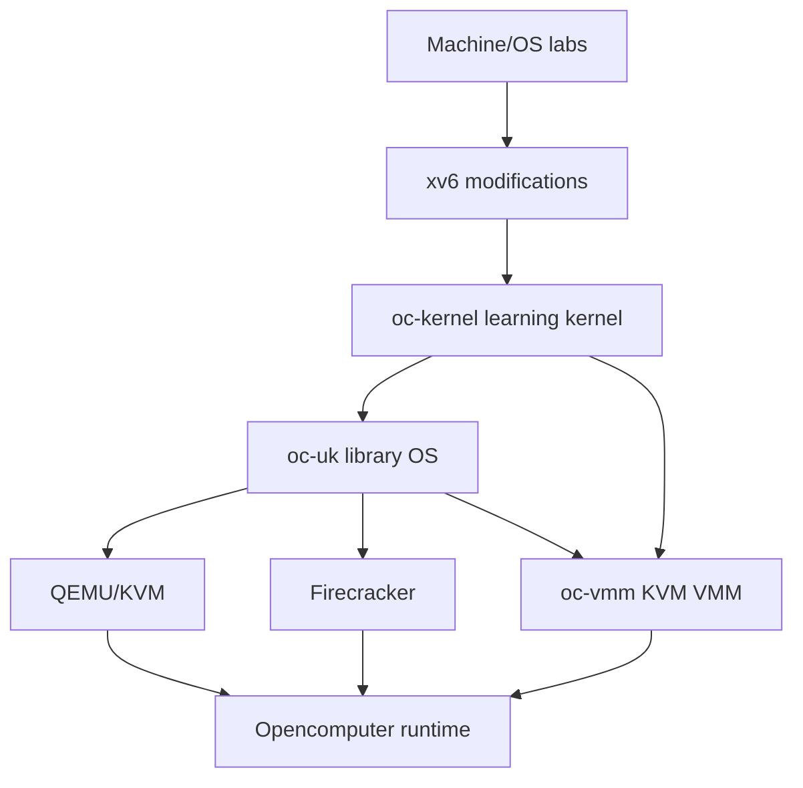

# Unikernel Engineering Handbook

> A reading, implementation, testing, and production-integration handbook for mastering operating systems, KVM, virtio, library operating systems, and unikernels—ending with `oc-uk`, `oc-vmm`, and an Opencomputer runtime.

**Edition:** 1.0  
**Reference check date:** 2026-07-13  
**Core curriculum:** 60 part-time weeks or approximately 8–10 focused full-time months  
**Advanced track:** approximately 12–24 additional full-time weeks

## Start here

1. Read [How to Use This Handbook](chapters/00-orientation.md).
2. Copy [the weekly log template](templates/WEEKLY_LOG.md) into `docs/weekly/week-01.md`.
3. Begin [Week 01](weeks/week-01-define-the-destination.md).
4. Use [`CURRICULUM.md`](CURRICULUM.md) as the complete checklist and progress dashboard.
5. Use [`UNIKERNEL_ENGINEERING_HANDBOOK.md`](UNIKERNEL_ENGINEERING_HANDBOOK.md) when you prefer one monolithic file.

## What you will build

## Core chapters

### Foundations

- [Chapter 0 — How to Use This Handbook](chapters/00-orientation.md)
- [Chapter 1 — Toolchains, ABIs, ELF, and the Path to `_start`](chapters/01-toolchain-abi-elf.md)
- [Chapter 2 — The x86-64 Machine Model](chapters/02-x86-64-machine-model.md)
- [Chapter 3 — Physical Memory, Virtual Memory, and Allocation](chapters/03-memory-management.md)
- [Chapter 4 — Concurrency, Scheduling, and Event-Driven Execution](chapters/04-concurrency-execution.md)

### Operating-system and kernel engineering

- [Chapter 5 — OS Interfaces Through xv6](chapters/05-os-interfaces-xv6.md)
- [Chapter 6 — Boot, Build, Test, and Debug Bare-Metal Code](chapters/06-boot-build-debug.md)
- [Chapter 7 — Interrupts, Time, Entropy, and Lifecycle State](chapters/07-interrupts-time-entropy.md)
- [Chapter 8 — Device Driver Engineering](chapters/08-device-driver-engineering.md)

### Virtio, network, and storage

- [Chapter 9 — Virtio](chapters/09-virtio.md)
- [Chapter 10 — Networking From Ethernet to an HTTP Service](chapters/10-networking.md)
- [Chapter 11 — Block Storage, Persistence, and Checkpoint Semantics](chapters/11-storage-persistence-snapshots.md)

### Virtualization and VMMs

- [Chapter 12 — Virtualization Theory](chapters/12-virtualization-theory.md)
- [Chapter 13 — Building a Small KVM VMM](chapters/13-kvm-vmm.md)
- [Chapter 14 — VMM Snapshots, Isolation, and Defensive Device Models](chapters/14-vmm-snapshot-security.md)

### Library OS and product architecture

- [Chapter 15 — Library Operating Systems and Unikernel Architecture](chapters/15-library-os-unikernel-design.md)
- [Chapter 16 — Application SDKs, C ABI, and Limited POSIX Compatibility](chapters/16-application-abi-posix.md)
- [Chapter 17 — Security Engineering for a Unikernel Platform](chapters/17-unikernel-security.md)
- [Chapter 18 — Performance, Measurement, and Observability](chapters/18-performance-observability.md)
- [Chapter 19 — Targeting Firecracker](chapters/19-firecracker-target.md)
- [Chapter 20 — Integrating `oc-uk` With Opencomputer](chapters/20-opencomputer-runtime.md)

## Advanced stretch chapters

- [Firecracker-class microVM monitor](chapters/21-stretch-firecracker-class-vmm.md)
- [Implement both sides of virtio](chapters/22-stretch-virtio-both-sides.md)
- [Build a TCP/IP stack from first principles](chapters/23-stretch-network-stack.md)
- [SDK, observability, fuzzing, and full runtime](chapters/24-stretch-sdk-ecosystem-runtime.md)

## Weekly curriculum

- [Weekly lab index](weeks/README.md)
- [Complete 60-week curriculum](CURRICULUM.md)

Each week includes reading, implementation work, verification, exit artifacts, and links to the relevant handbook chapters.

## Appendices

- [Reading map and primary sources](appendices/01-reading-map.md)
- [Starter repository and build scaffolds](appendices/02-starter-repository.md)
- [Debugging playbooks](appendices/03-debugging-playbooks.md)
- [Testing, fuzzing, and failure-injection matrix](appendices/04-testing-fuzzing-matrix.md)
- [Glossary](appendices/05-glossary.md)
- [Pacing and full-time schedule](appendices/06-pacing-and-study.md)
- [Source archaeology guide](appendices/07-source-archaeology.md)
- [Assessment and graduation rubric](appendices/08-assessment-and-graduation.md)

## Templates

- [Weekly log](templates/WEEKLY_LOG.md)
- [Architecture Decision Record](templates/ADR.md)
- [Paper review](templates/PAPER_REVIEW.md)
- [Threat model](templates/THREAT_MODEL.md)
- [Benchmark record](templates/BENCHMARK_RECORD.yml)
- [Unikernel config example](templates/UNIKERNEL_CONFIG.json)
- [Snapshot manifest example](templates/SNAPSHOT_MANIFEST.json)

## Core completion target

By the end of Week 60, the project should:

- boot one statically linked Rust application under QEMU/KVM, `oc-vmm`, and Firecracker;
- support virtio-net, virtio-block, and virtio-vsock;
- provide a native SDK and one source-ported C application;
- implement quiescing, durable data checkpoint, and runtime snapshot/restore;
- enforce W^X, NX data/stacks, guard pages, bounded parsers, and signed artifacts;
- expose structured guest and VMM observability;
- build reproducibly through Nix/Cargo;
- integrate with an idempotent Opencomputer worker lifecycle.

## Recommended repository use

Copy this directory into a repository as `docs/handbook/`, or use it as a standalone project root. Track each week with the included GitHub issue template and keep code in sibling `oc-kernel`, `oc-vmm`, and `oc-uk` directories.
