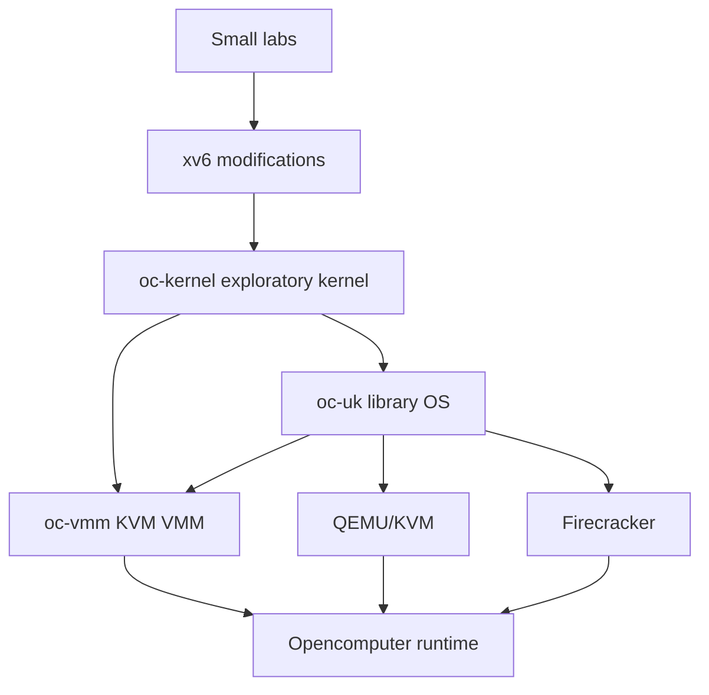
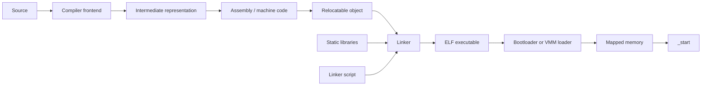
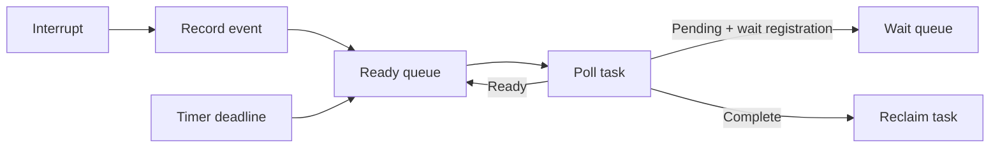
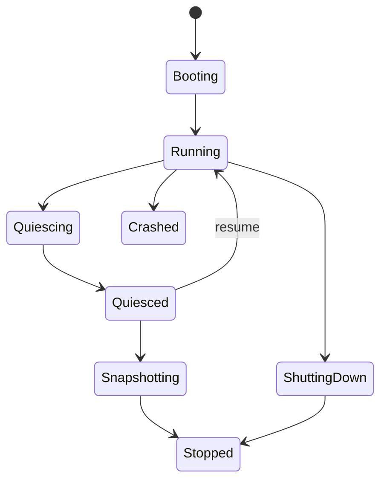
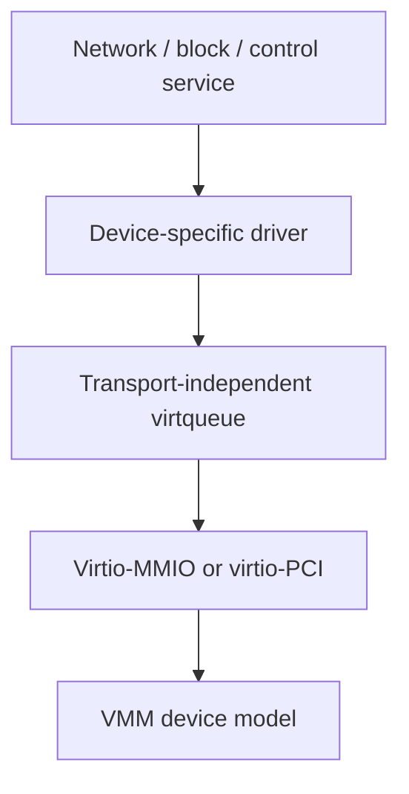
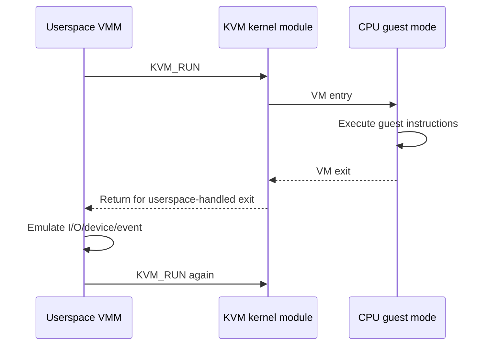
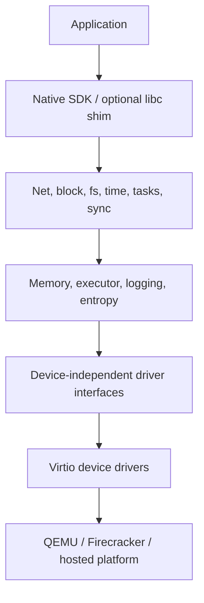
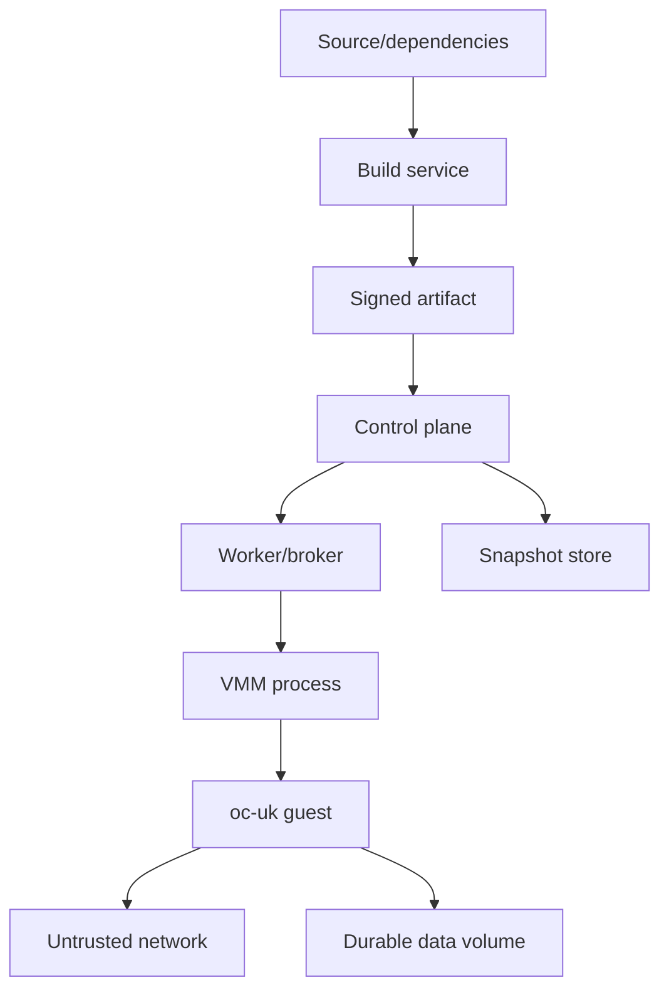
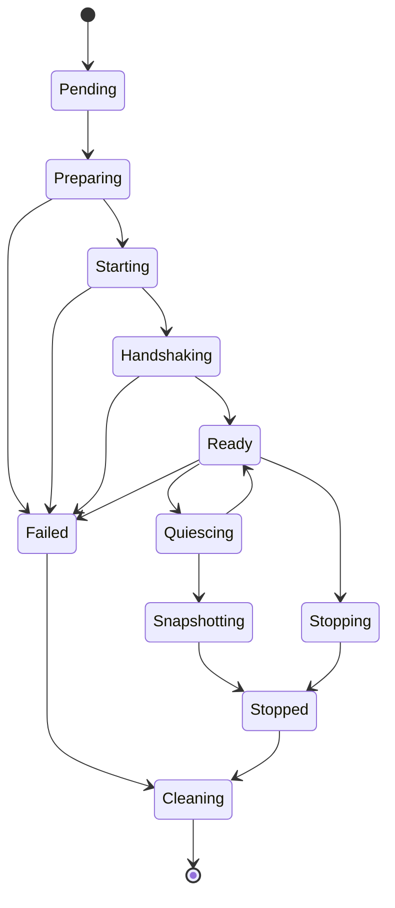
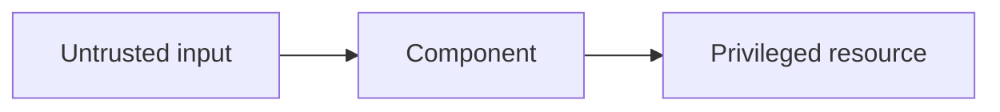

# Unikernel Engineering Handbook

> A complete reading and implementation guide to operating-system internals, x86-64, KVM, virtio, library operating systems, unikernels, Firecracker, and Opencomputer integration.

**Edition:** 1.0  
**Generated:** 2026-07-13  
**Core path:** 60 part-time weeks or approximately 8–10 full-time months  
**Advanced path:** 12–24 additional full-time weeks

This single-file edition is generated from the modular GitHub-ready handbook. The modular edition is easier to navigate and maintain; this file is convenient for search, offline reading, and one-file publication.

## Contents

- [Part I — Core and Advanced Handbook Chapters](#part-i--core-and-advanced-handbook-chapters)
- [Part II — The 60-Week Curriculum](#part-ii--the-60-week-curriculum)
- [Part III — Appendices](#part-iii--appendices)
- [Part IV — Working Templates](#part-iv--working-templates)

---

# Part I — Core and Advanced Handbook Chapters


## Chapter 0 — How to Use This Handbook

### Purpose

This handbook is an implementation course, not a survey. Its goal is to take you from ordinary systems programming to a working application-specific operating system, a small KVM virtual-machine monitor, and an Opencomputer runtime capable of building, launching, checkpointing, and restoring unikernel workloads.

You will repeatedly study a mechanism at four levels:

1. **Conceptual model** — what problem the mechanism solves.
2. **Concrete implementation** — how a small system such as xv6 realizes it.
3. **Authoritative contract** — what the architecture, ABI, protocol, or API specification requires.
4. **Product design** — which parts belong in `oc-uk`, `oc-vmm`, and the Opencomputer control plane.

This sequence prevents two common failure modes: copying tutorial code without understanding it, and reading specifications without ever building enough machinery to make them concrete.

### Learning objectives

By the end of the course you should be able to:

- trace execution from an ELF entry point to a statically linked application;
- explain x86-64 privilege, paging, exceptions, interrupts, and timers;
- implement frame, heap, stack, and DMA allocation;
- design cooperative and preemptive execution;
- implement split virtqueues and virtio-net, block, and vsock drivers;
- create a VM directly through `/dev/kvm` and handle VM exits;
- design a narrow application ABI and a narrow platform ABI;
- port Rust and C applications into a single-address-space library OS;
- threat-model the guest, VMM, snapshot, build, and control-plane boundaries;
- measure boot, memory, network, VM-exit, and restore performance;
- integrate the resulting system into Opencomputer.

### The three systems you will build



#### `oc-kernel`

`oc-kernel` is a learning kernel. It is where you first implement boot, page tables, traps, timers, memory allocation, tasks, and drivers. It may contain experiments and temporary abstractions.

#### `oc-vmm`

`oc-vmm` is a small userspace VMM built on KVM. Its purpose is to make guest memory, vCPU state, VM exits, interrupt injection, device models, and snapshots tangible. It is not initially intended to replace Firecracker.

#### `oc-uk`

`oc-uk` is the actual library operating system. It should have a small platform-independent core, stable application interfaces, platform backends, virtio drivers, a network stack, a host-control channel, and reproducible image generation.

### Recommended initial scope

Use the following constraints until the first HTTP service works:

| Area | Initial choice |
|---|---|
| Architecture | x86-64 |
| Language | Rust plus minimal assembly |
| Standard library | `#![no_std]` |
| Address spaces | One |
| vCPUs | One |
| Scheduling | Cooperative/event-driven |
| Boot | Existing bootloader/protocol for the learning kernel |
| Devices | Virtio-MMIO first |
| Networking | Handwritten ARP/IPv4/ICMP/UDP exercise, then smoltcp |
| Storage | Embedded read-only archive, then virtio-block |
| Control | virtio-vsock |
| Applications | Static linking |
| Compatibility | Native API first, limited POSIX later |
| Build | Cargo in a Nix-pinned environment |
| Artifact | ELF plus embedded manifest |

These constraints are architectural tools. They remove unrelated work so that you can study the unique properties of a library OS.

### Weekly operating rhythm

A productive full-time week is approximately:

| Activity | Hours |
|---|---:|
| Textbook and paper reading | 6–8 |
| Specification reading | 3–4 |
| Source archaeology | 3–5 |
| Implementation | 20–26 |
| Testing, debugging, and benchmarks | 6–8 |
| Notes and design review | 2–4 |

Every week must end with observable evidence:

- a boot log;
- a test result;
- a packet capture;
- a fault report;
- a benchmark;
- a source trace;
- an architecture decision;
- or a reproducible artifact.

Do not count pages read as progress.

### The reading hierarchy

Use materials according to their strengths:

- **CS:APP** explains the machine/software boundary.
- **OSTEP** explains OS abstractions and mechanisms.
- **xv6** provides a complete, compact kernel implementation.
- **Writing an OS in Rust** supplies practical bare-metal scaffolding.
- **OSDev Wiki** provides orientation, terminology, checklists, and common mistakes.
- **Intel/AMD manuals, ELF gABI, psABI, KVM API, Virtio, and RFCs** are authoritative.
- **MirageOS, Solo5, Unikraft, Firecracker, and rust-vmm** show production trade-offs.

OSDev Wiki should not be treated as the final authority for hardware behavior. Use it to find the right concepts and specifications, then verify critical details in the primary source.

### The implementation discipline

Before implementing any hardware-facing structure, write a contract containing:

```text
layout
alignment
endianness
ownership
lifetime
valid states
state transitions
memory ordering
error behavior
reset behavior
snapshot behavior
```

For every unsafe Rust function, document:

```text
what the caller must guarantee
what memory may be accessed
which aliases are permitted
which alignment is required
whether interrupts may run
whether the operation may block
what remains valid after return
```

For every device queue, write down exactly when ownership passes from guest to device and back again.

### Branch and commit strategy

Use one branch per week or lab:

```text
week/01-scope
week/02-lab-environment
week/03-address-types
...
```

Prefer small commits that correspond to independently testable steps:

```text
test: add ELF malformed-input corpus
feat: parse ELF64 program headers
feat: validate load segment ranges
docs: record ELF loader invariants
```

Do not place a week of debugging into one unreviewable commit.

### Completion standard

A subsystem is not complete merely because it works once. It is complete when:

1. its invariants are written down;
2. the happy path has automated tests;
3. malformed input is rejected;
4. failure behavior is observable;
5. the implementation is benchmarked where performance matters;
6. the public API does not leak accidental platform details;
7. the design decision is recorded when alternatives exist.

### Review questions

1. Why are `oc-kernel` and `oc-uk` separate projects?
2. Which components belong in the guest, VMM, and control plane?
3. Why is a booting demo insufficient evidence of correctness?
4. What is the difference between a tutorial, an implementation guide, and an authoritative specification?
5. Which first-version constraints are easiest to relax later, and which would create architectural debt?

### Opencomputer connection

The course is deliberately organized around interfaces Opencomputer will eventually own:

```text
source → reproducible build → signed image → VMM configuration
      → guest control channel → block/network attachment
      → readiness → checkpoint → restore → teardown
```

Keeping these interfaces explicit from the beginning prevents the unikernel from becoming a one-off demo that cannot be scheduled, observed, upgraded, or restored by a real platform.


---

## Chapter 1 — Toolchains, ABIs, ELF, and the Path to `_start`

### Purpose

A unikernel is created as much by its toolchain and linker as by its runtime. Before implementing paging or drivers, you must understand how source code becomes bytes, how those bytes are organized into an ELF image, how a loader maps them, and what the CPU and compiler expect when control reaches `_start`.

### Learning objectives

After this chapter you should be able to:

- describe preprocessing, compilation, assembly, linking, and loading;
- distinguish object-file sections from loadable segments;
- explain symbols, relocations, static archives, and linker garbage collection;
- cross an assembly/Rust boundary using the x86-64 System V ABI;
- write a linker script that creates explicit RX, R, and RW segments;
- explain how `.bss` is initialized and why `p_memsz` can exceed `p_filesz`;
- validate a kernel image before attempting to boot it.

### From source to executable

A simplified native pipeline is:



A relocatable object does not yet have final addresses. It contains code, data, symbols, and relocation records. The linker chooses final locations, resolves symbol references, merges input sections, applies relocations, and emits program headers that tell a loader what to map.

### Sections versus segments

This distinction is foundational:

- **Sections** are a link-time view: `.text`, `.rodata`, `.data`, `.bss`, symbol tables, debug information, relocation tables.
- **Segments** are a load-time view: contiguous ranges that receive permissions and are copied or zero-filled into memory.

A loader normally follows program headers, not section headers. A stripped executable can boot without a section table as long as its loadable segments are valid.

Typical layout:

```text
ELF file
├── ELF header
├── program headers
├── RX load segment
│   ├── .text.boot
│   └── .text
├── R load segment
│   └── .rodata
├── RW load segment
│   ├── .data
│   └── .bss (zero-fill portion)
├── symbols/debug sections (not necessarily loaded)
└── section headers
```

If a segment's in-memory size exceeds its file size, the remainder is initialized to zero. This is the common representation of `.bss`.

### The application binary interface

The ABI is the contract between independently compiled code. It defines, among other things:

- register roles;
- parameter and return-value placement;
- stack alignment;
- caller-saved and callee-saved registers;
- data layout rules;
- object-file conventions;
- process-entry conventions.

For ordinary System V x86-64 functions, the first integer/pointer arguments are passed in registers, selected registers must be preserved by callees, and the stack must meet alignment requirements at call boundaries. Bare-metal startup is different from an ordinary function call: `_start` has no caller and must establish every precondition required by the first Rust function.

### A disciplined startup path

A minimal startup sequence should be explicit:

```text
loader transfers control
    ↓
mask or define interrupt state
    ↓
establish a known stack
    ↓
clear direction flag
    ↓
clear .bss if loader contract does not guarantee it
    ↓
construct/validate boot information
    ↓
call a Rust `extern "C"` entry point
    ↓
never return unexpectedly
```

A useful assembly stub is tiny. Its job is to establish architecture state, not to implement runtime policy.

### Linker-script design

Your linker script should express the memory contract rather than merely concatenate sections. It should:

- set the entry point;
- choose a load address;
- page-align permission boundaries;
- keep startup and manifest sections;
- export image-boundary symbols;
- separate executable, read-only, and writable data;
- make the generated map easy to inspect.

Example scaffold:

```ld
ENTRY(_start)

PHDRS
{
  text   PT_LOAD FLAGS(5); /* R-X */
  rodata PT_LOAD FLAGS(4); /* R-- */
  data   PT_LOAD FLAGS(6); /* RW- */
  note   PT_NOTE;
}

SECTIONS
{
  . = 0xffffffff80200000;
  __image_start = .;

  .text : ALIGN(4096) {
    KEEP(*(.text.boot))
    *(.text .text.*)
  } :text

  .rodata : ALIGN(4096) {
    *(.rodata .rodata.*)
  } :rodata

  .note.oc_uk : ALIGN(4) {
    KEEP(*(.note.oc_uk))
  } :note

  .data : ALIGN(4096) {
    *(.data .data.*)
  } :data

  .bss (NOLOAD) : ALIGN(4096) {
    __bss_start = .;
    *(.bss .bss.* COMMON)
    __bss_end = .;
  } :data

  __image_end = .;
}
```

Do not copy this blindly. Verify whether your boot protocol expects physical or virtual addresses and whether the loader honors the emitted permissions.

### ELF validation pipeline

Treat image validation as a build stage:

```bash
readelf -hW result/kernel.elf
readelf -lW result/kernel.elf
readelf -SW result/kernel.elf
nm -n result/kernel.elf
objdump -d result/kernel.elf
```

Automate checks for:

- expected machine and ELF class;
- entry point inside an executable segment;
- non-overlapping load ranges;
- page-aligned permission changes;
- no RWX segment;
- file ranges within the artifact;
- `p_filesz <= p_memsz`;
- manifest presence;
- load ranges within supported guest memory.

Your own ELF parser should be strict. Never trust offsets or sizes from an untrusted image without checked arithmetic.

### Debugging playbook

#### Immediate reset or no output

Check, in this order:

1. Is the entry point the address you expect?
2. Did the loader map that address?
3. Is the stack mapped and canonical?
4. Is the stack aligned before calling Rust?
5. Is the serial port initialized before use?
6. Did `.bss` contain stale values?
7. Did a relocation assume a different code model or image base?

#### Works in debug, fails in release

Likely causes include undefined behavior, missing volatile accesses, incorrect aliasing, uninitialized memory, stack alignment, or optimizer-visible assumptions that are not true.

#### Symbols look correct but runtime addresses do not

Compare section virtual addresses, program-header virtual/physical addresses, the bootloader's placement contract, and any higher-half offset. Do not infer one from another.

### Exercises

1. Build a static C executable and a Rust executable, then compare sections, segments, symbols, relocations, and dependencies.
2. Modify the linker script to deliberately create an RWX segment; make CI reject it.
3. Change `.bss` to occupy one megabyte and prove that the file grows minimally while the memory image grows.
4. Build an ELF with overlapping load ranges and confirm your parser rejects it.
5. Write a function in assembly that corrupts a callee-saved register; create a test that detects the ABI violation.

### Review questions

1. Why can a loader ignore most section headers?
2. What information is lost when an ELF is reduced to a flat binary?
3. Why is `_start` not an ordinary function?
4. What is the difference between a symbol value and a relocation?
5. Why should permission boundaries be page-aligned?
6. Which ELF fields must be validated with checked arithmetic?

### Opencomputer connection

Opencomputer should validate and identify unikernel artifacts before scheduling them. The image service should extract an embedded manifest, verify architecture and ABI versions, reject unsafe segment layouts, calculate a digest, and sign the resulting metadata. A malformed image should fail in the build or admission path—not after a worker allocates a VM.


---

## Chapter 2 — The x86-64 Machine Model

### Purpose

A kernel or unikernel cannot rely on the host operating system to maintain CPU state. You must know which state exists, who initializes it, what the architecture guarantees, and what causes control to transfer into your handlers.

### Learning objectives

You should be able to:

- identify general, control, segment, model-specific, and extended-state registers;
- explain long mode, canonical addresses, and privilege rings;
- describe the roles of the GDT, TSS, IDT, and local APIC;
- distinguish faults, traps, aborts, and external interrupts;
- reason about the state saved by hardware and the state saved by software;
- create a reliable register dump for postmortem debugging;
- explain how the machine model changes under virtualization.

### Architectural state

Useful categories include:

#### General execution state

```text
RAX RBX RCX RDX
RSI RDI RBP RSP
R8–R15
RIP RFLAGS
```

The ABI assigns conventions to these registers, but exceptions and context switches must preserve whatever state your runtime promises.

#### Control state

```text
CR0  operating mode and protection controls
CR2  faulting linear address for page faults
CR3  root of the active page-table hierarchy
CR4  architectural feature controls
EFER long-mode and syscall-related controls
```

#### Descriptor state

```text
GDTR → Global Descriptor Table
IDTR → Interrupt Descriptor Table
TR   → Task State Segment descriptor
```

Long mode reduces the importance of segmentation for ordinary addressing, but the GDT and TSS still matter for privilege transitions, stack selection, and interrupt-stack-table entries.

#### Extended state

Floating-point, SIMD, and other architectural extensions have separate state. A scheduler that allows tasks to use them must define how that state is initialized, saved, and restored. Ignoring it can create cross-task corruption or information leakage.

### Privilege and control transfer

A unikernel often executes all guest code at ring 0 because the application and library OS are statically combined. That removes user/kernel transitions inside the guest, but it does not remove:

- page permissions;
- exception delivery;
- interrupt delivery;
- VM exits;
- the hypervisor security boundary;
- the need to treat untrusted input as hostile.

Single-address-space does not mean “no protection.” It means protection must come from language safety, memory permissions, narrow capabilities, and the hypervisor rather than a process boundary inside the guest.

### Canonical addresses

Not every 64-bit value is a valid virtual address. x86-64 requires unused high bits to be a sign extension of the highest implemented virtual-address bit. Address wrappers should validate canonicality and use checked arithmetic. A wrapped or noncanonical pointer can cause a general-protection fault rather than a page fault.

### Descriptor tables

#### GDT

For a first long-mode kernel, the GDT normally contains a minimal set of code/data descriptors plus a TSS descriptor. Keep it small and document selector values.

#### TSS

In long mode, the TSS is chiefly useful for:

- privilege-level stack pointers;
- interrupt stack table entries;
- I/O permission bitmap configuration.

Use a dedicated interrupt stack for double faults and possibly other catastrophic exceptions. A stack-overflow-induced page fault cannot safely use the already-corrupted normal stack.

#### IDT

Each IDT entry describes a handler, selector, gate type, privilege level, presence, and optional IST index. The assembly entry path must normalize differences between exceptions that push an error code and those that do not.

### Exception taxonomy

A practical engineering view:

- **Fault**: reported before completion; the instruction may be retried after correction, as with a recoverable page fault.
- **Trap**: reported after an instruction, often used for debugging.
- **Abort**: severe condition with no reliable restart point.
- **External interrupt**: asynchronous event delivered by interrupt hardware.

Your handler API should preserve the vector, optional error code, instruction pointer, stack pointer, flags, and fault-specific state such as CR2.

### Trap-frame design

A good trap frame has one canonical layout regardless of vector. The assembly stub can push a synthetic zero error code for exceptions that do not receive one, then save registers in a fixed order.

```text
high address
┌────────────────────────────┐
│ hardware-saved stack state │
├────────────────────────────┤
│ vector                     │
│ normalized error code      │
├────────────────────────────┤
│ general registers          │
├────────────────────────────┤
│ optional extended metadata │
└────────────────────────────┘
low address
```

Do not let Rust's default struct layout define an assembly ABI. Use explicit representation and static offset checks.

### Interrupt handling rules

Keep first-level handlers short:

```text
validate vector
acknowledge or mask source when required
capture minimal event state
enqueue deferred work
return
```

Avoid allocation, blocking, complex formatting, and nested lock acquisition in interrupt context until you have designed explicit support for them.

### Virtualization perspective

Under KVM, most guest instructions execute directly on the CPU in non-root guest mode. Selected operations, device accesses, or configured events cause VM exits. The guest still observes architectural exceptions and interrupts, but the VMM may synthesize device state and inject interrupts. Debugging therefore requires tracing both guest state and VMM exit handling.

### Debugging playbook

#### Triple fault / VM reset

Typical causes:

- invalid IDT entry;
- exception handler faults before a valid double-fault path exists;
- bad stack or TSS;
- returning with a mismatched frame;
- loading an invalid GDT/IDT limit or base.

Run QEMU without automatic reboot, enable guest-error logging, attach GDB before loading the table, and single-step the faulting instruction.

#### Wrong exception vector

Check stub generation, error-code normalization, gate indexing, and whether the CPU delivered a secondary exception while entering the first handler.

#### Handler returns into nonsense

Check stack layout, register push/pop order, stack alignment, and whether the return instruction matches the privilege transition and frame shape.

### Exercises

1. Generate all IDT stubs from one macro and verify their binary layout.
2. Trigger divide error, invalid opcode, breakpoint, general-protection fault, page fault, and double fault.
3. Add a guard page below a deliberately small stack and produce a reliable double-fault report.
4. Save and restore an artificial CPU context in userspace, then port the layout to the kernel.
5. Add static assertions for every trap-frame field offset consumed by assembly.

### Review questions

1. Why does a long-mode kernel still need a GDT?
2. Why is the TSS useful even without hardware task switching?
3. Which exceptions carry hardware error codes?
4. Why can a stack overflow turn an ordinary page fault into a double fault?
5. What additional state must be considered once tasks use SIMD?
6. Why does ring 0 application execution not eliminate security engineering?

### Opencomputer connection

Reliable fault reports are essential in a remote execution platform. `oc-uk` should emit a compact machine-readable crash record containing image digest, build ID, vCPU, vector, error code, RIP, stack bounds, selected registers, and a bounded backtrace. The worker should capture this record before tearing down the VM and attach it to the sandbox lifecycle event.


---

## Chapter 3 — Physical Memory, Virtual Memory, and Allocation

### Purpose

Memory management connects the linker, bootloader, CPU, allocator, drivers, application, and hypervisor. Most catastrophic early-kernel bugs are memory-contract bugs: an address is interpreted in the wrong domain, a page-table bit is wrong, an allocator returns overlapping memory, or a DMA buffer is not visible to the device as expected.

### Learning objectives

You should be able to:

- distinguish virtual, guest-physical, host-virtual, and host-physical addresses;
- walk an x86-64 page-table hierarchy;
- create mappings with explicit permissions and ownership;
- implement frame, heap, stack, and DMA allocation;
- explain TLB behavior and invalidation;
- design guard pages and direct-physical mappings;
- define memory invariants that survive snapshot and restore.

### Address domains

In a virtualized system, at least four address domains may be relevant:

```text
guest virtual address (GVA)
    ↓ guest page tables

guest physical address (GPA)
    ↓ EPT/NPT managed by KVM

host physical address (HPA)

host virtual address (HVA)
    ↕ VMM process mappings of guest RAM
```

The VMM usually manipulates guest memory through an HVA corresponding to a GPA. The guest driver puts GPAs into virtio descriptors. The guest application normally uses GVAs. These domains must not be represented by the same naked integer type.

### Page-table hierarchy

For conventional four-level x86-64 paging, a virtual address is divided into indexes plus a page offset:

```text
| sign extension | PML4 | PDPT | PD | PT | offset |
```

Each entry contains an address and flags. Effective permissions are constrained by all levels in the walk. A writable leaf under a read-only parent remains read-only. Execute-disable behavior similarly composes through the hierarchy.

Your page-table API should make intent explicit:

```rust
map_page(
    virtual_page,
    physical_frame,
    PagePermissions::READ | PagePermissions::EXECUTE,
    MappingOwner::KernelImage,
)
```

Avoid a generic `u64 flags` argument scattered throughout the codebase.

### Recommended virtual layout

A simple first layout might include:

```text
low canonical range
├── null guard / intentionally unmapped
├── optional identity bootstrap mappings
└── MMIO window if needed

high canonical range
├── kernel image
├── read-only manifest/config
├── direct physical map
├── heap
├── task stacks with guard pages
└── temporary mapping window
```

The exact addresses are less important than documenting invariants and preventing accidental overlap.

### Physical-frame allocator

Start with a memory map from the boot environment. Normalize overlapping and adjacent entries, reserve everything already in use, and then expose frames through a typed allocator.

Implementation progression:

1. **Early bump allocator** for bootstrap page tables and metadata.
2. **Bitmap allocator** for simplicity and strong validation.
3. Optional **buddy allocator** if large contiguous allocations or scalability require it.
4. Per-CPU caches only after SMP and measurement justify them.

Required checks:

- no frame allocated twice;
- reserved ranges never returned;
- alignment and range arithmetic checked;
- free rejects unknown or already-free frames;
- metadata itself is reserved;
- allocation statistics remain consistent.

### Heap allocation

The heap allocator should be replaceable. A first implementation can use a linked-list allocator or a maintained allocator adapted to your environment. Separate the concerns:

```text
virtual-range allocator
    ↓
page mapper
    ↓
physical-frame allocator
    ↓
heap suballocator
```

Do not make the heap responsible for arbitrary page-table manipulation.

### Stacks

Allocate stacks as regions with at least one unmapped guard page. Record bounds in task metadata so crash reporting can detect whether RSP is plausible.

```text
higher addresses
┌─────────────────────┐
│ mapped stack pages  │
├─────────────────────┤
│ unmapped guard page │
└─────────────────────┘
lower addresses
```

Consider a second guard at the high end if stack direction or corruption risks justify it.

### DMA memory

A DMA allocation contract must define:

- guest-physical contiguity requirements;
- alignment;
- device-visible address;
- ownership transfer;
- cache-coherency assumptions;
- pinning/lifetime;
- whether the memory may be reclaimed while a request is in flight.

With virtio in a typical coherent x86 VM, cache maintenance is simpler than on noncoherent hardware, but compiler and CPU ordering still matter. The queue and buffer must remain alive until the device returns ownership.

### Permissions and hardening

Enforce permissions from the first working page-table implementation:

```text
kernel code       R-X
read-only data    R--
writable data     RW-
heap              RW-
stacks            RW- plus guard pages
DMA               RW-
configuration     R-- after initialization
page zero         unmapped
```

If writable executable memory is temporarily necessary during relocation or JIT-like setup, make the transition explicit, narrow, and audited. A first unikernel should normally avoid it entirely.

### TLB behavior

Changing a page-table entry does not automatically guarantee every CPU stops using cached translation state. On a single vCPU, invalidate the affected page or reload the address-space root according to the architectural requirements. With multiple vCPUs, you need a shootdown protocol. That complexity is one reason to defer SMP.

### Snapshot implications

A memory snapshot preserves allocator metadata and page contents. Restore must use the same image/configuration contract and device topology. If the guest stores host-derived values such as wall-clock offsets, external connection state, or entropy pools, the restore path must explicitly repair or refresh them.

### Debugging playbook

#### Page fault after enabling your own tables

Check:

1. Is the currently executing instruction mapped?
2. Is the stack mapped through the switch?
3. Is the page-table root physical address correct?
4. Are intermediate entries present?
5. Are reserved bits zero?
6. Is the address canonical?
7. Is NX enabled and consistent with permissions?

#### Heap corruption

Reduce to one allocator, enable red zones/canaries, poison freed memory, log allocations by call site, and run hosted randomized tests. Do not debug the allocator only inside QEMU.

#### Virtio sees garbage

Verify the address placed in the descriptor is a GPA, not a GVA or HVA. Confirm the buffer is mapped, aligned, initialized, and published before notification.

### Exercises

1. Write a host-side page-table simulator and compare it with live guest walks.
2. Build a bitmap frame allocator with property tests for random allocate/free sequences.
3. Map the same physical frame at two virtual addresses and demonstrate aliasing.
4. Enforce read-only `.rodata`, then deliberately attempt a write and verify the fault report.
5. Add stack guard pages and produce a deterministic overflow test.
6. Implement a temporary mapping window for inspecting arbitrary physical frames.

### Review questions

1. Why does a VMM normally provide a GPA to HVA mapping rather than a GVA mapping?
2. How do permissions at intermediate page-table levels affect a leaf mapping?
3. Why should allocator metadata itself be reserved?
4. What must remain valid while a DMA request is in flight?
5. Why does adding a second vCPU complicate page-table updates?
6. Which memory state must be refreshed after cloning a snapshot?

### Opencomputer connection

Opencomputer should treat requested guest memory, image load ranges, block mappings, and snapshot memory as one validated plan. The worker must reject overlapping or impossible regions before creating the VM. Memory accounting should distinguish committed guest RAM, VMM overhead, shared immutable pages, snapshot working set, and host page-cache effects so scheduling decisions use real—not nominal—cost.


---

## Chapter 4 — Concurrency, Scheduling, and Event-Driven Execution

### Purpose

A unikernel can avoid much of the process machinery of a general-purpose OS, but it still needs to coordinate timers, network packets, block completions, application tasks, and shutdown. The first design decision is whether to use threads and preemption, cooperative tasks, an async executor, or a mixture.

### Learning objectives

You should be able to:

- distinguish concurrency from parallelism;
- explain interrupt, task, and vCPU execution contexts;
- use atomics and locks with explicit memory-ordering arguments;
- design a cooperative event loop with wait queues and timers;
- identify lost wake-ups, lock-order cycles, and priority inversion;
- add preemption without corrupting scheduler invariants;
- explain the extra work required for SMP.

### Execution contexts

A first `oc-uk` runtime has at least these contexts:

```text
boot context
interrupt context
executor/task context
idle context
host-control callback context
panic/shutdown context
```

Each context needs explicit rules. For example, interrupt context should not block or perform arbitrary allocation. Panic context should avoid locks that may already be held. Host-control callbacks should not mutate application state without a synchronization or message-passing contract.

### Cooperative first

A cooperative executor is a strong initial choice because:

- context switches occur at explicit points;
- most invariants can be reasoned about without arbitrary preemption;
- an event-driven network stack integrates naturally;
- single-vCPU execution avoids data races between tasks unless interrupts intervene;
- debugging is substantially easier.

A minimal model:



The hardest part is not polling tasks; it is making registration and wake-up atomic enough to avoid a task going to sleep after its event has already occurred.

### Wait-queue invariant

A useful invariant is:

> A task is either runnable, running, blocked on exactly one owned wait registration, or complete—never in two states simultaneously.

Implement state transitions with one synchronization domain. Avoid separately updating a task state and queue membership without a protocol that prevents races.

### Timers

Use monotonic time for scheduling. A deadline queue can be implemented as a binary heap initially. The timer interrupt should advance or sample the clock, mark expired timers, and enqueue work. Wall-clock time is configuration or a service, not the basis of scheduler correctness.

Define behavior for:

- deadline in the past;
- overflow when adding duration;
- timer cancellation;
- task destruction with an active timer;
- snapshot pause duration;
- clock-source changes.

### Locks and interrupt safety

On a single vCPU, ordinary task code can still be interrupted while holding a lock. If an interrupt handler attempts the same lock, the guest deadlocks. Options include:

- disable relevant interrupts around the critical section;
- ensure interrupt handlers never acquire task locks;
- use lock-free handoff from interrupt to deferred work;
- split data into interrupt-owned and task-owned portions.

A lock type should encode or document its interrupt policy. “It is single-core” is not a sufficient synchronization argument.

### Memory ordering

Atomics coordinate both compiler and CPU behavior. Use the weakest ordering you can correctly justify, but optimize only after establishing a simple correct version. In queue publication, the producer must make descriptor and buffer writes visible before updating the shared index or notifying the consumer. The consumer must acquire visibility before reading the published data.

The question to write in every review is:

```text
Which write must happen before which read, and what creates that ordering?
```

### Adding preemption

Preemption requires:

- a timer interrupt capable of requesting reschedule;
- complete context save/restore;
- preemption-disable regions;
- scheduler data structures safe against interrupt-time access;
- defined behavior inside locks and unsafe code;
- stack and extended-state management;
- careful return paths.

Add preemption only after the cooperative executor has strong tests. One approach is deferred preemption: the timer marks a reschedule flag, and the actual switch happens at a safe boundary.

### SMP

Multiple vCPUs introduce true parallelism and require:

- per-CPU state;
- startup of application processors;
- inter-processor interrupts;
- TLB shootdowns;
- scalable allocation and scheduling;
- lock-order discipline;
- memory-reclamation strategy;
- device interrupt routing;
- snapshot coordination across vCPUs.

A sensible first SMP design uses per-CPU run queues, pinned tasks, and no task migration. General work stealing can come later.

### Debugging playbook

#### Task never wakes

Inspect the ordering between event observation and wait registration. Add unique IDs to tasks and wait objects. Log state transitions, not merely function entry. Build a deterministic hosted test where the event fires at every possible point in the registration sequence.

#### Sporadic deadlock

Record lock acquisition order and ownership. Add a debug-only lock graph or rank system. Check interrupt reentrancy and panic paths, not only task-to-task contention.

#### Works with logging, fails without it

Suspect timing, missing atomics, uninitialized state, or optimizer-sensitive undefined behavior. Logging can accidentally serialize execution.

#### CPU at 100% while idle

Check tasks that continuously self-wake, timer programming, interrupt acknowledgement, eventfd behavior in the VMM, and whether the idle path uses an appropriate halt/wait instruction.

### Exercises

1. Build a hosted executor whose event sources are pipes, timerfds, and eventfds.
2. Create a lost-wake-up bug intentionally, then write a deterministic regression test.
3. Implement an interrupt-to-task SPSC queue and justify its ordering.
4. Add cancellation to timer waits without use-after-free.
5. Add scheduler tracing and render a timeline from structured events.
6. Implement deferred preemption and compare tail latency with purely cooperative execution.

### Review questions

1. Why can a single-vCPU system still deadlock on a spin lock?
2. What invariant prevents a task from being both runnable and blocked?
3. Why should scheduler deadlines use monotonic time?
4. What is the difference between atomicity and memory ordering?
5. What new state must be saved once SIMD is permitted?
6. Which SMP feature creates the need for TLB shootdowns?

### Opencomputer connection

An Opencomputer workload must respond to stop, quiesce, checkpoint, and shutdown requests. The runtime therefore needs cancellation and quiescing as first-class concepts, not afterthoughts. The scheduler should expose bounded metrics—runnable tasks, blocked tasks, longest poll duration, timer lag, and event-queue depth—through the host control channel so the platform can distinguish a busy workload from a wedged guest.


---

## Chapter 5 — OS Interfaces Through xv6

### Purpose

Before removing processes, users, system calls, and a general filesystem from your own system, you must understand what those abstractions accomplish. xv6 is compact enough to trace end to end and complete enough to show the interactions among traps, page tables, scheduling, file descriptors, filesystems, locks, and devices.

### Learning objectives

You should be able to:

- trace a user call through a trap into the kernel and back;
- explain process state, kernel stacks, context switching, and scheduling;
- describe page faults, copy-on-write, and address-space teardown;
- explain sleeping, wake-up, and lost-wake-up prevention;
- trace file operations through inodes, buffer cache, logging, and block I/O;
- identify which Unix abstractions a first unikernel can eliminate;
- separate teaching simplifications in xv6 from universal OS principles.

### Read xv6 as a set of complete paths

Do not read the source file by file. Trace operations across files.

#### System-call path

```text
user wrapper
  → architecture trap instruction
  → trampoline entry
  → trap-frame save
  → syscall number dispatch
  → implementation
  → trap return
  → user continuation
```

Questions to answer:

- Which stack is active at each stage?
- Which page table is active?
- Where are arguments validated?
- What happens if a pointer crosses an unmapped page?
- Which state is trusted and which is copied?

#### Scheduling path

```text
running process
  → blocks, yields, or is preempted
  → kernel context switch
  → scheduler context
  → choose runnable process
  → switch to process kernel context
  → return toward user mode
```

Separate the architecture-specific context switch from policy. This separation will later guide your `oc-uk` executor and `oc-vmm` vCPU loop.

#### File-write path

```text
write(fd, buffer, n)
  → file object
  → inode operation
  → block mapping
  → buffer cache
  → log transaction
  → block driver
```

Study where locks are held, where code may sleep, and what makes a transaction crash-consistent.

### What xv6 teaches well

xv6 is especially useful for:

- explicit invariants;
- readable trap and syscall paths;
- small page-table code;
- process lifecycle;
- lock and sleep/wakeup interaction;
- inode and logging structure;
- complete source-level tracing.

### What xv6 does not represent fully

Do not infer production design directly from xv6. It simplifies:

- scalability;
- security hardening;
- device breadth;
- complex VM policies;
- network stack behavior;
- NUMA;
- asynchronous I/O;
- production filesystems;
- observability;
- compatibility.

The correct question is not “How do I copy xv6?” but “Which invariant or mechanism is xv6 making visible?”

### Process machinery versus unikernel machinery

A conventional process model provides:

- separate virtual address spaces;
- privilege transitions;
- user pointer validation;
- process identifiers and lifecycle;
- signals and exit status;
- file descriptor tables;
- resource accounting;
- isolation among applications.

A single-application unikernel may eliminate most of these internally. However, the Opencomputer platform still needs workload identity, resource accounting, lifecycle state, and isolation—those responsibilities move to the VMM and control plane rather than disappearing.

### Page faults and copy-on-write

The copy-on-write lab is valuable because it forces precise ownership reasoning:

```text
parent and child PTEs point to one frame
    ↓
write permission removed
    ↓
write fault
    ↓
validate COW mapping
    ↓
allocate/copy or reuse based on reference count
    ↓
update PTE and invalidate translation
```

The same style of reasoning applies to immutable image pages, snapshot sharing, and copy-on-write workspace disks in Opencomputer.

### Sleep and wake-up

The classic lost-wake-up pattern occurs when a task checks a condition, an event occurs, and then the task sleeps after the wake-up has already been sent. xv6's sleep/wakeup design demonstrates why condition checking and sleep registration must be coordinated under a lock.

Translate the lesson into your executor:

```text
observe condition
register interest
recheck condition
park task
```

The exact API differs, but the race does not.

### Filesystem and logging lessons

The xv6 log illustrates transaction boundaries and recovery rather than a production filesystem. Focus on:

- which writes form one invariant-preserving unit;
- why metadata ordering matters;
- how replay decides whether a transaction committed;
- why cache state and durable state differ;
- what application consistency requires beyond filesystem consistency.

For a first unikernel, you may use a read-only image plus an append-only data format. The xv6 filesystem phase still teaches why writes and snapshots require quiescing and flush semantics.

### Implementation method for the labs

For every MIT lab:

1. Read the named xv6 chapter and source files.
2. Draw the relevant path before editing code.
3. Write the invariants and failure cases.
4. Add tracing before changing behavior.
5. Implement the smallest increment.
6. Run provided tests and add one adversarial test.
7. Write a postmortem explaining any incorrect first design.

### Instrumentation to add

Create a small tracing facility with fixed-size events:

```c
struct trace_event {
    uint64 ticks;
    uint32 cpu;
    uint16 kind;
    uint16 flags;
    uint64 a;
    uint64 b;
};
```

Use it for:

- syscall entry/exit;
- page faults;
- context switches;
- sleep/wakeup;
- lock contention;
- block transactions;
- network interrupts.

Export traces after tests rather than printing from sensitive paths.

### Debugging playbook

#### xv6 hangs after a lock change

Check lock order, sleeping while holding a spin lock, interrupts disabled too long, and missing wakeups. Use per-lock acquisition counters and owner information in debug builds.

#### Copy-on-write fails only during exit

Check reference counts, page-table teardown, shared trampoline mappings, and whether a page is decremented more than once.

#### Filesystem test passes until simulated crash

Check whether commit state reaches disk before dependent metadata, whether recovery replays only complete transactions, and whether buffer-cache writes escape the intended transaction.

### Exercises

1. Add a syscall trace filtered by process and syscall number.
2. Add page-fault counters by cause and render a histogram.
3. Implement a scheduling policy and measure fairness and turnaround.
4. Add lock-wait instrumentation and identify the hottest lock.
5. Inject a crash after each filesystem log write and classify recovery outcomes.
6. Write a document listing every xv6 subsystem your first unikernel omits and where its responsibilities move.

### Review questions

1. Why does a process need both a user stack and a kernel stack?
2. Which state is saved by the trap entry and which by the context switch?
3. What prevents a lost wake-up in xv6?
4. Why is copy-on-write fundamentally an ownership problem?
5. What guarantee does the filesystem log provide, and what does it not provide?
6. Which process responsibilities must Opencomputer still implement externally?

### Opencomputer connection

xv6 provides a useful responsibility map. Opencomputer replaces process isolation with VM isolation, replaces process lifecycle with sandbox lifecycle, replaces an in-guest package environment with immutable artifacts and attached volumes, and replaces local syscalls for orchestration with a host-control protocol. The abstractions move across the guest/VMM boundary; they do not vanish.


---

## Chapter 6 — Boot, Build, Test, and Debug Bare-Metal Code

### Purpose

The earliest kernel code runs in an environment where ordinary diagnostics do not exist. A reproducible build, serial output, machine-readable test exit, linker inspection, and debugger attachment are not optional tooling; they are the foundation that makes every later subsystem possible.

### Learning objectives

You should be able to:

- define a reproducible Nix-based systems laboratory;
- boot a freestanding x86-64 ELF through a documented protocol;
- initialize serial output before complex runtime code;
- run automated VM tests with deterministic pass/fail reporting;
- attach GDB before the first guest instruction;
- inspect QEMU logs and CPU state after fatal faults;
- minimize a failure into a reproducible test.

### Reproducible environment

Pin the compiler, target components, linker, QEMU, GDB, binutils, and helper tools. A useful development shell contains:

```text
rustc cargo rust-src llvm-tools
clang lld binutils nasm
qemu-system-x86_64 gdb
python socat tcpdump jq just
```

Nix should define the tool environment, while Cargo manages Rust packages. Keep the boundary clear: Nix pins external tools and system dependencies; Cargo defines Rust crates and features.

### Repository commands

A new contributor should need only:

```bash
nix develop
just test
just run
just debug
just inspect
```

Recommended commands:

```text
build       compile the selected image
run         boot with serial attached
debug       boot paused and start/print GDB instructions
test        run hosted and VM tests
inspect     print ELF headers, segments, symbols, and size
bench       run selected benchmark
fmt         format all supported languages
lint        clippy/static checks/shell checks
clean       remove generated artifacts
```

### Boot protocol choice

Use an existing bootloader or direct-kernel protocol for the exploratory kernel. The goal is to learn kernel mechanisms, not firmware parsing. Your boot interface should provide or allow discovery of:

- memory map;
- image bounds;
- command line or configuration;
- framebuffer only if desired;
- ACPI or platform tables if needed;
- modules/embedded files;
- an initial stack and CPU mode contract.

Immediately normalize protocol-specific data into your own `BootInfo` type. Do not let bootloader structs leak across the kernel.

### Serial first

COM1 output is simple, scriptable, and visible in headless CI. Initialize it before the heap, scheduler, or rich logger. Keep a minimal emergency write path that does not allocate or take ordinary locks.

A layered design:

```text
raw UART byte output
    ↓
nonallocating emergency formatter
    ↓
structured logger after initialization
    ↓
host log collector
```

Avoid depending on VGA or a graphical console for correctness.

### Machine-readable VM tests

A test VM should terminate with a status the host can interpret. Under QEMU, common approaches include a dedicated debug-exit device or a controlled shutdown protocol. Whichever mechanism you use, define:

```text
success code
failure code
panic code
infrastructure timeout
unexpected reset
```

The host runner must distinguish a guest test failure from QEMU failing to start.

### GDB workflow

Start QEMU paused with a GDB server, then load symbols from the exact ELF used to boot. Maintain a checked-in GDB command file:

```gdb
set pagination off
set disassembly-flavor intel
target remote :1234
symbol-file result/oc-kernel.elf
break _start
continue
```

Useful operations:

- inspect `rip`, `rsp`, `cr0`, `cr2`, `cr3`, `cr4`;
- walk stack memory;
- inspect page-table entries;
- disassemble around `rip`;
- set hardware watchpoints;
- single-step table loads and control-register writes.

Be careful with source-level stepping through optimized code. Assembly and register state are the final truth.

### QEMU diagnostic modes

Use targeted logging rather than enabling everything permanently. Useful categories include guest errors, interrupt activity, MMU behavior, and CPU reset state. Disable reboot after fatal faults so evidence remains available. Record the complete QEMU command line in test output.

### Layered test strategy

```text
hosted unit tests
    ↓
property/fuzz tests
    ↓
small VM subsystem tests
    ↓
full boot integration tests
    ↓
load/failure tests
```

Parsing, allocators, queue logic, network protocol validation, manifest handling, and snapshot decoding should be tested in normal processes whenever possible. Reserve VM tests for architecture and device behavior.

### Reproducibility record

Every benchmark and fault report should include:

```text
git commit
Rust toolchain
linker version
QEMU/VMM version
host kernel
host CPU model
build profile
image digest
VM configuration
```

Without this data, performance changes and low-level failures are difficult to reproduce.

### Debugging playbook

#### No serial output

Confirm QEMU serial routing, I/O port permissions/implementation, UART initialization, entry point, stack, and whether the CPU reset before the first write. Use a one-byte write in assembly before Rust.

#### GDB breakpoints appear at wrong addresses

Ensure the symbol file matches the booted artifact and account for higher-half or relocation offsets. Compare `readelf -l`, the loader's chosen address, and runtime RIP.

#### CI hangs

Add host-side timeouts, capture serial to an artifact, disable interactive devices, report QEMU stderr, and map every exit status. A timeout should produce the last N kilobytes of guest logs and configuration.

#### Test passes locally but not under Nix/CI

Check undeclared tools, host CPU assumptions, KVM availability, architecture-specific compiler flags, network privileges, and reliance on `/tmp` or current directory.

### Exercises

1. Create a VM test that deliberately passes, fails, panics, and hangs; verify the runner classifies all four.
2. Boot with one-byte assembly serial output before any Rust code.
3. Add `scripts/inspect-image` that rejects unsafe segment permissions.
4. Reproduce a page fault entirely from saved CI artifacts.
5. Run the same guest with TCG and KVM and record behavioral/performance differences.
6. Create a minimized boot test containing only startup, serial, and shutdown.

### Review questions

1. Why should boot-protocol structures be normalized immediately?
2. Which tests should run outside a VM?
3. Why is a serial logger still needed after adding vsock?
4. What makes a VM test result machine-readable?
5. Why can source-level GDB views be misleading under optimization?
6. Which environment details are essential in a benchmark record?

### Opencomputer connection

The worker runtime needs the same discipline at scale: deterministic command construction, exact image/configuration identity, bounded startup time, serial/control log capture, explicit readiness, and categorized termination. The local test runner is the prototype of the production lifecycle supervisor.


---

## Chapter 7 — Interrupts, Time, Entropy, and Lifecycle State

### Purpose

Timers, interrupts, clocks, and entropy are deceptively cross-cutting. They influence scheduling, networking, TLS, timeouts, snapshots, and security. A correct implementation must distinguish event delivery from time measurement and monotonic time from wall-clock time.

### Learning objectives

You should be able to:

- route and acknowledge interrupts correctly;
- program or consume a virtual timer source;
- maintain a monotonic clock and deadline queue;
- distinguish wall time, monotonic time, and CPU cycle counters;
- initialize and reseed entropy safely;
- explain how suspend, restore, and cloning affect time and randomness;
- design lifecycle-safe timer and entropy APIs.

### Interrupt routing

A virtual platform may deliver interrupts through legacy-compatible mechanisms, an APIC, MSI/MSI-X, or transport-specific mechanisms. Your platform layer should normalize this into:

```rust
register_handler(vector, handler)
mask(source)
unmask(source)
acknowledge(source)
set_affinity(source, vcpu)
```

The device driver should not need to know every detail of the host VMM's interrupt implementation.

### Timer sources

Possible sources include emulated legacy timers, local APIC timer, HPET, paravirtual clocks, or calibrated cycle counters. Choose the simplest source supported by your target, then hide it behind a monotonic clock interface.

A timer mechanism has two distinct jobs:

1. **Measure time** — answer “what is the monotonic time now?”
2. **Deliver an event** — interrupt or wake the guest near a deadline.

Do not conflate tick counting with accurate time. Periodic ticks are simple but create unnecessary exits and interrupt overhead. A later design can program one-shot deadlines.

### Monotonic time

Monotonic time must never move backward within one running instance. Represent deadlines with checked arithmetic and a well-defined epoch meaningful only inside the instance.

API sketch:

```rust
pub trait MonotonicClock {
    fn now(&self) -> Instant;
}

pub trait DeadlineTimer {
    fn arm(&mut self, deadline: Instant) -> Result<(), TimerError>;
    fn disarm(&mut self);
}
```

Avoid using wall-clock timestamps for scheduler decisions. Wall clock can jump because of synchronization or administrator action.

### Snapshot and restore

A restored VM may resume after seconds, hours, or days. Decide whether guest monotonic time:

- includes suspended duration;
- excludes suspended duration;
- or is explicitly rebased.

For application timeout behavior, excluding suspended duration is often intuitive for “continue where I left off,” while external leases and credentials may need real elapsed time. There is no universal answer; expose policy and record it in snapshot metadata.

### Entropy

Entropy is required for:

- cryptographic keys;
- TCP sequence and port randomization;
- identifiers;
- randomized algorithms;
- stack/address randomization if implemented.

Do not seed a deterministic PRNG solely from time, MAC address, or image digest. Prefer a virtual entropy device or host-provided cryptographic seed delivered at boot through a trusted channel.

A robust model:

```text
host obtains cryptographic entropy
    ↓
per-instance boot seed
    ↓
guest CSPRNG initialization
    ↓
periodic/explicit reseed where supported
```

On snapshot clone, two guests must not continue from identical PRNG state. Reseed before exposing network or secret-dependent operations. If the snapshot contains long-lived private keys, cloning also has identity implications beyond PRNG state.

### Wall-clock time

Treat wall clock as an external service with an uncertainty and trust model. For a small first runtime, receive a boot timestamp plus monotonic anchor from the host. Later you may add a paravirtual clock or network synchronization.

Define behavior when wall time is unavailable. Most core runtime functions should continue operating with monotonic time only.

### Lifecycle API

A useful lifecycle state machine:



Timer creation, entropy use, network acceptance, and block writes should be constrained by lifecycle state. For example, quiescing should prevent new application work while allowing in-flight operations to drain.

### Debugging playbook

#### Timers fire too quickly or slowly

Check frequency conversion, integer overflow, calibration, virtualization of the cycle counter, and whether units are mixed. Store conversion tests for boundary values.

#### Guest consumes a full host CPU while idle

Check whether the timer remains continuously expired, whether the interrupt is acknowledged, and whether the idle loop actually halts/waits.

#### Restored TLS or identifiers repeat

Assume duplicated PRNG state until proven otherwise. Add an explicit post-restore reseed event and tests that clone one snapshot twice.

#### Timeout occurs immediately after restore

Inspect monotonic rebase policy and serialized deadline representation. Prefer serializing relative remaining duration or restoring the clock epoch coherently.

### Exercises

1. Implement a host-tested deadline heap with insertion, cancellation, and randomized tests.
2. Measure periodic versus one-shot timer VM exits.
3. Clone one memory snapshot twice and verify random streams diverge after restore.
4. Simulate wall-clock jumps while confirming scheduler deadlines remain correct.
5. Add a lifecycle state machine that rejects invalid operations.
6. Define a snapshot policy for external leases, credentials, and network timeouts.

### Review questions

1. Why are time measurement and event delivery separate concerns?
2. Why should scheduler time be monotonic?
3. What happens to a future deadline when a VM is suspended for an hour?
4. Why is cloning a PRNG state dangerous?
5. Which operations should be disallowed while quiescing?
6. How can a periodic guest timer increase host VM-exit load?

### Opencomputer connection

Opencomputer should inject per-instance entropy and explicit time metadata, record snapshot pause/resume policy, and rotate ephemeral credentials after restore. The worker and guest should agree on lifecycle state through the control channel so a snapshot is never mistaken for a durable application checkpoint when writes or external protocols remain in flight.


---

## Chapter 8 — Device Driver Engineering: MMIO, DMA, Queues, and Interrupts

### Purpose

Virtual devices are simpler than arbitrary physical hardware, but they still require precise contracts. Driver bugs often come from address-domain confusion, descriptor lifetime mistakes, missing ordering, incomplete reset handling, or assumptions about well-behaved devices.

### Learning objectives

You should be able to:

- distinguish port I/O, MMIO, and DMA;
- design typed register blocks and safe access wrappers;
- define device state machines and reset behavior;
- implement producer/consumer queues with ownership transfer;
- separate interrupt handling from deferred completion work;
- validate device-provided lengths, indexes, and identifiers;
- test a driver against a fake device before booting a VM.

### Three communication mechanisms

#### Port I/O

The CPU executes special instructions to access an I/O port namespace. This is common for legacy x86 devices such as a serial port.

#### MMIO

Registers are mapped into the address space. Accesses must use volatile semantics and correct widths. The compiler must not remove, combine, or reorder accesses in ways prohibited by the device contract.

#### DMA

The device reads or writes memory without the CPU copying every byte. The driver gives the device a device-visible address and must keep the memory valid until ownership returns.

### Register access design

Avoid exposing arbitrary pointers. Wrap registers by width and access mode:

```rust
pub struct ReadOnly<T> { /* ... */ }
pub struct WriteOnly<T> { /* ... */ }
pub struct ReadWrite<T> { /* ... */ }
```

A register contract should record:

- offset;
- width;
- permitted access sizes;
- reset value;
- reserved bits;
- write-one-to-clear behavior;
- side effects;
- ordering requirements.

Never use a packed Rust struct and take references to potentially unaligned fields. Compute offsets or use carefully designed wrappers.

### Device state machine

Every driver should make initialization explicit:

```text
reset
  → detect/present
  → acknowledge
  → identify driver
  → negotiate features
  → allocate/configure queues
  → mark driver ready
  → operate
  → quiesce
  → reset
```

Reject impossible transitions. If initialization fails, reset the device and release all resources. Do not leave half-owned queue memory behind.

### Ownership model

For each request buffer, ownership moves through states:

```text
free
  → driver preparing
  → published to device
  → device owned/in flight
  → completion visible
  → driver reclaiming
  → free
```

The driver must not mutate or free device-owned memory. The device's completion data is untrusted until validated.

### Interrupt versus polling

Polling is useful for initial correctness because it removes interrupt-routing variables. Once the data path works:

1. enable interrupts;
2. acknowledge sources correctly;
3. process bounded batches;
4. suppress or coalesce notifications where supported;
5. retain a polling fallback for debugging.

High packet rates can produce interrupt storms. A hybrid model can disable interrupts while a queue is busy, poll a bounded batch, then re-enable when idle.

### Device-independent interfaces

Keep library OS services independent of transport details:

```rust
trait NetDevice {
    fn receive(&mut self) -> Option<RxToken>;
    fn transmit(&mut self) -> Option<TxToken>;
}

trait BlockDevice {
    fn submit(&mut self, request: BlockRequest) -> Result<RequestId, Error>;
    fn poll_complete(&mut self) -> Option<BlockCompletion>;
}
```

The network stack should not know whether the device is virtio-MMIO, virtio-PCI, a hosted TAP adapter, or a test fake.

### Host-tested fake devices

Build device models in ordinary Rust tests. A fake can:

- expose registers;
- observe driver state transitions;
- consume descriptors;
- inject malformed completions;
- delay or reorder operations;
- reset at adversarial points;
- count notifications.

This lets you test queue logic without a VM and later reuse the model in `oc-vmm`.

### Defensive validation

Treat device output as untrusted because a compromised or buggy VMM could return malformed data. Validate:

- queue indexes;
- descriptor identifiers;
- chain length and loops;
- reported byte counts;
- status values;
- buffer boundaries;
- completion of an actually in-flight request;
- feature-dependent fields.

A compromised guest should also be assumed capable of sending malicious device requests to the host. Defensive engineering is required on both sides.

### Reset and shutdown

Reset is not merely reinitialization. It must define what happens to in-flight buffers, interrupts, pending completions, and task waiters. On quiesce:

```text
stop accepting new requests
drain or cancel in-flight requests
flush where required
mask/disable notifications
record stable device state
```

If cancellation is impossible, snapshot must wait for a bounded drain or fail cleanly.

### Debugging playbook

#### Device reports ready but no completions arrive

Check feature negotiation, queue addresses, queue size, descriptor flags, notification register, GPA/GVA confusion, and memory publication ordering.

#### First request works, second corrupts memory

Check descriptor reuse, ring index wrap-around, completion reclamation, queue-free list, and whether buffers remain live.

#### Interrupt fires continuously

Check acknowledgement semantics, status bits, queue draining, masking order, and whether the device level-trigger condition remains asserted.

#### Polling works but interrupts do not

Keep the queue code unchanged and isolate interrupt routing: vector configuration, injection, IDT entry, APIC acknowledgement, and source masking.

### Exercises

1. Implement a toy MMIO device in userspace and a driver against it.
2. Add a fake DMA engine that writes after a random delay and detect premature buffer reuse.
3. Inject a descriptor loop and verify bounded rejection.
4. Reset a device after every initialization transition and check resource cleanup.
5. Compare polling, one-interrupt-per-completion, and batched completion processing.
6. Write a driver contract document for one device before implementing it.

### Review questions

1. Why is volatile access not the same as an atomic access?
2. Which address domain belongs in a DMA descriptor?
3. When exactly does ownership transfer to a device?
4. Why should polling be implemented before interrupts?
5. What state must reset invalidate?
6. Why must both guest drivers and VMM device models validate input?

### Opencomputer connection

Virtio is part of Opencomputer's tenant boundary. A malicious guest can construct hostile descriptor chains, while a malicious or compromised device model can return hostile completions. The runtime should minimize device count, sandbox the VMM, fuzz both sides, meter queue activity, and make device topology part of the signed workload and snapshot identity.


---

## Chapter 9 — Virtio: Transport, Virtqueues, and Device Families

### Purpose

Virtio is the central device interface for this handbook because it provides a standardized contract between guest drivers and virtual-machine monitors. Mastering it means understanding both the data structure shared with the device and the ordering and lifecycle rules around that data structure.

Use the current [OASIS Virtio specification](https://docs.oasis-open.org/virtio/virtio/v1.4/cs01/virtio-v1.4-cs01.html) as the authority. Tutorials and existing code are aids, not substitutes.

### Learning objectives

You should be able to:

- explain virtio device discovery and status transitions;
- negotiate features without accepting unsupported semantics;
- implement a split virtqueue;
- distinguish transport-independent queue logic from MMIO or PCI transport;
- implement safe descriptor allocation and reclamation;
- reason about notification and interrupt suppression;
- apply the generic queue to network, block, entropy, console, and vsock devices.

### Virtio layering



Keep these layers separate. A block request should not directly write MMIO registers; it should create device-specific descriptors and submit them through a queue abstraction.

### Device status and feature negotiation

The driver and device communicate initialization progress through status bits. Your implementation should represent the process as a state machine rather than scattered register writes.

Conceptually:

```text
reset
  → acknowledge device
  → announce driver
  → read offered features
  → select supported subset
  → confirm feature negotiation
  → configure queues
  → mark driver ready
```

If the device rejects the negotiated features or initialization fails, set failure state as specified and reset before reuse.

Feature negotiation is a compatibility contract. Never accept a feature bit merely because the device offered it. A negotiated feature may change descriptor layout, header fields, or ordering requirements.

### Split virtqueue layout

A split queue has three major areas:

```text
Descriptor table
  entries describe buffers and chains

Available ring
  driver publishes descriptor heads to device

Used ring
  device publishes completed descriptor heads to driver
```

The queue size is negotiated and bounded. Indexes wrap naturally in their fixed-width representation, while array access uses modulo queue size.

A descriptor contains:

```text
buffer address
buffer length
flags
next descriptor index when chained
```

Typical flags indicate whether the device may write the buffer and whether another descriptor follows.

### Descriptor allocation

Use a free list or bitmap with generation/debug metadata. For every descriptor head, record the associated request, owned buffers, expected completion constraints, and lifecycle state.

Required invariants:

1. A free descriptor appears exactly once in the free structure.
2. A submitted chain contains only allocated descriptors.
3. A chain terminates and cannot loop.
4. No descriptor is reclaimed until a valid completion returns its head.
5. A completion refers to a currently in-flight head.
6. Queue reset invalidates all outstanding request identities.

In debug builds, poison reclaimed descriptors and increment a queue generation to detect stale completions.

### Publication ordering

Submission follows a logical sequence:

```text
1. Write request buffers.
2. Write descriptor entries.
3. Publish descriptor head into available ring.
4. Publish updated available index.
5. Notify device if required.
```

The device must not observe step 4 before steps 1–3 are visible. Use the ordering required by the architecture and virtio specification. Volatile register access alone does not necessarily order ordinary memory writes.

Completion processing similarly needs to acquire visibility of device-written used entries and buffers after observing the used index.

### Notification strategy

Notifications and interrupts are hints that work is available; queue state is the source of truth. Avoid assuming one notification per request or one interrupt per completion.

A high-performance path may:

- batch submissions before notification;
- process multiple completions per interrupt;
- suppress notifications while continuously busy;
- recheck the ring after enabling interrupts to avoid races.

Implement the simplest unconditional notification path first, then optimize with measurements.

### Virtio-MMIO

Virtio-MMIO exposes a register region with device identification, feature selection, queue configuration, notifications, interrupt status, and device status. It is an appropriate first transport because it avoids PCI enumeration and MSI-X setup.

Your MMIO transport should expose a transport-independent interface:

```rust
trait VirtioTransport {
    fn device_type(&self) -> DeviceType;
    fn read_device_features(&mut self) -> u64;
    fn write_driver_features(&mut self, features: u64);
    fn set_status(&mut self, status: DeviceStatus);
    fn configure_queue(&mut self, index: u16, config: QueueConfig)
        -> Result<(), TransportError>;
    fn notify_queue(&mut self, index: u16);
    fn interrupt_status(&self) -> InterruptStatus;
    fn acknowledge_interrupt(&mut self, status: InterruptStatus);
}
```

Do not expose raw offsets to every driver.

### Virtio-PCI later

Virtio-PCI adds PCI discovery, capabilities, BAR mapping, and typically MSI-X. Add it after the queue core and device drivers work through MMIO. The goal is for net/block/vsock logic to remain unchanged.

### Device-specific patterns

#### Network

Receive buffers are posted before packets arrive. Transmit chains contain a virtio network header plus packet bytes. Validate device-written lengths before parsing.

#### Block

A request commonly chains a header, data buffer, and status byte. Respect read/write direction, sector units, flush semantics, and feature-dependent fields.

#### Entropy

Post writable buffers and treat returned bytes as entropy input. Define health/failure behavior; do not silently substitute predictable data.

#### Vsock

Vsock includes connection-oriented protocol state above the transport queues. The device driver is only one layer; connection identity, credit flow, and lifecycle require separate implementation.

### Testing architecture

Create a transport-independent queue test suite and run it against:

- pure in-memory fake device;
- toy device in `oc-vmm`;
- QEMU virtio device;
- Firecracker device where applicable.

Use randomized operation sequences:

```text
allocate chain
submit
complete some requests out of sequence
reset
inject malformed completion
wrap indexes
repeat
```

### Debugging playbook

#### Device remains unavailable

Check magic/version/device ID, status sequence, selected feature pages, and whether unsupported bits were accidentally acknowledged.

#### Queue appears configured but device ignores it

Check queue-ready state, size, descriptor/available/used GPAs, alignment, and notification register value.

#### Used index advances but packet/data is corrupt

Check acquire ordering, write flags, buffer lengths, header layout, and whether the device wrote into memory still aliased mutably by the driver.

#### Failure after index wrap-around

Check arithmetic width, modulo use, monotonic counters, and comparisons that incorrectly assume indexes only increase numerically without wrapping.

### Exercises

1. Implement a split queue entirely in hosted tests before touching MMIO.
2. Create a fake device that completes requests in random order.
3. Fuzz descriptor chains and used entries.
4. Measure notifications per request under batching strategies.
5. Add reset during every request lifecycle state.
6. Implement the same toy device on both sides: guest driver and `oc-vmm` device model.

### Review questions

1. Which parts of virtio are transport-independent?
2. Why is feature negotiation part of the ABI rather than a performance hint?
3. What makes a descriptor chain valid?
4. Why can an interrupt be coalesced or omitted without losing correctness?
5. What ordering is required before publishing the available index?
6. Why must queue reset invalidate request identities?

### Opencomputer connection

The selected virtio feature set is part of the runtime compatibility contract. Opencomputer should record VMM version, device type, transport, negotiated feature policy, queue sizes, and topology in the instance and snapshot metadata. Restoring a snapshot onto a worker with an incompatible device model must fail admission before guest execution begins.


---

## Chapter 10 — Networking From Ethernet to an HTTP Service

### Purpose

Networking combines device ownership, packet parsing, checksums, timers, resource limits, and adversarial input. Implementing a small protocol path yourself builds the required mental model; integrating a maintained stack then produces a realistic system.

### Learning objectives

You should be able to:

- trace a frame from virtio receive completion to an application task;
- parse Ethernet, ARP, IPv4, ICMP, and UDP safely;
- explain TCP's connection state and timer dependence;
- integrate an event-driven stack such as smoltcp;
- design bounded packet buffers and connection limits;
- capture and diagnose traffic across the host/guest boundary;
- expose ports safely through an Opencomputer data plane.

### End-to-end packet path


Debug each boundary independently. A missing HTTP response can be caused by TAP setup, ARP, IP configuration, queue ownership, checksums, TCP timers, listener state, or application scheduling.

### Buffer design

A simple first design uses fixed-size receive and transmit buffers in bounded pools. Avoid allocating on every packet.

Track buffer state:

```text
free → posted to device → received → stack-owned → recycled
free → app/stack builds packet → device-owned → completed → recycled
```

Record drops by reason:

```text
no receive buffer
malformed frame
unsupported EtherType
invalid checksum
no route/ARP entry
socket queue full
connection limit
application backlog
```

Silent drops are extremely difficult to debug.

### Ethernet and ARP

Ethernet provides source/destination MAC addresses and an EtherType. Validate minimum/maximum lengths before reading protocol headers.

ARP maps an IPv4 address to a link-layer address. A minimal cache needs:

- bounded entries;
- expiration;
- pending resolution state;
- retry limits;
- handling for unsolicited/reply updates;
- duplicate and malformed packet policy.

Do not let arbitrary peers grow the cache without bound.

### IPv4

Validate:

- version;
- header length;
- total length against received bytes;
- checksum;
- destination address;
- fragmentation policy;
- protocol number.

A first stack may reject fragments explicitly. Do not partially parse unsupported fragmentation states.

### ICMP and UDP

ICMP echo is an excellent first end-to-end test because it exercises receive, parse, transmit, checksums, and addressing without socket state.

UDP then adds ports and application demultiplexing. A bounded UDP echo service should reject oversized datagrams and avoid reflecting traffic indiscriminately outside the development environment.

### TCP mental model

Do not implement production TCP as a prerequisite. Understand:

- connection identification;
- sequence and acknowledgment numbers;
- receive windows;
- retransmission timers;
- connection establishment and teardown;
- out-of-order data;
- congestion control;
- TIME-WAIT;
- reset behavior.

TCP correctness depends on monotonic timers and resource limits. A snapshot can preserve TCP memory state but not guarantee external peers or NAT mappings remain valid.

### Integrating smoltcp

[smoltcp](https://github.com/smoltcp-rs/smoltcp) is event-driven and suitable for `no_std` environments. Adapt your `NetDevice` to its device abstraction and drive polling when:

- a packet arrives;
- a socket/application changes state;
- the next protocol deadline occurs.

Avoid busy polling. Ask the stack for its next deadline and arm the guest timer.

### Application server design

Your first HTTP service should be intentionally bounded:

```text
GET  /health
GET  /version
GET  /metrics
POST /echo
```

Limits:

- maximum request-line and header bytes;
- maximum body size;
- maximum concurrent connections;
- per-connection idle timeout;
- bounded response queue;
- bounded work per executor poll;
- graceful shutdown deadline.

Do not add TLS until the base data path is reliable. Terminating TLS at an Opencomputer proxy is acceptable initially. Later, guest TLS becomes valuable for end-to-end trust or confidential workloads.

### Host networking laboratory

Begin with an isolated namespace or bridge:

```text
host namespace
  ├── TAP interface for VM
  ├── test client interface
  └── packet capture
```

Automate setup and teardown. Never require a developer to manually leave global routes, iptables rules, or TAP devices behind.

Useful observations:

```bash
tcpdump -n -e -vv -i tap0
ip link show tap0
ip neigh show
ss -tnp
```

Correlate packet timestamps with guest queue and stack events.

### Security and abuse controls

Treat every byte as hostile. Required protections include:

- checked length arithmetic;
- bounded parsing loops;
- bounded fragment/connection/ARP state;
- timeout of half-open connections;
- rate limits where appropriate;
- no unbounded logging of packet contents;
- fuzzing of each protocol parser;
- separation of control and tenant data channels.

### Snapshot behavior

Default to treating external network connections as nonportable. Before a durable checkpoint:

- stop accepting new connections;
- drain or terminate active requests;
- record application state, not assumptions about remote TCP state;
- reestablish listeners after restore;
- rotate connection-scoped credentials if needed.

Warm resume on the same network may preserve some connections, but it should be an optimization with explicit constraints.

### Debugging playbook

#### No ARP reply

Check MAC addresses, EtherType endianness, target IP, TAP bridge state, RX buffer posting, and whether the reply is transmitted to the correct destination.

#### UDP works but TCP does not

Check stack timer polling, MSS/MTU assumptions, checksums, window configuration, listener binding, and executor wake-ups.

#### Packets appear in `tcpdump` but not guest logs

Inspect VMM device queue state, descriptor posting, queue notification, interrupt/polling path, and receive-buffer availability.

#### Throughput is unexpectedly low

Measure copies, buffer size, queue depth, notification frequency, executor batch size, checksum work, and VM exits. Do not optimize based on intuition alone.

### Exercises

1. Implement and test Ethernet, ARP, IPv4, ICMP echo, and UDP echo manually.
2. Fuzz each parser with truncated and inconsistent lengths.
3. Integrate smoltcp and expose the four HTTP endpoints.
4. Simulate packet loss, duplication, and reordering with host traffic control.
5. Measure interrupts and VM exits per packet under different queue batching.
6. Quiesce the server, snapshot, restore, and verify listeners reappear cleanly.

### Review questions

1. Why should receive buffers be posted before packets arrive?
2. Which IPv4 length fields must be cross-validated?
3. Why is an ARP cache a resource-exhaustion surface?
4. What event sources should trigger a smoltcp poll?
5. Why is TCP state not automatically a durable application checkpoint?
6. Where should Opencomputer enforce tenant egress policy?

### Opencomputer connection

Opencomputer should give each microVM a controlled virtual NIC and keep platform control on a separate vsock channel. Port exposure should be declared in workload metadata and implemented by a host proxy or data-plane service. The guest should not configure host firewall policy. Per-instance network identity, rate limits, egress rules, and connection metrics belong to the platform.


---

## Chapter 11 — Block Storage, Persistence, and Checkpoint Semantics

### Purpose

A bootable image, mutable application data, a container-style writable layer, and a VM memory snapshot are different objects with different correctness properties. This chapter develops the storage model needed for a durable Opencomputer workload.

### Learning objectives

You should be able to:

- implement and validate virtio-block requests;
- distinguish read completion from durable write completion;
- explain cache, flush, and ordering semantics;
- choose an appropriate first on-disk format;
- define crash-consistent application checkpoints;
- separate immutable image, data volume, and VM runtime snapshot;
- design snapshot identity and restore validation.

### Storage layers

```text
application data model
    ↓
filesystem or custom format
    ↓
block interface
    ↓
virtio-block driver
    ↓
VMM file-backed/block-backed device
    ↓
host filesystem or block service
    ↓
physical storage
```

Each layer may buffer or reorder. A successful write submission is not necessarily durable. Define what `flush` means at every boundary you control.

### Virtio-block request model

A block request typically contains:

```text
request header
    type and sector

data buffers
    readable by device for writes
    writable by device for reads

status byte
    written by device
```

Validate:

- sector arithmetic and overflow;
- buffer length alignment where required;
- negotiated capacity;
- request type and features;
- status byte;
- completion ID;
- read-only device policy.

Do not report success to the application until the device status is checked.

### First persistence format

Do not begin by implementing ext4. Choose one of:

1. **Embedded read-only archive** for application assets.
2. **Read-only simple filesystem** for image contents.
3. **Append-only key-value log** for a persistent capstone.
4. **SQLite with a custom VFS** once the block and flush model is sound.

An append-only log teaches durability with limited surface area. A record format might contain:

```text
magic
format version
record length
sequence number
operation
key length/value length
payload
checksum
commit marker or atomic framing
```

Recovery scans until the first invalid or incomplete record and rebuilds an in-memory index.

### Crash consistency

A system can crash between any two durable writes. For every update, identify the invariants that must survive every prefix of the write sequence.

Use fault injection:

```text
perform operation
simulate crash after write 0
recover and verify
simulate crash after write 1
recover and verify
...
```

Power-loss behavior is not identical to a process crash; host caches and storage devices complicate the real durability model. For the educational system, clearly define the guarantees supplied by the VMM-backed block device and `flush` path.

### Storage object model for Opencomputer

Recommended separation:

```text
unikernel image
  immutable, content-addressed ELF and manifest

data volume
  durable application state, independently snapshotted

runtime scratch
  ephemeral caches and temporary files

VM runtime snapshot
  guest memory, vCPU, and device state for fast continuation
```

The durable application identity should not depend solely on a VM memory snapshot. Memory snapshots are tightly coupled to CPU/VMM/device versions and can preserve undesirable transient state.

### Quiescing

A storage-consistent checkpoint requires coordination:

```text
1. Stop admission of new application work.
2. Wait for or cancel in-flight operations.
3. Commit application-level transactions.
4. Submit block flush and wait for completion.
5. Freeze mutations to the volume.
6. Snapshot the block device.
7. Optionally snapshot guest memory/device state.
8. Resume or stop.
```

Filesystem freeze alone does not guarantee application-level consistency. A database may have its own transaction and cache protocol.

### Snapshot identity

A snapshot manifest should include:

```json
{
  "format": 1,
  "image_digest": "sha256:...",
  "config_digest": "sha256:...",
  "vmm": { "kind": "firecracker", "version": "..." },
  "cpu_contract": "...",
  "memory_object": "...",
  "vmm_state_object": "...",
  "block_snapshots": [
    { "device_id": "data0", "snapshot_id": "...", "writable": true }
  ],
  "network_restore_policy": "recreate",
  "created_at": "...",
  "integrity": "..."
}
```

Do not trust paths embedded in an untrusted snapshot. Resolve object IDs through the control plane and validate all lengths and versions before allocation.

### Snapshot chains

Copy-on-write block snapshots are efficient, but deep chains degrade performance and complicate retention. Define:

- maximum chain depth;
- flatten/consolidation policy;
- parent reference counting;
- garbage collection;
- encryption key lifecycle;
- cross-worker transfer format.

Content-addressed immutable layers can be shared; mutable data snapshots need explicit ownership and retention.

### Restore protocol

Before guest execution:

1. authenticate snapshot manifest;
2. verify image and configuration digests;
3. verify VMM and device compatibility;
4. validate CPU contract;
5. attach exact block snapshots to exact device IDs;
6. allocate guest memory safely;
7. decode state with bounded parsers;
8. restore vCPU/device state;
9. establish control channel;
10. reseed entropy and apply time policy;
11. recreate platform network state;
12. release the guest to run.

### Debugging playbook

#### Data disappears after reported successful write

Check whether the application waited for completion, whether the status byte indicated success, whether a flush was issued, and whether host backing storage honors the expected durability contract.

#### Snapshot restores but application state is inconsistent

Check application quiescing, transaction commit, in-flight block requests, data-volume snapshot timing, and mismatch between memory state and block snapshot.

#### Restore works only on original worker

Look for host paths, CPU-specific state, local cache dependencies, TAP names, vsock CIDs, and VMM-version coupling not represented in metadata.

#### Snapshot chain performance degrades

Measure read amplification and chain depth; consolidate rather than repeatedly stacking overlays indefinitely.

### Exercises

1. Implement an append-only key-value log with crash-after-every-write tests.
2. Add virtio-block read, write, flush, and read-only policy tests.
3. Produce a consistent block snapshot without a memory snapshot, then restore application state.
4. Produce a memory snapshot paired with the wrong block snapshot and ensure admission rejects it.
5. Clone one data snapshot into two writable children and verify isolation.
6. Fuzz the snapshot manifest and VMM-state decoder.

### Review questions

1. Why is write completion not always durability?
2. Which layer defines application consistency?
3. Why should a memory snapshot not be the canonical data format?
4. What must be frozen before a block snapshot is taken?
5. Why are deep copy-on-write chains operationally dangerous?
6. Which restore checks must occur before allocating large buffers?

### Opencomputer connection

Opencomputer should expose three separate operations: **checkpoint data**, **suspend runtime**, and **create template**. Checkpointing snapshots durable volumes after application quiesce. Suspending additionally captures VM state for fast continuation. Creating a template produces a new immutable application artifact. Keeping these semantics separate avoids users accidentally treating fragile VM state as durable data.


---

## Chapter 12 — Virtualization Theory: From Trap-and-Emulate to KVM

### Purpose

Building a VMM is easier when the historical design space is clear. Hardware-assisted virtualization, paravirtualization, library OSes, and process-hosted unikernels solve different problems at different boundaries.

### Learning objectives

You should be able to:

- explain the classic virtualization requirements of Popek and Goldberg;
- compare trap-and-emulate, binary translation, paravirtualization, and hardware assistance;
- explain VMX/SVM execution modes and VM exits;
- distinguish guest paging from EPT/NPT translation;
- describe interrupt injection and virtual device emulation;
- explain why KVM is a kernel API rather than a complete VMM;
- place Xen, QEMU/KVM, Firecracker, Solo5, and process-hosted unikernels in one model.

### The core virtualization problem

A VMM wants most guest instructions to execute directly while retaining control over sensitive operations and resources. Conceptually, a virtualizable architecture permits sensitive operations to trap when executed without sufficient privilege, allowing the monitor to emulate their effects.

Early x86 contained instructions that complicated pure trap-and-emulate. Systems used binary translation, paravirtualization, or other techniques. Modern VT-x and AMD-V add explicit guest execution modes and control structures so the processor can transfer to the VMM on configured events.

### Four major approaches

#### Emulation

Interpret or translate every guest instruction. Flexible and architecture-independent, but usually slower. Useful for cross-architecture development and testing.

#### Binary translation

Dynamically rewrite problematic instruction sequences while allowing translated code to execute natively. Historically important for x86 virtualization.

#### Paravirtualization

Modify the guest interface to cooperate with the hypervisor. Xen's original design exposed an intentionally virtualized machine interface and hypercalls. Paravirtualized devices such as virtio retain this idea even when CPU virtualization is hardware-assisted.

#### Hardware-assisted virtualization

The CPU executes guest code in a controlled non-root mode. Configured events cause VM exits into the host. KVM exposes these hardware facilities through Linux.

### VM entry and exit



Not every VM exit reaches userspace. KVM handles many events in the kernel. Userspace commonly handles selected port I/O, MMIO, shutdown, and device-model interactions.

### VMCS and VMCB

Intel VMX uses a virtual-machine control structure; AMD SVM uses a virtual-machine control block. They contain guest state, host state, control fields, and exit information. You normally do not manipulate these directly when using KVM, but understanding their role explains why KVM needs register/state ioctls and why CPU compatibility matters for snapshots.

### Two-dimensional translation

Without second-level translation, a hypervisor may maintain shadow page tables mapping guest virtual addresses toward host physical memory. EPT (Intel) and NPT (AMD) add a second hardware walk:

```text
GVA --guest tables--> GPA --EPT/NPT--> HPA
```

This makes guest page-table changes cheaper to virtualize and allows KVM to manage the guest-physical mapping independently.

### TLB and address-space tags

Virtualization adds translation caching concerns. The CPU may tag translations by guest/virtual-machine context, but changes to guest tables or EPT/NPT still require appropriate invalidation. Snapshot restore and vCPU migration must establish coherent translation state.

### Interrupt virtualization

A VMM must present virtual interrupt-controller state and inject interrupts into the guest. Delivery may be immediate or delayed until guest state permits it. The VMM/device model must avoid losing level-triggered conditions or injecting duplicates inconsistent with virtual-controller state.

For your educational VMM, begin with a simple interrupt path and one vCPU. Add advanced routing only after basic correctness.

### KVM's role

KVM is not QEMU or Firecracker. It is the Linux kernel virtualization API and execution engine. Userspace remains responsible for:

- creating and configuring the VM;
- allocating/mapping guest memory;
- loading firmware/kernel/application images;
- creating vCPUs;
- configuring registers;
- handling userspace exits;
- implementing device models;
- lifecycle, metrics, snapshots, and control API.

The official [KVM API documentation](https://docs.kernel.org/virt/kvm/api.html) organizes operations around system, VM, vCPU, and device file descriptors and capability queries.

### Device-model spectrum

```text
full machine emulation  ←────────────→  minimal purpose-built devices
QEMU                                        Firecracker / oc-vmm
```

A larger device model improves compatibility but increases code, attack surface, startup work, and snapshot state. A unikernel permits a very small model because it can target a known set of virtio devices directly.

### Unikernel execution targets

A library OS can target:

- virtual hardware through QEMU/KVM;
- a narrow tender ABI such as Solo5;
- Firecracker's microVM device model;
- a process-hosted backend for testing;
- potentially bare metal.

The application/library-OS architecture is conceptually separate from whether isolation is supplied by a VM or process boundary. This is the lesson behind process-hosted unikernel research and hosted test backends.

### Debugging playbook

#### Guest runs under TCG but not KVM

Check unsupported CPU assumptions, control-register setup, CPUID exposure, timing races, and undefined behavior hidden by slower emulation.

#### Unexpected VM-exit storm

Classify exits by reason and guest RIP. Common causes include port polling, MMIO-heavy notification, frequent timer programming, and instructions configured to exit unnecessarily.

#### Interrupt is pending but guest never handles it

Check virtual interrupt-controller state, guest interrupt flag, masking, injection readiness, and whether the device's asserted condition remains represented.

### Exercises

1. Write a comparison table for emulation, binary translation, paravirtualization, and hardware assistance.
2. Run one guest under TCG and KVM; compare exit/trace behavior and performance.
3. Draw GVA→GPA→HPA translation for a concrete address.
4. Classify every interaction in a virtio-net packet path as guest code, KVM, or VMM work.
5. Read the Firecracker paper and identify which compatibility features it deliberately removes.
6. Write an ADR choosing the minimal virtual machine interface for `oc-uk`.

### Review questions

1. Why was classic x86 difficult to virtualize with pure trap-and-emulate?
2. What does hardware-assisted virtualization add?
3. Why are virtio devices still paravirtualized?
4. What does KVM implement, and what remains in userspace?
5. Why does a smaller device model improve more than image size?
6. How can a unikernel run as a process without ceasing to be a library OS?

### Opencomputer connection

Opencomputer can standardize on a deliberately narrow virtual platform: a defined CPU contract, RAM layout, virtio-net, block, vsock, entropy, and a shutdown mechanism. This reduces worker variability and snapshot compatibility problems. QEMU can remain a development/reference backend, while Firecracker or a hardened `oc-vmm` supplies production isolation.


---

## Chapter 13 — Building a Small KVM VMM

### Purpose

A small VMM turns virtualization concepts into concrete code. You will allocate guest memory, create vCPUs, establish x86 state, enter `KVM_RUN`, handle exits, emulate devices, inject interrupts, and serialize state.

The target is educational but real:

```text
oc-vmm
├── KVM system/VM/vCPU wrappers
├── guest memory map
├── ELF loader
├── x86 boot-state builder
├── vCPU run loop
├── event loop
├── MMIO bus
├── toy and virtio devices
├── metrics
└── snapshot encoder/decoder
```

### Learning objectives

You should be able to:

- use `/dev/kvm` and query API/capabilities;
- create a VM, register guest memory, and create a vCPU;
- map and interpret the shared `kvm_run` structure;
- enter real mode for a tiny guest, then long mode for `oc-uk`;
- load ELF segments safely into guest memory;
- handle I/O, MMIO, HLT, shutdown, and internal-error exits;
- integrate vCPU execution with eventfds and epoll;
- implement a minimal device bus and interrupt path.

### KVM object model

KVM operations are scoped to file descriptors:

```text
/dev/kvm fd
  ├── system capability queries
  └── KVM_CREATE_VM
          ↓
       VM fd
        ├── memory regions
        ├── IRQ/chip/device configuration
        └── KVM_CREATE_VCPU
                ↓
             vCPU fd
              ├── register state
              ├── CPUID/MSR state
              └── KVM_RUN
```

Always check the API version and required `KVM_CAP_*` capabilities. Capabilities, not host-kernel version strings, are the supported feature contract.

### Minimal creation sequence

A simplified flow:

```text
open /dev/kvm
KVM_GET_API_VERSION
KVM_CHECK_EXTENSION...
KVM_CREATE_VM
allocate anonymous guest RAM
KVM_SET_USER_MEMORY_REGION
KVM_CREATE_VCPU
KVM_GET_VCPU_MMAP_SIZE
mmap shared kvm_run area
set initial registers
loop KVM_RUN and handle exits
```

Wrap each resource in RAII types and make partial-construction cleanup automatic.

### Guest memory

Represent guest RAM as one or more nonoverlapping slots:

```rust
struct MemoryRegion {
    guest_base: GuestPhysAddr,
    len: usize,
    host_ptr: NonNull<u8>,
    slot: u32,
    flags: MemoryFlags,
}
```

Provide checked translation:

```rust
fn get_slice(
    &self,
    guest_addr: GuestPhysAddr,
    len: usize,
) -> Result<&[u8], GuestMemoryError>;
```

Never add a guest-provided offset to a host pointer without overflow and bounds checks.

### First guest: tiny real-mode code

Begin with a few bytes that write to an emulated I/O port and halt. This isolates KVM setup from ELF and long-mode complexity.

Exit-loop sketch:

```rust
loop {
    match vcpu.run()? {
        Exit::IoOut { port, data } => io_bus.write(port, data)?,
        Exit::IoIn { port, data } => io_bus.read(port, data)?,
        Exit::MmioRead { address, data } => mmio_bus.read(address, data)?,
        Exit::MmioWrite { address, data } => mmio_bus.write(address, data)?,
        Exit::Hlt => break,
        Exit::Shutdown => return Err(VmError::GuestTripleFault),
        Exit::InternalError(info) => return Err(VmError::KvmInternal(info)),
        other => return Err(VmError::UnsupportedExit(other)),
    }
}
```

The exact Rust API depends on whether you use raw ioctls or a wrapper. Implement the raw path once, then refactor.

### ELF loading

Reuse the strict loader developed earlier. Validate every segment before copying any data:

1. correct architecture/class/endianness;
2. `filesz <= memsz`;
3. checked file range;
4. checked guest-memory range;
5. no overlap with reserved boot structures or device MMIO;
6. permitted alignment;
7. entry point lies in executable load range;
8. zero-fill memory tail.

Use a two-phase loader: validate the whole plan, then mutate guest memory. This prevents half-loaded images after a late error.

### Entering long mode

To start an x86-64 guest without firmware, the VMM must construct enough state for long mode. That normally includes:

- page tables in guest RAM;
- GDT in guest RAM;
- control-register values;
- EFER long-mode bits;
- segment state compatible with long mode;
- RIP at the kernel entry;
- RSP at a mapped stack;
- boot-information address in the agreed register or memory location.

Document the boot ABI in one place. Do not scatter magic addresses through the loader and guest.

### CPUID and CPU contract

A snapshot or portable image should not depend on every host feature. Define a virtual CPU contract and expose only the features your guest expects. At minimum, record:

- vendor/model policy or baseline;
- required long-mode, NX, APIC, and timing features;
- XSAVE/SIMD policy;
- invariant/virtual TSC assumptions;
- physical/virtual address widths.

Start conservatively. Host-passthrough is easy for local development but creates migration and snapshot compatibility problems.

### Event loop

A simple one-vCPU VMM can run the vCPU in its own thread and coordinate through:

- eventfd for device notifications and shutdown;
- epoll for TAP, vsock/backend sockets, timers, and control requests;
- a bounded channel for vCPU/device actions;
- atomic state for pause/stop requests.

Avoid executing arbitrary API work on the vCPU thread. Define clear ownership for VM state.

### MMIO bus

Represent address ranges explicitly:

```rust
trait MmioDevice {
    fn read(&mut self, offset: u64, data: &mut [u8]) -> Result<(), DeviceError>;
    fn write(&mut self, offset: u64, data: &[u8]) -> Result<(), DeviceError>;
}
```

The bus validates width and range, finds one device, calculates offset, and records metrics. Reject overlapping registrations.

Begin with a toy device before virtio. It should expose a few registers, trigger one interrupt, and serialize its state.

### Interrupt injection

For a minimal design, configure the required virtual interrupt-controller machinery through KVM or implement the simplest supported injection path for your guest. The device model should raise a logical interrupt; the interrupt controller decides how and when it reaches the vCPU.

Keep device state level-aware. Clearing an injected interrupt without clearing the underlying completion condition can cause lost or repeated interrupts.

### VMM metrics

At minimum collect:

```text
VM exits by reason
exit handling duration
vCPU run time
MMIO reads/writes by device
I/O port operations
interrupt injections
queue notifications
bytes/packets/block operations
pause and snapshot duration
fatal exit reason
```

Metrics are part of debugging, not post-production polish.

### Debugging playbook

#### `KVM_RUN` returns immediately in a loop

Classify the exit reason. Common causes include unhandled port polling, MMIO reads returning an invalid value, a pending shutdown, or incorrect interrupt state.

#### Guest triple faults during long-mode entry

Check page tables, CR0/CR4/EFER order, GDT descriptors, segment state, canonical RIP/RSP, and the first guest instruction. Capture sregs and disassembly before restarting.

#### Memory appears correct from the host but guest faults

Verify the GPA is actually mapped by KVM, guest page tables refer to the right GPAs, and the VMM did not confuse file offset, GPA, or HVA.

#### vCPU cannot be stopped cleanly

Use a defined kick mechanism rather than waiting for a guest exit indefinitely. Coordinate pause state and ensure all vCPU threads acknowledge a barrier before snapshot.

### Exercises

1. Run a real-mode guest that writes characters through port I/O.
2. Add an ELF plan validator and malicious-image tests.
3. Boot `oc-kernel` directly into long mode.
4. Add a toy MMIO device and interrupt.
5. Produce a VM-exit histogram for the HTTP unikernel.
6. Replace raw KVM wrappers selectively with current rust-vmm components after the raw implementation works.

### Review questions

1. Why does KVM use several file-descriptor classes?
2. Why should ELF validation finish before guest memory mutation begins?
3. Which state must the VMM initialize for direct long-mode boot?
4. Why is host CPU passthrough problematic for portable snapshots?
5. What work belongs on the vCPU thread?
6. How does a logical device interrupt differ from injection into a vCPU?

### Opencomputer connection

`oc-vmm` gives Opencomputer a reference implementation of the exact VM contract it needs. Even when production uses Firecracker, this reference can validate image loading, boot ABI, device behavior, snapshots, and performance assumptions independently of a larger VMM.


---

## Chapter 14 — VMM Snapshots, Isolation, and Defensive Device Models

### Purpose

A VMM handles untrusted guest-controlled state while holding access to host memory, files, network interfaces, and KVM. Snapshot decoders additionally process large, privileged, persistent inputs. This chapter treats VMM isolation and snapshot design as primary architecture concerns.

### Learning objectives

You should be able to:

- define a complete stopped-state snapshot;
- coordinate vCPU, device, memory, timer, and block state;
- version and validate snapshot formats;
- identify guest-to-host attack surfaces;
- sandbox a VMM with least privilege and narrow host resources;
- design defensive virtio device models;
- distinguish warm resume from portable application checkpointing.

### Snapshot components

A stopped VM snapshot may contain:

```text
manifest and format version
VM configuration and feature policy
vCPU general/special/extended state
interrupt-controller state
device model state
guest memory or memory-page index
clock/timer state
external resource identities
integrity/authentication metadata
```

Writable block storage should generally be snapshot independently and referenced by identity. Embedding huge mutable disk images inside the VMM-state format makes lifecycle management and consistency harder.

### Stop-the-world protocol

A correct baseline is a stopped snapshot:

```text
request guest quiesce
    ↓
guest drains and confirms quiesced
    ↓
pause/kick all vCPUs
    ↓
wait for vCPU barrier
    ↓
drain device event handlers
    ↓
freeze/flush external block state
    ↓
serialize devices and CPU state
    ↓
capture guest memory
    ↓
commit authenticated manifest
```

Do not attempt live migration until this path is reliable and heavily tested.

### State ordering

Define dependencies. For example, a used virtqueue entry visible in memory must correspond to device state that will not re-complete the same request after restore. A pending interrupt must be consistent with both device status and virtual interrupt-controller state.

The snapshot point is one logical instant across:

```text
vCPUs
memory
devices
interrupts
timers
external storage
```

Stopping only the vCPU while device threads continue mutating memory does not produce a coherent snapshot.

### Versioning

Use an envelope that supports:

- magic and format version;
- bounded section table;
- per-section type/version/length/checksum;
- optional compression identified explicitly;
- endianness and architecture;
- image/configuration digest;
- required VMM capability set.

Avoid serializing raw Rust structs. Compiler layout, enum representation, and dependency versions are not durable file-format contracts.

Use explicit integer widths and checked decoding.

### Restore validation

Validation must happen before large allocation or host-resource attachment when possible:

1. authenticate envelope;
2. check size limits;
3. parse with checked arithmetic;
4. verify architecture and format versions;
5. verify image/configuration identity;
6. check CPU/device compatibility;
7. resolve storage/network references through authorized control-plane objects;
8. allocate guest memory;
9. restore bounded state;
10. establish lifecycle and control channels;
11. release vCPUs.

A snapshot is equivalent to code and memory supplied to a privileged component. Treat it as hostile unless authenticated and authorized.

### Guest-to-host attack surfaces

A malicious guest controls or influences:

- virtio descriptor addresses, lengths, flags, and chains;
- device register access size and order;
- packet contents;
- block request patterns;
- vsock protocol messages;
- shutdown/reboot behavior;
- interrupt pressure;
- memory contents captured into snapshots;
- timing and resource consumption.

Device models must validate every guest-provided offset before translating it to host memory.

### Defensive virtio device implementation

For each descriptor chain:

```text
limit total descriptors
reject loops
check every GPA range
check read/write direction
bound total byte length
copy or pin according to clear ownership rules
handle partial backend operations
complete once
never trust guest-provided identifiers as host indexes
```

Rate-limit expensive paths and cap in-flight requests. The host must remain responsive even if the guest never consumes completions.

### Process isolation

A production VMM should run with:

- dedicated unprivileged identity;
- no unnecessary capabilities;
- restricted filesystem view;
- pre-opened or brokered resources;
- cgroup CPU/memory/I/O limits;
- namespaces where appropriate;
- seccomp or equivalent syscall filtering;
- no ambient network access except declared backends;
- bounded logging and core-dump policy.

Firecracker's jailer and thread-specific filters illustrate defense in depth: KVM is the primary hardware boundary, but the userspace VMM should still be treated as attackable.

### Resource broker pattern

Avoid giving the VMM permission to open arbitrary host files or create arbitrary TAP devices. A privileged worker/broker can:

1. authorize a workload specification;
2. create/open exact resources;
3. pass file descriptors to the VMM;
4. drop or isolate privileges;
5. monitor lifecycle externally.

This narrows the impact of a compromised device model.

### Time and entropy after restore

After restore:

- rebase monotonic time according to policy;
- update wall-clock anchor;
- reseed guest randomness;
- rotate ephemeral platform credentials;
- allocate a fresh vsock identity if cloning;
- recreate network interfaces/routes;
- invalidate external connection assumptions.

Two clones of one snapshot must not share identity accidentally.

### Warm snapshot versus durable checkpoint

A warm snapshot optimizes continuation of an exact runtime. It is coupled to VMM, CPU contract, device topology, and transient state.

A durable checkpoint stores application-defined state and durable volumes in a versioned format that survives runtime upgrades. Opencomputer should support both and make the distinction explicit.

### Debugging playbook

#### Restored VM repeats a completion

Compare queue memory, device in-flight state, used ring, interrupt state, and backend request state at the snapshot point. The device was likely not drained or serialized atomically.

#### Snapshot parser crashes before authentication

Reorder the envelope design. Authentication and coarse size limits should be checked before complex decoding; parsing itself must still be memory safe and bounded.

#### VMM memory grows under malicious guest

Check unbounded in-flight requests, log amplification, descriptor-chain allocation, packet queues, backend retries, and snapshot buffering.

#### Clone has duplicate network identity

Separate image identity, instance identity, MAC/IP assignment, vsock CID, and cryptographic identity. Regenerate instance-scoped values after clone.

### Exercises

1. Design a sectioned snapshot format and write a fuzzable decoder.
2. Snapshot after every device-request lifecycle state and verify restore behavior.
3. Run a malicious descriptor fuzzer against the host device model.
4. Launch the VMM inside a restricted namespace/cgroup/seccomp profile.
5. Pass TAP and block file descriptors from a broker rather than opening paths in the VMM.
6. Clone one snapshot twice and test identity, entropy, storage, and networking separation.

### Review questions

1. Why is pausing the vCPU alone insufficient for a coherent snapshot?
2. Why should block storage be independently identified?
3. Why is serializing raw Rust structs unsafe as a durable format?
4. Which inputs can a malicious guest control in a virtio device model?
5. What resources should be pre-opened by a broker?
6. How does a warm snapshot differ from an application checkpoint?

### Opencomputer connection

Opencomputer should own snapshot authentication, encryption, retention, compatibility policy, and object references. The VMM should serialize only runtime state; the control plane should assemble the complete checkpoint object and authorize restore. This separation keeps tenant metadata and storage policy out of the VMM while preventing snapshots from becoming unauthenticated host-local files.


---

## Chapter 15 — Library Operating Systems and Unikernel Architecture

### Purpose

A unikernel is not merely a small kernel. It is an application-specific system assembled by linking an application with the OS facilities it requires. The important design questions concern interfaces, specialization, compatibility, protection, configuration, and execution targets.

### Learning objectives

You should be able to:

- distinguish monolithic kernels, microkernels, exokernels, library OSes, and unikernels;
- explain the architectural contributions of Exokernel, Drawbridge, MirageOS, Solo5, and Unikraft;
- identify application, library-OS, platform, and hypervisor boundaries;
- choose where specialization occurs;
- design explicit dependencies on time, entropy, networking, and storage;
- explain the single-address-space security trade-off;
- justify the `oc-uk` architecture.

### The defining composition

```text
application source
    + selected runtime/libraries
    + selected OS services
    + selected drivers/platform backend
    ↓ static specialization and linking
standalone application-specific image
```

A stripped Linux guest is still Linux. A unikernel removes the conventional userspace/kernel boundary for the target application and composes needed OS functionality as libraries into one image.

### Architectural lineage

#### Exokernel

The exokernel idea separates protection from high-level resource-management policy. A small privileged layer securely multiplexes resources, while library operating systems implement abstractions useful to applications. The lesson for `oc-uk` is that abstractions need not be fixed in a general-purpose kernel.

#### Drawbridge

Drawbridge takes a top-down compatibility approach: support rich applications by placing an OS personality in a library and exposing a small host interface for threads, memory, and I/O streams. The lesson is that the host ABI can be far smaller than the application-facing API.

#### MirageOS

MirageOS makes system dependencies explicit in a high-level language ecosystem and specializes one application into a sealed image. It demonstrates that the hypervisor can be the hardware compatibility layer and that configuration is a compile-time dependency graph.

#### Solo5

Solo5 separates library OSes from execution environments through narrow bindings and tenders. This is highly relevant to `oc-uk`: the library OS should not depend directly on QEMU or Firecracker details. A hosted backend and a narrow hardware-virtualized platform ABI improve testing and portability.

#### Unikraft

Unikraft decomposes OS functionality into configurable micro-libraries and emphasizes practical application porting, libc, and syscall compatibility. It shows the value—and complexity—of making allocators, schedulers, network stacks, and APIs selectable.

### Layers for `oc-uk`



The most important dependency rule is downward-only: applications should depend on service interfaces, not on a VMM target. Platform code should satisfy driver/runtime requirements without knowing application policy.

### Native API first

A native API can express the actual runtime model:

```rust
async fn main(runtime: Runtime) -> Result<(), AppError>;
```

It can expose explicit capabilities for:

- listener creation;
- monotonic time;
- entropy;
- durable volume access;
- configuration and secrets;
- task spawning;
- quiesce/shutdown notifications;
- metrics.

This is cleaner than pretending every Unix syscall exists. Add compatibility only for concrete applications.

### Explicit dependencies

Avoid globally available hidden services. Application construction should make dependencies visible:

```rust
struct AppContext<N, B, C, E, T> {
    network: N,
    block: B,
    config: C,
    entropy: E,
    time: T,
}
```

In practice you may use trait objects or generated composition to control type complexity. The principle is that a service cannot accidentally call a filesystem, wall clock, or network implementation that does not exist on a target.

### Specialization dimensions

Specialization can occur at:

- source configuration;
- crate/library feature selection;
- link-time dead-code elimination;
- generated platform manifest;
- runtime configuration for values that must remain dynamic.

Do not compile secrets or tenant-specific mutable configuration into the image. Specialize code and capabilities; inject secret values at launch.

### One address space

Benefits:

- no syscall transition for application-to-OS calls;
- direct language-level APIs;
- simpler memory sharing;
- fewer process abstractions;
- potentially smaller image and startup path.

Costs:

- an application memory-corruption bug can corrupt runtime state;
- no in-guest privilege boundary between app and drivers;
- resource capabilities must be enforced through APIs and the hypervisor;
- debugging accidental corruption can be difficult;
- ported unsafe C code expands trusted code.

Rust improves memory safety but does not make unsafe drivers, FFI, parsers, or logic automatically secure.

### Configuration graph

The build tool should resolve a graph such as:

```text
http-app
├── executor
├── smoltcp
│   └── virtio-net
├── metrics
├── monotonic-time
├── entropy
├── vsock-control
└── qemu-x86_64 platform
```

The output manifest should identify selected components and ABI versions. Build failure is preferable to silently substituting a service.

### Execution backends

Implement at least:

1. **Hosted Linux backend** for fast unit/integration testing.
2. **QEMU/KVM backend** as the broad reference platform.
3. **Firecracker backend** as the production-oriented target.
4. **`oc-vmm` backend** as the educational/reference VMM.

The same application should run across these targets with platform-independent logic unchanged.

### Design traps

#### “Everything is a global singleton”

This simplifies first boot but makes hosted tests, multiple instances, lifecycle control, and dependency reasoning difficult.

#### “POSIX compatibility first”

You may spend years recreating semantics before learning whether the native architecture is good. Port one bounded application after the native service works.

#### “Compile out all observability”

Small images are useless if failures cannot be diagnosed. Make observability configurable and bounded, not absent.

#### “The hypervisor makes the guest secure”

The hypervisor protects the host and other tenants. It does not prevent a network bug from compromising all code and secrets inside the single guest address space.

### Exercises

1. Build the same HTTP service in MirageOS and Unikraft.
2. Produce a comparison matrix for host ABI, app API, configuration, debugging, and targets.
3. Define the minimum platform ABI needed by your native app.
4. Run the same app through a hosted backend and QEMU without changing application code.
5. Create two images with different selected allocators or network features and compare size/performance.
6. Write ADRs for native API first, single address space, and virtio-only device support.

### Review questions

1. What makes a library OS different from a small general-purpose kernel?
2. Which responsibilities are separated in an exokernel design?
3. What does Drawbridge teach about host versus application interfaces?
4. Why is Solo5's binding/tender separation valuable?
5. Which configuration belongs at build time versus launch time?
6. What does the hypervisor protect in a single-address-space system?

### Opencomputer connection

Opencomputer can treat the unikernel image as an immutable capability declaration: the manifest lists required devices, ABI versions, memory, and services. The scheduler then admits the image only on compatible workers. Dynamic tenant configuration and secrets arrive through vsock after instance identity is established, keeping builds reusable and secrets out of artifacts.


---

## Chapter 16 — Application SDKs, C ABI, and Limited POSIX Compatibility

### Purpose

A library OS becomes useful when applications can target it through stable, comprehensible interfaces. The first interface should match the runtime's actual model. A compatibility layer should then be added deliberately for selected applications, with every semantic gap documented.

### Learning objectives

You should be able to:

- design a versioned native application API;
- define a stable C ABI independent of Rust layout;
- distinguish source compatibility, ABI compatibility, and binary compatibility;
- implement a minimal libc/syscall shim for one application;
- inventory hidden Unix assumptions in existing software;
- define unsupported behavior honestly;
- build a repeatable application porting workflow.

### Native application model

A native Rust application should receive capabilities rather than ambient global access:

```rust
pub trait UnikernelApp {
    fn init(config: &AppConfig) -> Result<Self, AppError>
    where
        Self: Sized;

    fn run(&mut self, runtime: &Runtime) -> Result<(), AppError>;

    fn quiesce(&mut self, reason: QuiesceReason)
        -> Result<(), AppError>;

    fn shutdown(&mut self, reason: ShutdownReason);
}
```

An async facade may be more ergonomic:

```rust
#[oc_uk::main]
async fn main(ctx: AppContext) -> Result<()> {
    let listener = ctx.net.bind_tcp("0.0.0.0:8080").await?;
    loop {
        let connection = listener.accept().await?;
        ctx.tasks.spawn(handle(connection));
    }
}
```

The macro should generate a stable entry shim, not hide lifecycle semantics.

### API versioning

Version separately:

```text
image manifest format
boot/platform ABI
native application API
C application ABI
control protocol
snapshot format
```

Changing one should not force all others to change. Define compatibility rules and reject unsupported major versions at build or launch.

### Stable C ABI

Rust-native trait layouts are not durable ABIs. Expose C-compatible fixed-width structures and function tables:

```c
#define OC_UK_APP_ABI_V1 1

struct oc_uk_slice {
    const uint8_t *ptr;
    size_t len;
};

struct oc_uk_runtime_v1 {
    uint32_t abi_version;
    int (*log)(uint32_t level, struct oc_uk_slice msg);
    int (*clock_now_ns)(uint64_t *out);
    int (*getrandom)(void *buf, size_t len);
    /* additional versioned functions */
};

int oc_uk_main_v1(const struct oc_uk_runtime_v1 *runtime,
                  struct oc_uk_slice config);
```

Rules:

- use explicit representation and integer widths;
- carry lengths with pointers;
- avoid exposing internal allocator ownership accidentally;
- define error codes and thread-safety;
- version function tables;
- validate application-provided pointers when crossing unsafe FFI code, even in one address space.

### Compatibility levels

#### Source compatibility

Application source can be recompiled against your headers/libraries with changes limited to configuration or build scripts.

#### ABI compatibility

An already compiled object or library can link against your implementation because calling conventions and symbol contracts match.

#### Binary compatibility

An existing executable can run without relinking, often requiring ELF loading, dynamic-linker behavior, syscall ABI, thread-local storage, auxiliary vectors, and substantial Linux semantics.

For the first project, target source compatibility for one C application. Binary compatibility is a separate major project.

### Syscall/libc ledger

Maintain a table:

| Interface | Status | Semantic notes | Tests | Required by |
|---|---|---|---|---|
| `write` | implemented | stdout/stderr to structured log | ... | app A |
| `clock_gettime` | partial | monotonic only initially | ... | libc |
| `mmap` | partial | anonymous private mappings only | ... | allocator |
| `fork` | unsupported | no process model | n/a | none |

Never label the system “POSIX compatible” without specifying the tested profile and differences.

### First compatibility surface

A practical starting set may include:

```text
exit / abort
read / write / close
clock_gettime / nanosleep
getrandom
mmap / munmap
poll-like wait primitive
socket / bind / listen / accept
send / recv / shutdown
basic environment/config access
```

Implement only what the selected application and libc require. Stubbed functions that return false success are dangerous; return explicit unsupported errors.

### Hidden application assumptions

Existing software may assume:

- filesystem paths and current directory;
- dynamic libraries and plugins;
- environment variables;
- locale/timezone databases;
- `/proc`, `/dev`, and `/etc`;
- users, groups, permissions;
- signals;
- `fork`/`exec`;
- thread-local storage;
- wall-clock time;
- DNS resolver behavior;
- file locking;
- entropy availability;
- durable rename/fsync semantics.

Instrument unresolved symbols and unsupported calls to create an empirical porting inventory.

### Porting workflow

1. Select a small, bounded application.
2. Build it statically on Linux and inspect dependencies.
3. Disable optional features and plugins.
4. Compile against your C headers and shim.
5. Resolve link errors one capability at a time.
6. Run hosted tests against the same shim.
7. Boot in QEMU and capture unsupported calls.
8. Add semantics plus tests, not just symbol stubs.
9. Compare behavior with Linux using the application's own test suite.
10. Record the compatibility profile.

SQLite with a custom VFS is a useful advanced target because it forces explicit storage and locking semantics. A small C HTTP server is simpler for the first port.

### Memory allocation across the ABI

Define who allocates and who frees. Avoid returning runtime-owned pointers with ambiguous lifetime. Options include:

- caller-provided buffers;
- paired allocate/free functions within one ABI;
- opaque handles;
- immutable borrowed slices valid only for the call.

Never free memory through a different allocator than the one that created it.

### Threading and TLS

If the application expects pthreads, decide whether to:

- map them to cooperative tasks;
- implement real preemptive threads;
- restrict to one thread;
- reject the application.

Thread-local storage requires compiler/runtime support and context-switch integration. Do not claim thread support based solely on a `pthread_create` symbol.

### Debugging playbook

#### Application links but fails immediately

Check constructors, TLS, stack alignment, environment/auxiliary data, panic/abort behavior, and assumptions made before `main`.

#### Works with one connection, fails under concurrency

Inspect shim thread-safety, blocking semantics, allocator synchronization, socket wakeups, and application assumptions about preemption.

#### Data corruption across FFI

Check structure layout, alignment, integer widths, ownership, and C compiler flags. Add ABI layout tests compiled from both C and Rust.

#### Stubbed function causes strange behavior later

Replace permissive stubs with explicit unsupported errors. Applications often interpret a successful return as a strong semantic guarantee.

### Exercises

1. Define `oc_uk_main_v1` and call a C hello-world application.
2. Compile layout assertions in both C and Rust.
3. Port a small C HTTP service with a documented syscall ledger.
4. Add `clock_gettime`, `getrandom`, and anonymous `mmap` with conformance tests.
5. Build SQLite with a custom in-memory VFS, then extend it to your block log.
6. Compare native SDK and POSIX-shim image size, boot time, and attack surface.

### Review questions

1. Why is a Rust trait not a stable C ABI?
2. How do source, ABI, and binary compatibility differ?
3. Why is a successful no-op stub dangerous?
4. Which ownership information must cross an FFI boundary?
5. What does pthread compatibility require beyond function names?
6. How should unsupported semantics be communicated to users?

### Opencomputer connection

Opencomputer should advertise build targets explicitly: native `oc-uk` SDK, source-ported C ABI, or Linux/OCI runtime. A workload should not silently fall back between them. Build reports should show selected compatibility libraries, unsupported interfaces, image size contribution, and the exact ABI profile so users can choose the right execution model.


---

## Chapter 17 — Security Engineering for a Unikernel Platform

### Purpose

A small image and reduced feature set can reduce attack surface, but they do not automatically provide security. In a single address space, compromise of unsafe application or parser code may grant access to runtime, driver, and secret state. The hypervisor protects the host and other tenants; guest hardening protects the workload itself and reduces malicious interaction with the VMM.

### Learning objectives

You should be able to:

- construct a threat model spanning build, artifact, guest, VMM, control plane, storage, and network;
- enforce W^X, NX stacks/heaps, guard pages, and null-page protection;
- minimize capabilities and device surface;
- isolate unsafe Rust and C code;
- fuzz parsers and state machines;
- secure boot/configuration/secret injection;
- authenticate and encrypt snapshots;
- design a supply-chain and update policy.

### Security boundaries



Each arrow is a trust decision. Document who authenticates whom, what data crosses, how it is bounded, and which component is allowed to fail without compromising others.

### Threat actors

At minimum consider:

- malicious network peer;
- malicious application input;
- vulnerable or malicious tenant application;
- compromised unikernel attempting to attack the VMM;
- malicious or buggy VMM/device response attacking the guest;
- hostile snapshot or image artifact;
- compromised build dependency;
- malicious tenant attempting cross-tenant access;
- compromised worker;
- privileged operator misuse;
- denial-of-service through resource exhaustion.

Not every threat can be eliminated. Record assumptions and residual risks.

### Guest memory hardening

Required baseline:

```text
no RWX mappings
code read-execute only
read-only data immutable after init
heap/stacks/DMA non-executable
null page unmapped
stack guard pages
stack canaries where supported
checked arithmetic for sizes and offsets
bounded recursion and parser depth
```

Consider address randomization later, but do not use it as a substitute for memory safety or permissions. Snapshot cloning and reproducibility complicate randomization policy.

### Unsafe-code policy

Create a repository policy:

1. Unsafe code lives in named modules with narrow APIs.
2. Every unsafe function has a `# Safety` section.
3. Public safe APIs must uphold invariants for all safe callers.
4. Raw pointers are not stored longer than necessary without ownership documentation.
5. FFI layouts receive static tests.
6. MMIO and DMA types encode address domain and lifetime.
7. `unsafe` additions require focused review.

Use linting to deny or audit unsafe code outside approved modules.

### Parser policy

Parsers consume attacker-controlled lengths and state. Apply:

- checked addition and multiplication;
- early total-size limits;
- no recursion from untrusted depth unless bounded;
- exact cross-validation of nested lengths;
- rejection of unknown critical versions/features;
- deterministic error behavior;
- bounded logs without secret or packet amplification;
- fuzz harnesses that run outside the VM.

Targets include ELF, manifest, network, virtqueue, vsock/control, block metadata, and snapshot formats.

### Capability minimization

A unikernel image manifest should declare required capabilities:

```text
network
read-only block image
writable data volume
vsock control
entropy
debug serial
```

Do not attach devices the image does not require. Do not expose a shell, package manager, SSH service, or generic host filesystem merely for convenience. Debug features should be explicit development profiles.

### Secret injection

Never bake tenant secrets into the image or command line. A robust flow:

```text
VM boots with public instance identity
    ↓
control channel authenticates instance/session
    ↓
platform sends encrypted/authorized configuration
    ↓
guest stores secrets in bounded memory
    ↓
configuration becomes read-only where possible
    ↓
secrets zeroized on shutdown/error
```

Avoid emitting secrets in panic dumps, metrics, or snapshots. Decide whether a snapshot is allowed to contain secrets and how restore authorization works.

### Artifact security

The build output should include:

- content digest;
- source revision;
- dependency lock data;
- compiler/toolchain identity;
- selected features/components;
- ABI versions;
- reproducibility result;
- vulnerability/advisory scan result where applicable;
- signature/provenance statement.

The worker should launch by immutable digest, not a mutable tag.

### VMM and worker hardening

The worker should broker exact resources and launch the VMM with:

- minimal privileges;
- isolated filesystem namespace;
- cgroup limits;
- seccomp/system-call policy;
- no arbitrary path access;
- no undeclared host network access;
- bounded logs and metrics;
- watchdog and termination policy;
- up-to-date KVM/VMM compatibility checks.

Treat vCPU threads as capable of provoking hostile exit patterns and device requests.

### Denial-of-service controls

Bound:

```text
memory and vCPUs
network rate and connection count
virtqueue size and in-flight requests
block bandwidth/IOPS
vsock message size and request concurrency
log volume
panic dump size
snapshot size and decode work
build CPU/time/disk
```

A memory-safe parser can still be a denial-of-service vulnerability if it allocates based on attacker input or performs quadratic work.

### Fuzzing strategy

Use three layers:

#### Pure parser fuzzing

No VM; fastest and easiest to scale.

#### State-machine fuzzing

Random sequences of device status changes, queue operations, lifecycle transitions, and snapshot sections.

#### Differential/integration fuzzing

Compare behavior with a known implementation or run generated queue/packet inputs through QEMU/`oc-vmm` test devices.

Persist minimized crashing inputs in the repository.

### Update policy

Static images improve immutability but require a deliberate update pipeline. Define:

- supported image lifetime;
- dependency update cadence;
- emergency rebuild process;
- revocation of vulnerable digests;
- snapshot compatibility across updates;
- migration of durable application data;
- rollback policy.

A resumed old snapshot may reintroduce vulnerable code. Admission policy should consider both snapshot and image age.

### Security review checklist

For each subsystem ask:

1. What input is attacker controlled?
2. What resource can it consume?
3. Which unsafe code processes it?
4. What is the maximum size and state count?
5. What happens on reset, cancellation, or partial failure?
6. What data appears in logs and snapshots?
7. What prevents cross-instance confusion?
8. Which invariant is fuzzed or property-tested?

### Debugging and incident playbook

When a security-relevant crash occurs:

- preserve image/config/snapshot digests;
- capture bounded guest and VMM crash records;
- isolate the reproducer from production secrets;
- minimize the input;
- determine whether guest-only, VMM, worker, or cross-tenant impact exists;
- revoke affected artifacts if needed;
- add regression tests before patch release;
- review sibling parsers sharing the same pattern.

### Exercises

1. Write `THREAT-MODEL.md` using STRIDE or an equivalent structured method.
2. Add CI that rejects RWX segments and unexpected device requirements.
3. Fuzz ELF, packet, virtqueue, control, and snapshot parsers.
4. Launch `oc-vmm` under a minimal seccomp and namespace profile.
5. Prove two cloned snapshots receive distinct entropy and instance identities.
6. Create a compromised-guest test that submits hostile descriptor chains while the host remains bounded.

### Review questions

1. What does the hypervisor protect, and what does it not protect?
2. Why can a smaller image still be insecure?
3. Which secrets may be captured in a memory snapshot?
4. Why must resource exhaustion be included in parser design?
5. How should image revocation interact with old snapshots?
6. Which guest capabilities should be declared in the manifest?

### Opencomputer connection

Security must be enforced at admission and runtime. Opencomputer should verify signed artifact metadata, attach only declared resources, isolate the VMM, enforce resource quotas, authenticate control messages, encrypt snapshots, and preserve lifecycle evidence. `oc-uk` should expose the smallest possible application capability surface and assume that any unsafe C application may compromise the entire guest.


---

## Chapter 18 — Performance, Measurement, and Observability

### Purpose

Unikernels are often justified by boot speed, small memory footprint, and efficient I/O. Those claims are meaningful only when measurement boundaries and baselines are explicit. Observability must be designed into the guest and VMM so performance can be explained rather than merely reported.

### Learning objectives

You should be able to:

- define boot and readiness milestones precisely;
- measure guest and host memory separately;
- classify VM exits and device notifications;
- benchmark network and block paths without misleading warm-cache effects;
- collect structured guest/VMM metrics with bounded overhead;
- profile code size and allocation sources;
- compare Linux, Unikraft, QEMU, Firecracker, and `oc-vmm` fairly;
- turn performance regressions into reproducible tests.

### Measurement principles

1. **Define the boundary.** “Boot time” may mean process start, first guest instruction, kernel ready, network ready, or application ready.
2. **Record the environment.** Host CPU, kernel, VMM, compiler, build profile, memory, vCPUs, and networking matter.
3. **Separate cold and warm paths.** Page cache, image cache, JIT, DNS, ARP, and connection reuse can dominate.
4. **Use distributions.** Report p50/p95/p99 and sample count, not only an average.
5. **Change one variable.** Avoid comparing different VMMs, images, CPUs, and application configurations simultaneously.
6. **Measure overhead of measurement.** Debug logs can alter scheduling and exits.

### Boot timeline

Instrument guest milestones with a monotonic timestamp and host correlation ID:

```text
host create requested
host VMM process started
KVM VM created
guest first instruction
boot info validated
page tables ready
allocator ready
devices ready
network configured
control channel ready
application ready
first request accepted
```

Where possible, correlate host and guest clocks through an initial anchor rather than assuming their timestamps share an epoch.

### Memory metrics

Distinguish:

```text
configured guest RAM
host virtual allocation
host resident set size
private dirty pages
shared/file-backed pages
VMM overhead
KVM/kernel overhead estimate
guest allocated frames
guest heap live/peak
device buffers
stack reservation versus use
snapshot working set
```

A VM configured with 128 MiB does not necessarily consume 128 MiB resident host memory immediately. Conversely, host RSS can include page cache or shared mappings not attributable in a simple way.

### Image-size analysis

Produce a build report by section and component:

```text
.text
.rodata
.data
.bss
unwind/debug metadata
embedded assets
network stack
allocator
crypto
compatibility layer
application
```

Use linker maps, `size`, `nm`, `objdump`, and Rust tooling. Track size over time and set budgets for optional features.

### VM-exit analysis

Classify exits by:

- reason;
- guest RIP or symbol;
- device;
- count;
- total and max handling time;
- request/packet correlation.

Common avoidable sources:

- excessive MMIO notifications;
- periodic timers;
- port polling;
- small I/O batches;
- unnecessary CPUID/MSR exits;
- interrupt storms;
- guest halt/wakeup behavior.

Optimize only after identifying the dominant category.

### Network benchmarks

Measure separately:

```text
raw virtio throughput
TCP throughput
request throughput
latency under controlled concurrency
small and large payloads
packet rate
interrupts/packet
VM exits/request
CPU use in guest/VMM/host
```

Use a stable host network topology and account for NAT or proxies. Compare the same application behavior and request limits.

### Storage benchmarks

Measure:

- sequential and random reads/writes;
- request sizes;
- queue depth;
- flush latency;
- data-volume snapshot creation;
- restore read amplification;
- copy-on-write chain depth;
- cache-cold versus cache-warm behavior.

Do not benchmark an append-only log against a mature filesystem without clarifying semantic differences.

### Structured observability

Guest events should be compact and machine readable:

```json
{
  "ts_mono_ns": 123456,
  "level": "info",
  "component": "virtio-net",
  "event": "rx_batch",
  "instance": "...",
  "image": "sha256:...",
  "fields": { "packets": 32, "bytes": 48120 }
}
```

Avoid arbitrary high-cardinality labels. Metrics should be bounded and reset/overflow behavior defined.

Core guest metrics:

```text
allocated/free frames
heap live/peak/failures
tasks by state
executor poll duration
timer lag
network packets/bytes/drops
connections by state
block operations/errors/latency
virtqueue notifications/completions
control messages
quiesce duration
panic count
```

Core VMM metrics:

```text
VM exits
vCPU run/blocked time
MMIO/I/O operations
interrupt injections
device queue depth
backend errors
memory resident/dirty
snapshot phase duration
lifecycle state duration
```

### Tracing

Use correlation IDs across:

```text
control request
VMM lifecycle event
guest control message
application request
block/network operation
snapshot operation
```

A small fixed-size guest trace ring can preserve recent events for crash reports without streaming every event continuously.

### Benchmark harness

A benchmark entry should record:

```yaml
commit: ...
image_digest: ...
host_cpu: ...
host_kernel: ...
vmm: ...
vmm_version: ...
vcpus: 1
memory_mib: 64
network_mode: tap-bridge
build_profile: release
samples: 1000
warmup: 100
workload: ...
```

Store raw results, not only rendered charts.

### Debugging playbook

#### Boot time regresses

Compare milestone deltas. Determine whether time moved into VMM creation, guest initialization, device negotiation, network configuration, or application startup.

#### Throughput rises but p99 worsens

Inspect batching, cooperative task starvation, interrupt suppression, queue depth, and oversized executor work units.

#### Guest reports low memory but host RSS is high

Inspect VMM buffers, snapshot mappings, page cache, TAP/backend queues, logging, and unreturned guest memory pages that the host cannot reclaim.

#### Benchmark is unstable

Pin CPU frequency/governor where appropriate, isolate cores, avoid noisy neighbors, record temperature, increase samples, and separate cold/warm runs.

### Exercises

1. Add all boot milestones and render a timeline.
2. Produce a per-component image-size report.
3. Add VM-exit counters to `oc-vmm` and identify the top three causes.
4. Benchmark polling versus interrupt-driven virtio-net.
5. Compare the same HTTP application under minimal Linux, Unikraft, `oc-uk`/QEMU, and `oc-uk`/Firecracker.
6. Add a CI performance smoke test with broad regression thresholds and a separate controlled benchmark suite.

### Review questions

1. Which milestone should define “application ready”?
2. Why is configured guest RAM not equal to host RSS?
3. How can batching improve throughput but hurt tail latency?
4. Which exit metrics reveal an overly chatty device interface?
5. Why must raw benchmark data be retained?
6. Which metric labels can cause observability-system overload?

### Opencomputer connection

Opencomputer needs performance data at the scheduling boundary: startup distribution by image/worker class, resident memory, restore working set, data-volume latency, and VMM exit/device load. The guest manifest can include expected resource minima, but placement should be driven by measured behavior. Observability should link build digest, instance, snapshot, and worker without exposing tenant secrets.


---

## Chapter 19 — Targeting Firecracker

### Purpose

Firecracker is a production-oriented KVM VMM with a deliberately constrained machine model. Targeting it forces `oc-uk` to separate platform assumptions from library-OS logic and provides a realistic integration point for Opencomputer.

Consult the current [Firecracker repository and documentation](https://github.com/firecracker-microvm/firecracker) because supported devices and operational guidance evolve.

### Learning objectives

You should be able to:

- package and boot an x86-64 unikernel image through Firecracker's kernel-loading path;
- configure memory, vCPUs, network, block, vsock, entropy, logs, and metrics;
- adapt boot information and virtio transport discovery;
- use vsock as a control channel;
- understand Firecracker snapshot constraints;
- launch through a jailer/isolated worker design;
- compare Firecracker with QEMU and `oc-vmm`.

### Firecracker's design point

Firecracker uses KVM but avoids the broad hardware model of a general machine emulator. It exposes a smaller set of devices and an API-oriented lifecycle suitable for microVM workloads. That reduced model improves startup, attack-surface control, and snapshot tractability, at the cost of general OS/hardware compatibility.

This aligns with a unikernel: the guest can target a known virtual platform rather than probing arbitrary legacy hardware.

### Integration layers

```text
Opencomputer worker
    ↓ API / process supervision
Firecracker + jailer
    ↓ KVM and virtio devices
oc-uk platform backend
    ↓ normalized BootInfo/Device traits
library OS and application
```

Keep Firecracker-specific boot and device-discovery code in one platform module. The network stack and application should be unchanged from QEMU.

### Kernel image and boot ABI

Firecracker's x86-64 kernel-loading support accepts a Linux-style kernel path and, in supported configurations, uncompressed ELF kernel images. Verify the current documented requirements rather than assuming any ELF layout is accepted.

Your image pipeline should produce:

```text
oc-uk.elf
manifest.json or embedded ELF note
Firecracker machine configuration
optional read-only image/root block file
optional writable data block file
```

Validate image load ranges against configured guest memory before invoking Firecracker.

### Device transport

Historically Firecracker's minimal platform emphasized virtio-MMIO; newer capabilities may add or preview other transport/device options. Build `oc-uk` so the virtio device-specific layer is independent of transport. For the first stable target, use the simplest transport supported by the exact Firecracker release you pin.

### Network configuration

Typical path:

```text
guest virtio-net
    ↓
Firecracker TAP backend
    ↓
host bridge/routing/proxy
```

Opencomputer should create and authorize the TAP interface, configure rate limits/policy, then pass the exact resource to the isolated Firecracker process. The guest receives IP configuration through static config, DHCP-like service, or the control channel according to your platform design.

### Block devices

Attach immutable image or data files as declared read-only/read-write devices. Maintain stable device IDs across snapshot and restore. The guest should not infer durable identity solely from enumeration order.

Separate:

```text
boot/application image
persistent data volume
ephemeral scratch
```

Firecracker block snapshots and the underlying data-volume snapshots must be coordinated by Opencomputer.

### Vsock control channel

Vsock is a strong fit for:

- readiness;
- launch configuration;
- secrets;
- logs/metrics control;
- quiesce/checkpoint commands;
- graceful shutdown;
- health probes.

Define an application-independent protocol with:

```text
framing
maximum message size
request IDs
version negotiation
authentication/session binding
timeouts
idempotency
lifecycle state
error codes
```

Do not expose an unrestricted shell over vsock in production.

### Configuration sequence

A worker flow:

```text
1. Resolve and verify image digest.
2. Materialize exact image and block objects.
3. Allocate instance ID, network identity, and vsock CID.
4. Create TAP/backend resources and cgroup.
5. Start Firecracker in isolation.
6. Configure machine, boot source, drives, network, vsock, logs/metrics.
7. Start microVM.
8. Wait for authenticated guest control handshake.
9. Deliver dynamic config/secrets.
10. Wait for application-ready event.
11. Publish instance as running.
```

Every step needs timeout, rollback, and idempotent cleanup.

### Snapshot and restore

Firecracker snapshots capture microVM runtime state and guest memory, while external block-device state must be coordinated separately. Pin and record:

- Firecracker version/format compatibility;
- CPU template/contract;
- machine configuration;
- device IDs and backing snapshot identities;
- guest image/config digest;
- network recreation policy;
- entropy/time/credential refresh policy.

Restore into a prepared environment; do not assume host TAP names or file paths from the original worker remain valid.

### Jailer and host hardening

Production launch should use Firecracker's isolation mechanisms and an outer worker/broker policy. The worker should:

- create only authorized resources;
- place the process in cgroups/namespaces;
- use a minimal chroot/filesystem view;
- drop privileges;
- configure seccomp as supported;
- bound log/metrics output;
- monitor process and vCPU health;
- clean up all resources after exit.

### Compatibility test suite

Run the same guest tests under:

```text
QEMU/KVM
oc-vmm
Firecracker pinned release
```

Cover:

- boot and memory map;
- virtio feature negotiation;
- network TX/RX;
- block read/write/flush;
- vsock request/response;
- entropy;
- clean shutdown;
- snapshot/restore;
- malformed control messages;
- resource limits.

A target-specific failure should not require modifying application logic.

### Debugging playbook

#### Image boots under QEMU but not Firecracker

Compare boot protocol, supported ELF/kernel layout, command line, expected load address, CPU features, and device discovery. QEMU's broad compatibility may hide an assumption unsupported by Firecracker.

#### Guest network device initializes but no traffic flows

Check TAP ownership/state, host routes, Firecracker interface config, MAC/IP agreement, rate limiter, and guest queue/interrupt handling.

#### Vsock connection fails after restore

Check CID uniqueness, host Unix-socket/backend recreation, guest connection state, and whether the protocol is designed to reconnect rather than preserve an external socket.

#### Snapshot restore fails on another worker

Check Firecracker version, CPU model/template, device topology/IDs, memory size, kernel/image digest, block identities, and unsupported host-specific state.

### Exercises

1. Boot the same HTTP ELF under QEMU and Firecracker.
2. Implement an authenticated versioned vsock readiness protocol.
3. Attach read-only image, writable data, and ephemeral scratch devices.
4. Snapshot a quiesced instance and restore it on a fresh worker configuration.
5. Compare boot and VM-exit/device metrics with QEMU and `oc-vmm`.
6. Run Firecracker through a worker-created jail/cgroup with only preauthorized resources.

### Review questions

1. Which Firecracker-specific details should remain outside the library OS core?
2. Why must device-specific virtio logic be transport independent?
3. What belongs on vsock versus the tenant network?
4. Which snapshot objects are external to VMM memory state?
5. Why should restore recreate host network resources?
6. What extra isolation exists outside the KVM boundary?

### Opencomputer connection

Firecracker can be Opencomputer's production microVM backend while `oc-vmm` remains a reference/learning implementation and QEMU remains the broad debug backend. The Opencomputer runtime interface should hide VMM-specific API details behind one lifecycle contract but preserve VMM/version/device metadata for compatibility and incident analysis.


---

## Chapter 20 — Integrating `oc-uk` With Opencomputer

### Purpose

The final step is to turn a bootable unikernel into a schedulable product. This requires artifact identity, reproducible builds, admission, worker orchestration, network and storage attachment, control channels, snapshots, observability, and upgrade policy.

### Learning objectives

You should be able to:

- define a content-addressed unikernel artifact;
- build and sign it reproducibly;
- design a VMM-neutral runtime interface;
- implement worker lifecycle and rollback;
- separate image, configuration, data, and runtime snapshots;
- authenticate guest control communication;
- schedule based on compatibility and measured resources;
- operate upgrades and failure recovery safely.

### Artifact model

A unikernel artifact can use OCI-compatible distribution infrastructure without pretending to be a Docker root filesystem. Define a media type and manifest:

```json
{
  "schemaVersion": 2,
  "mediaType": "application/vnd.opencomputer.unikernel.manifest.v1+json",
  "config": {
    "mediaType": "application/vnd.opencomputer.unikernel.config.v1+json",
    "digest": "sha256:...",
    "size": 1234
  },
  "layers": [
    {
      "mediaType": "application/vnd.opencomputer.unikernel.elf.v1",
      "digest": "sha256:...",
      "size": 1048576
    }
  ]
}
```

The config should declare:

```text
architecture
image and application ABI
supported VMM targets
minimum and recommended memory
vCPU range
required/optional devices
entry/boot protocol
configuration schema digest
health/readiness protocol
build provenance
```

Use immutable digests throughout runtime state.

### Build pipeline


The build service executes untrusted source and must itself be isolated. Cache by content inputs, not mutable project names. Never allow build credentials to leak into the output image.

### `ukbuild`

A build command might be:

```bash
ukbuild build \
  --app ./apps/http-service \
  --platform firecracker-x86_64 \
  --features net,vsock,block \
  --profile release \
  --output ./result
```

It should emit:

```text
unikernel ELF
embedded/extracted manifest
component and size report
SBOM/provenance
hosted test report
VM smoke-test report
content digest
signature metadata
```

### Runtime API

Keep the control-plane interface VMM neutral:

```go
type UnikernelSpec struct {
    ImageDigest string
    Platform    string
    VCPUs       int
    MemoryBytes uint64
    CPUContract string
    Network     NetworkSpec
    Blocks      []BlockSpec
    ConfigRef   string
    SecretRefs  []string
    RestoreRef  string
}

type Runtime interface {
    Create(ctx context.Context, spec UnikernelSpec) (Instance, error)
    Start(ctx context.Context, id string) error
    Quiesce(ctx context.Context, id string) error
    Snapshot(ctx context.Context, id string, mode SnapshotMode) (Snapshot, error)
    Stop(ctx context.Context, id string) error
    Delete(ctx context.Context, id string) error
}
```

Define idempotency for every operation. Repeated `Stop` or cleanup after partial `Create` should be safe.

### Worker lifecycle

A worker agent owns local execution resources:

```text
admit assignment
verify compatibility and artifact signature
reserve CPU/memory/storage/network identities
materialize immutable objects
create data/scratch attachments
start isolated VMM
configure devices
start guest
perform control handshake
inject config/secrets
wait for readiness
report running
monitor
quiesce/snapshot/stop
clean up deterministically
```

Persist a small local journal so worker restart can reconcile orphaned VMMs, TAP devices, mounts, and allocations.

### State machine



Every transition should be observable, timed, and recoverable.

### Guest control protocol

Messages might include:

```text
Hello(instance nonce, image digest, ABI versions)
Configure(config payload reference/data)
Secrets(secret envelope)
Ready(endpoints, build info)
Health(status)
Metrics(snapshot)
Quiesce(reason, deadline)
Quiesced(checkpoint token)
Resume
Shutdown(reason, deadline)
Crash(report)
```

Bind the session to the expected instance and VMM channel. Use framed, size-bounded, versioned messages and idempotent request IDs.

### Networking

The platform owns:

- TAP/backend creation;
- MAC/IP assignment;
- routing and egress policy;
- exposed-port proxying;
- rate limits;
- DNS/service identity;
- network teardown and restore.

The guest owns its stack and listeners. The control plane should publish an endpoint only after the guest reports ready and host data-plane health checks pass.

### Storage

Define volume classes:

```text
image        immutable and content addressed
data         durable, snapshot capable
scratch      ephemeral
shared-ro    optional immutable data set
```

Map stable logical device IDs to VMM devices and guest names. Snapshot manifests should reference logical IDs and storage objects, never rely on `/dev/vdX` ordering alone.

### Snapshot modes

#### Data checkpoint

Application quiesce plus durable volume snapshot. Portable across runtime versions if application format permits.

#### Runtime suspend

Data checkpoint plus VMM memory/device state. Fast continuation, stronger compatibility coupling.

#### Template creation

A new immutable application artifact or image layer. It should not capture instance secrets or transient identity.

Expose these as distinct APIs and user concepts.

### Scheduling

Scheduler filters:

```text
architecture
KVM availability
VMM and snapshot format
CPU contract
required devices/features
memory/vCPU capacity
storage locality/capability
network policy
artifact availability
security/update policy
```

Then score based on:

```text
measured resident memory
startup/restore latency
local artifact/snapshot cache
NUMA/CPU isolation
network/storage locality
worker load and failure domain
```

Use real telemetry rather than assuming manifest minimums equal steady-state cost.

### Failure handling

Examples:

#### VMM starts, guest never handshakes

Capture serial/VMM diagnostics, terminate after deadline, classify as guest boot failure, release resources, and retain bounded evidence.

#### Worker dies during snapshot

Use transactional object creation: incomplete snapshots are not published as restorable. Data snapshot and runtime state receive one committed manifest only after all objects are durable.

#### Control plane retries `Create`

Use idempotency key and instance ID. Reconcile existing local state instead of launching a duplicate.

#### Restore incompatible

Fail before starting the guest and provide a structured compatibility reason. Optionally fall back to data-checkpoint restore with a fresh runtime, never silently.

### Upgrade strategy

Version independently:

```text
oc-uk runtime
application ABI
artifact manifest
control protocol
VMM
snapshot format
worker API
```

Use canaries and compatibility tests. A VMM upgrade should prove clean boot and supported snapshot behavior for the currently admitted image set. Durable data must have an application migration plan separate from runtime snapshots.

### Final capstone

Deploy a key-value or HTTP service through the complete path:

```text
source commit
  → reproducible build
  → signed artifact
  → registry
  → scheduler
  → worker/Firecracker
  → vsock handshake
  → network endpoint
  → durable data writes
  → quiesced checkpoint
  → worker teardown
  → restore on another worker
  → service validation
```

Inject failures at every transition.

### Exercises

1. Define and validate the artifact manifest and media types.
2. Implement an idempotent worker lifecycle state machine.
3. Build the versioned vsock control protocol.
4. Separate data checkpoint, runtime suspend, and template creation APIs.
5. Restore on a second worker with a recreated network and exact data snapshot.
6. Produce an operational runbook for boot failure, VMM crash, snapshot failure, and incompatible restore.

### Review questions

1. Why can OCI distribution be reused without using a container rootfs?
2. Which runtime operations must be idempotent?
3. Why should the worker maintain a local reconciliation journal?
4. What is the difference between a data checkpoint and runtime suspend?
5. Which compatibility filters belong in scheduling?
6. How should incomplete snapshot objects be prevented from becoming visible?

### Completion criteria

The Opencomputer capstone is complete when:

- builds are reproducible and content addressed;
- image admission validates ABI, devices, and permissions;
- the worker launches the guest through an isolated VMM;
- the guest authenticates its control session and reports readiness;
- networking and durable data work;
- data checkpoint and runtime suspend have distinct semantics;
- restore works on a compatible second worker;
- failures leave no leaked resources;
- logs, metrics, traces, and crash evidence link to the exact image and instance.


---

## Stretch Chapter 21 — From Educational VMM to Firecracker-Class MicroVM Monitor

### Goal

Extend `oc-vmm` from a teaching VMM into a small, hardened microVM monitor with a stable control API, multiple vCPUs, production virtio devices, snapshots, metrics, and process isolation.

This remains a learning/research implementation. “Firecracker-class” describes the architecture and discipline, not a claim of equivalent maturity, audit depth, or production history.

### Advanced architecture

```text
oc-vmm process
├── API/control thread
├── lifecycle state machine
├── resource broker interface
├── VM memory manager
├── vCPU threads
├── interrupt controller
├── epoll/event manager
├── virtio-MMIO/PCI bus
│   ├── net
│   ├── block
│   ├── vsock
│   ├── rng
│   └── console
├── rate limiters
├── snapshot manager
├── metrics/logging
└── sandbox setup
```

### 12-week implementation sequence

#### Weeks 61–62 — Control plane and lifecycle

- Define an OpenAPI or gRPC API.
- Implement `Created → Configured → Running → Paused → Stopped` transitions.
- Reject configuration mutation after boot unless explicitly supported.
- Add idempotent stop/delete and structured errors.
- Create integration tests for every invalid transition.

#### Weeks 63–64 — Multi-vCPU

- Start application processors through the guest's selected boot protocol.
- Add one thread per vCPU.
- Implement pause barriers and vCPU kicks.
- Define CPU affinity and scheduling policy.
- Serialize all vCPU state coherently.
- Add tests for halted and interrupt-waiting vCPUs.

#### Weeks 65–66 — Interrupt architecture

- Implement a virtual interrupt controller appropriate to your machine model.
- Add eventfd/irqfd where supported and understood.
- Route device interrupts to selected vCPUs.
- Add level and edge semantics tests.
- Measure injection latency and exit reduction.

#### Weeks 67–68 — Production devices

- Harden virtio-net, block, vsock, and entropy.
- Add queue-size limits and negotiated feature policies.
- Add rate limiting for bytes and operations.
- Support read-only and writable block backends.
- Add backend error and cancellation semantics.

#### Week 69 — Snapshot format and dirty tracking

- Add versioned section encoding.
- Track dirty guest pages where practical.
- Support full and incremental memory capture experiments.
- Bind state to CPU/device/image configuration.
- Fuzz restore decoding.

#### Week 70 — Metrics and tracing

- Export lifecycle, vCPU, exit, queue, backend, memory, and snapshot metrics.
- Add correlation IDs and bounded event rings.
- Create a support bundle with configuration and recent events.

#### Week 71 — Sandboxing

- Launch with dedicated UID/GID.
- Restrict filesystem and network namespace.
- Apply cgroups and syscall filtering.
- Accept pre-opened resources from a broker.
- Verify the VMM cannot open arbitrary host paths.

#### Week 72 — Adversarial qualification

- Fuzz device models and API parser.
- Run malicious guest queue patterns.
- Test memory pressure, backend stalls, interrupt storms, and API races.
- Compare behavior with Firecracker and crosvm where useful.
- Write a security and performance report.

### Additional engineering topics

#### Device backend isolation

For stronger isolation, consider moving high-risk or complex backends into separate processes or vhost-user-style services. Evaluate the trade-off between additional IPC complexity and containment.

#### CPU templates

Define named virtual CPU profiles rather than exposing raw host features. A profile should be testable on all intended worker classes and versioned for snapshot compatibility.

#### Live update versus replacement

Prefer immutable VMM versions and workload replacement. In-process live update is a major research project. If runtime snapshots cross versions, create an explicit compatibility matrix and conversion strategy.

#### Confidential-computing extension

After the base VMM is robust, study SEV-SNP and TDX. These change attestation, memory visibility, device trust, snapshots, and debugging. Treat them as a separate track rather than adding scattered flags to the normal design.

### Acceptance criteria

- Stable documented control API.
- Multi-vCPU guest boots and shuts down correctly.
- Virtio-net, block, vsock, and entropy pass guest/host fuzz tests.
- Snapshot restore is versioned, authenticated by the platform, and compatibility checked.
- VMM runs with no arbitrary path or network access.
- Host remains bounded under a malicious guest.
- Performance and exit profiles are reproducible.
- Opencomputer can swap Firecracker and `oc-vmm` behind one runtime interface.


---

## Stretch Chapter 22 — Implement Both Sides of Virtio

### Goal

Implementing only a guest driver can leave device behavior mysterious; implementing only a host device can leave guest ownership assumptions implicit. This track builds each device on both sides and tests the pair against independent implementations.

### Device order

1. Toy queue device
2. Entropy device
3. Console device
4. Block device
5. Network device
6. Vsock device
7. Optional PCI transport and MSI-X

### Per-device method

For each device:

1. Read the generic virtio facilities and device-specific specification.
2. Write a state machine and feature table.
3. Define queue layouts and buffer ownership.
4. Implement a fake model in hosted tests.
5. Implement the guest driver.
6. Implement the `oc-vmm` device.
7. Test guest driver against QEMU/Firecracker where available.
8. Test an existing guest driver against `oc-vmm` where practical.
9. Fuzz register access and descriptor chains.
10. Benchmark notifications, copies, and exits.

### Cross-implementation matrix

| Guest | Device model | Purpose |
|---|---|---|
| `oc-uk` driver | hosted fake | deterministic unit/state tests |
| `oc-uk` driver | `oc-vmm` | end-to-end ownership and interrupt tests |
| `oc-uk` driver | QEMU | compatibility reference |
| `oc-uk` driver | Firecracker | production-target compatibility |
| Linux driver | `oc-vmm` | independent validation of host device semantics |

Linux-driver interoperability may require a more complete machine/boot environment; it is a stretch within the stretch track.

### Advanced queue topics

After split queues work:

- event-index notification suppression;
- indirect descriptors;
- packed virtqueues;
- multiqueue devices;
- queue reset;
- MSI-X vectors;
- zero-copy or reduced-copy backends;
- vhost/vhost-user comparisons.

Implement one feature at a time and negotiate it only after the entire path supports it.

### Host memory safety

The device model must not create a host slice until it has:

```text
validated GPA + length without overflow
located exactly one registered memory range
checked read/write direction
bounded total chain length
ensured mapping lifetime for the operation
```

Do not cache raw host pointers across memory-layout changes or lifecycle transitions without a strict contract.

### Backend semantics

#### Block

Define short reads/writes, flush, read-only mode, capacity changes, cancellation, and backend failure. A guest request may span multiple descriptors and backend operations.

#### Network

Define TAP readiness, packet truncation, offload features, multiqueue, rate limiting, and behavior when the guest has no RX buffers.

#### Vsock

Define connection table limits, credit accounting, host endpoint authorization, reset, and clone/restore identity.

### Adversarial tests

- descriptor chains that loop;
- chains longer than queue size;
- GPA at end of address space plus overflowing length;
- writable flag opposite to device requirement;
- duplicate completion;
- stale completion after reset;
- register accesses with unexpected width;
- interrupt status read/ack races;
- backend completion after device reset;
- snapshot with requests in each lifecycle state.

### Acceptance criteria

- One generic queue implementation is shared by all guest drivers.
- One defensive guest-memory translation layer is shared by all host devices.
- Every negotiated feature has a conformance test.
- QEMU/Firecracker compatibility tests pass for supported devices.
- Malicious input remains bounded and cannot access host memory outside registered guest regions.
- Snapshot tests prove completion and interrupt state are not duplicated or lost.


---

## Stretch Chapter 23 — Build a TCP/IP Stack From First Principles

### Goal

The core curriculum implements Ethernet, ARP, IPv4, ICMP, and UDP before integrating smoltcp. This stretch track continues into TCP and a more complete network subsystem. It is educational; a new stack should not replace a mature stack in production without extensive validation.

### 10-week sequence

#### Week 73 — Packet-buffer and interface architecture

- Fixed and chained packet buffers.
- Checksummed cursor/parser API.
- Interface input/output queues.
- MTU and headroom handling.
- Deterministic packet test vectors.

#### Week 74 — IPv4 fragmentation and reassembly

- Fragment identification and offsets.
- Bounded reassembly table.
- Timeouts and overlap policy.
- Resource-exhaustion defenses.

You may choose to remain “reject fragments” in production; implementing reassembly is still educational.

#### Week 75 — Routing and neighbor discovery

- Route table and longest-prefix match.
- ARP state machine and pending packets.
- Gateway handling.
- Bounded cache and retries.

#### Weeks 76–78 — TCP state machine

Implement:

```text
LISTEN
SYN-SENT
SYN-RECEIVED
ESTABLISHED
FIN-WAIT-1/2
CLOSE-WAIT
CLOSING
LAST-ACK
TIME-WAIT
CLOSED
```

Add sequence-space comparisons that handle wrap-around, retransmission queues, acknowledgments, and orderly/reset close.

#### Week 79 — Flow and congestion control

- Receive and send windows.
- Retransmission timeout estimation.
- Slow start and congestion avoidance experiment.
- Duplicate acknowledgments and fast retransmit.
- Bounded outstanding data.

#### Week 80 — Socket API and executor integration

- Listener backlog.
- Connection handles with generations.
- Async read/write readiness.
- Cancellation and timeout.
- Half-close semantics.

#### Week 81 — DNS client and configuration

- UDP DNS query/response parser.
- Bounded names and compression-pointer loop protection.
- Cache and timeout.
- Static versus platform-provided DNS configuration.

#### Week 82 — Hardening and differential tests

- Packet corpus and fuzzing.
- Compare selected behavior with Linux or smoltcp.
- Run loss/reordering/duplication tests.
- Test connection and memory exhaustion.

### Correctness principles

- Sequence arithmetic uses wrapping comparisons, not ordinary integer ordering.
- Every connection owns bounded queues and timers.
- A packet cannot allocate unbounded state.
- Invalid segments elicit a defined ignore/reset policy.
- Timers use monotonic time.
- External TCP connections are not assumed portable across durable restore.

### Useful test tools

- packet-capture comparison;
- Scapy-generated packets;
- network namespaces;
- `tc netem` for loss, delay, duplication, corruption, and reordering;
- protocol fuzzers;
- reference clients/servers;
- packetdrill-style scripted interactions.

### Comparison report

Compare your stack with smoltcp on:

```text
code size
memory per connection
throughput
p99 latency
packet copies
API ergonomics
protocol coverage
fuzz results
failure behavior
```

The likely final architecture is to retain your small stack as a learning/reference implementation and use smoltcp or another maintained stack for production.

### Acceptance criteria

- HTTP works over your TCP implementation under clean conditions.
- Retransmission works under controlled loss.
- Sequence wrap-around tests pass.
- Every connection and global table is bounded.
- Parser and state machine survive fuzzing.
- The report clearly states unsupported TCP/RFC behavior.


---

## Stretch Chapter 24 — SDK, Observability, Fuzzing, and the Full Opencomputer Runtime

### Goal

Turn the core technical system into a developer platform. This track focuses on application experience, reusable templates, compatibility reporting, operational observability, continuous fuzzing, and distributed runtime services.

### SDK workstream

Build:

```text
oc-uk-sdk
├── native Rust APIs
├── procedural entry macro
├── C headers and bindings
├── application templates
├── hosted test runtime
├── local QEMU/Firecracker runner
├── build/size report
├── compatibility checker
└── documentation generator
```

#### Developer experience requirements

A developer should be able to:

```bash
oc init --template http-rust my-service
cd my-service
oc test
oc run --target hosted
oc run --target qemu
oc build --target firecracker
oc inspect result/image
```

The same configuration schema should work locally and in Opencomputer. Secrets must use local development providers and never be copied into build artifacts.

### Application templates

Provide examples for:

- HTTP service;
- UDP/DNS-like service;
- persistent key-value service;
- scheduled/background task;
- C application using the stable ABI;
- service with a read-only embedded asset archive.

Every template should include tests, metrics, graceful shutdown, and checkpoint hooks.

### Compatibility service

For source-ported applications, build a report showing:

```text
resolved symbols
implemented interfaces
unsupported calls
semantic deviations
selected libc/runtime
threading model
filesystem assumptions
image size contribution
```

Make this report an artifact of every build rather than tribal knowledge.

### Observability workstream

Add:

- OpenTelemetry-compatible host spans where appropriate;
- stable event schemas;
- guest-to-host metrics snapshots;
- crash support bundles;
- fleet dashboards for boot, failure, memory, exits, and restore;
- per-image regression views;
- trace sampling and data-retention policy.

Do not forward unlimited tenant-provided labels or logs into the platform metrics system.

### Continuous fuzzing workstream

Maintain separate campaigns for:

```text
ELF and manifest parsers
network protocols
virtqueue guest driver
virtio host device models
vsock/control protocol
block metadata
snapshot envelope and sections
SDK configuration parser
```

Requirements:

- sanitizer and debug configurations where supported;
- corpus stored and deduplicated;
- minimized regressions checked into tests;
- coverage reporting;
- resource/time limits;
- private handling for security-sensitive findings.

### Distributed runtime workstream

Services:

```text
API/control plane
build service
artifact registry/cache
scheduler
worker agent
network controller/proxy
volume and snapshot service
identity/secrets service
metrics/log/trace pipeline
compatibility catalog
```

#### End-to-end durability

Use a transactional control-plane model so an instance or snapshot is visible only after required objects and metadata commit. Workers reconcile desired state against observed local state after restart.

#### Migration strategy

Start with stop-and-restore:

```text
quiesce
data checkpoint
runtime snapshot
transfer/cache objects
prepare destination
restore
health validation
switch endpoint
retire source
```

Live migration is a later research extension requiring iterative dirty-page transfer, device/backend coordination, connection handling, and strict CPU/VMM compatibility.

#### Multi-tenant policy

Define:

- per-tenant build and runtime quotas;
- image-signing and admission policy;
- allowed network egress;
- volume/snapshot ownership;
- secret scopes;
- debug feature policy;
- snapshot retention and deletion;
- audit events.

### Advanced timeline

| Weeks | Focus |
|---:|---|
| 83–84 | SDK command-line and hosted/QEMU runner |
| 85–86 | C ABI packaging and compatibility reports |
| 87–88 | Observability schemas, support bundles, dashboards |
| 89–90 | Continuous fuzzing infrastructure |
| 91–94 | Distributed build/registry/scheduler/worker integration |
| 95–96 | Cross-worker checkpoint/restore and failure exercises |

### Final acceptance criteria

- New applications can be created, tested, run, and built through one SDK.
- Build artifacts include compatibility, size, test, provenance, and security reports.
- Every critical parser and device state machine has continuous fuzz coverage.
- Opencomputer can schedule by immutable digest and compatibility contract.
- Checkpoint/restore works across workers with authenticated objects and recreated networking.
- Operations dashboards identify image-specific regressions and failure classes.
- Tenant quotas, secret handling, audit, and cleanup are documented and tested.


---


# Part II — The 60-Week Curriculum


## Unikernel Mastery Curriculum

> A 60-week, implementation-led curriculum for learning operating systems, virtualization, library operating systems, and unikernels—ending with a custom x86-64 unikernel that runs under QEMU/KVM, a small VMM of your own, and Firecracker.

---

### Progress

| Phase | Weeks | Theme | Status |
|---|---:|---|:---:|
| 0 | 1–2 | Orientation and systems laboratory | [ ] |
| 1 | 3–8 | Machine model, ABI, ELF, linking, atomics | [ ] |
| 2 | 9–20 | OS fundamentals with OSTEP and xv6 | [ ] |
| 3 | 21–30 | Bare-metal x86-64 kernel | [ ] |
| 4 | 31–38 | Virtio, networking, storage, host control | [ ] |
| 5 | 39–46 | Virtualization, KVM, and a small VMM | [ ] |
| 6 | 47–52 | Library OS and unikernel systems archaeology | [ ] |
| 7 | 53–60 | Build and deploy your own unikernel | [ ] |

**Started:** `YYYY-MM-DD`  
**Target completion:** `YYYY-MM-DD`  
**Current week:** `00`

---

### Table of contents

- [1. Goal](#1-goal)
- [2. How to use this curriculum](#2-how-to-use-this-curriculum)
- [3. What you will build](#3-what-you-will-build)
- [4. Initial technical decisions](#4-initial-technical-decisions)
- [5. Time commitment and weekly cadence](#5-time-commitment-and-weekly-cadence)
- [6. Core bookshelf and references](#6-core-bookshelf-and-references)
- [7. Curated OSDev Wiki reading track](#7-curated-osdev-wiki-reading-track)
- [8. Curriculum](#8-curriculum)
- [9. Testing requirements](#9-testing-requirements)
- [10. Scope control](#10-scope-control)
- [11. Graduation criteria](#11-graduation-criteria)
- [12. Weekly work-log template](#12-weekly-work-log-template)
- [13. Paper-review template](#13-paper-review-template)
- [14. Architecture-decision template](#14-architecture-decision-template)
- [15. Benchmark matrix](#15-benchmark-matrix)

---

## 1. Goal

By completing this curriculum, you should be able to:

- explain execution from an ELF entry point to application startup;
- write and debug x86-64 assembly across the System V ABI;
- configure page tables, exceptions, interrupts, timers, and CPU state;
- implement physical-frame, virtual-memory, heap, stack, and DMA allocators;
- design cooperative and preemptive execution models;
- implement a virtqueue and virtio-net driver;
- explain VMX/SVM, EPT/NPT, VM exits, interrupt injection, and device emulation;
- create a VM directly through `/dev/kvm`;
- write a small userspace KVM virtual-machine monitor;
- statically link an application with a library operating system;
- port one Rust application and one C application;
- design a narrow application ABI and host/platform ABI;
- implement a limited, explicitly documented POSIX compatibility layer;
- threat-model and harden a single-address-space system;
- benchmark boot time, memory use, network performance, and VM exits;
- snapshot and restore a quiesced unikernel safely;
- integrate the resulting artifact with an Opencomputer-style control plane.

The final system should resemble:

```text
Opencomputer control plane
        │
        ▼
QEMU/KVM | oc-vmm | Firecracker
        │
        ├── virtio-net
        ├── virtio-block
        ├── virtio-vsock
        └── serial/debug channel
                │
                ▼
         oc-uk unikernel ELF
        ┌─────────────────────────────┐
        │ Statically linked app       │
        ├─────────────────────────────┤
        │ Native app API              │
        │ Optional limited POSIX shim │
        ├─────────────────────────────┤
        │ TCP/IP │ FS │ executor      │
        ├─────────────────────────────┤
        │ Memory │ time │ entropy     │
        ├─────────────────────────────┤
        │ Virtio device drivers       │
        ├─────────────────────────────┤
        │ x86-64 platform layer       │
        └─────────────────────────────┘
```

---

## 2. How to use this curriculum

This is not a reading list. It is a sequence of experiments.

Use the following learning loop for every subsystem:

```text
1. Read a conceptual textbook chapter.
2. Read the corresponding OSDev overview.
3. Write the mechanism in your own words.
4. Read the authoritative specification section.
5. Define software invariants.
6. Implement the smallest useful version.
7. Add negative and failure tests.
8. Compare with an existing implementation.
9. Record what changed in your mental model.
```

Use resources for different purposes:

| Resource type | Purpose |
|---|---|
| Textbook | Explains concepts and abstractions |
| OSDev Wiki | Provides practical orientation and subsystem checklists |
| Specification | Defines authoritative layout and behaviour |
| Research paper | Explains architecture and trade-offs |
| Production source code | Shows real engineering compromises |
| Your implementation | Proves you understand the mechanism |

OSDev Wiki is an orientation and reference resource, not a substitute for architecture manuals or a copy-and-paste kernel tutorial.

### Repository workflow

Create one GitHub issue per week, using the template near the end of this file. Close the issue only after the week’s verification criteria pass.

Suggested labels:

```text
phase-0-lab
phase-1-machine
phase-2-os
phase-3-kernel
phase-4-virtio
phase-5-vmm
phase-6-unikernel-study
phase-7-oc-uk
reading
implementation
test
benchmark
blocked
```

Suggested branch and commit conventions:

```text
branch: week-03/address-and-layout
commit: week-03: add typed physical and virtual addresses
commit: week-03: test alignment and endian conversions
commit: week-03: document unsafe MMIO invariants
```

---

## 3. What you will build

Keep four main projects separate. The learning kernel may donate code to the final unikernel, but do not assume it will become the final architecture unchanged.

```text
unikernel-course/
├── README.md
├── UNIKERNEL_MASTERY_CURRICULUM.md
├── flake.nix
├── justfile
│
├── labs/
│   ├── abi-lab/
│   ├── elf-inspector/
│   ├── page-table-simulator/
│   ├── trap-frame-simulator/
│   ├── lockfree-ring/
│   └── network-protocol-lab/
│
├── xv6-labs/
│   └── xv6-riscv/
│
├── oc-kernel/
│   └── exploratory x86-64 kernel
│
├── oc-vmm/
│   └── userspace KVM VMM
│
├── oc-uk/
│   └── application-specific library OS
│
├── apps/
│   ├── hello/
│   ├── udp-echo/
│   ├── http-service/
│   └── kv-service/
│
├── docs/
│   ├── notes/
│   ├── weekly/
│   ├── paper-reviews/
│   ├── architecture-decisions/
│   ├── BOOT-ABI.md
│   ├── APPLICATION-ABI.md
│   ├── THREAT-MODEL.md
│   ├── SNAPSHOT-FORMAT.md
│   ├── PERFORMANCE.md
│   └── PORTING.md
│
├── tests/
├── fuzz/
└── benches/
```

### Project responsibilities

#### `labs/`

Small host-side experiments that make one mechanism visible without booting a kernel.

Examples:

- ELF parser;
- x86-64 ABI exercises;
- page-table walker over simulated memory;
- trap-frame construction;
- lock-free ring buffer;
- packet parser and checksum tests.

#### `xv6-labs/`

Your modified xv6 tree and lab notes. This is where you learn complete OS paths before eliminating abstractions in your unikernel.

#### `oc-kernel/`

An exploratory x86-64 bare-metal kernel. Its purpose is to learn boot, paging, traps, interrupts, allocation, tasks, and drivers.

#### `oc-vmm/`

A small userspace VMM built against KVM. Its purpose is to make guest memory, vCPU state, VM exits, interrupt injection, device models, and snapshots concrete.

#### `oc-uk/`

The final application-specific library OS with a platform abstraction, application ABI, virtio drivers, networking, host control, and Opencomputer integration.

---

## 4. Initial technical decisions

Use these constraints until a concrete requirement proves that one should change.

| Decision | Initial choice |
|---|---|
| Production architecture | x86-64 |
| Teaching architecture | RISC-V through xv6 |
| Primary language | Rust |
| Low-level code | Small amount of x86-64 assembly |
| Runtime | `#![no_std]` |
| Foreign application interface | Stable C ABI |
| Address spaces | One |
| Initial vCPU count | One |
| Initial scheduler | Cooperative/event-driven |
| Learning-kernel boot | Limine |
| Primary VMM | QEMU/KVM |
| Secondary VMM | Firecracker |
| Device model | Virtio |
| Initial virtio transport | MMIO |
| Networking exercise | Handwritten Ethernet/ARP/IPv4/ICMP/UDP |
| Product network stack | smoltcp |
| Initial storage | Embedded read-only archive |
| Writable storage | Virtio-block |
| Host control | Virtio-vsock |
| Application linkage | Static |
| Compatibility | Native API first, limited POSIX later |
| Build environment | Nix |
| Artifact | ELF plus embedded manifest |

### Core architectural separation

Keep these layers separate from the beginning:

```text
application
    ↓
library OS interfaces
    ↓
runtime services
    ↓
device-independent driver interfaces
    ↓
virtio transport
    ↓
platform boot, CPU, and interrupt layer
    ↓
QEMU | oc-vmm | Firecracker | hosted Linux tests
```

Application and networking code should not directly depend on QEMU- or Firecracker-specific details.

---

## 5. Time commitment and weekly cadence

Recommended pace: **12–15 hours per week for 60 weeks**.

| Activity | Weekly time |
|---|---:|
| Textbook/specification reading | 3 hours |
| Source-code or paper reading | 1–2 hours |
| Implementation | 7–8 hours |
| Tests and debugging | 2 hours |
| Design notes/postmortem | 1 hour |

Every week must produce something observable:

```text
boot log
unit test
integration test
packet capture
fault dump
benchmark
source-level trace
architecture diagram
design decision
```

Do not measure progress by pages read. Measure it by whether you can reproduce, explain, test, and modify the mechanism.

---

## 6. Core bookshelf and references

### 6.1 Textbooks and guided courses

#### Computer Systems: A Programmer’s Perspective, 3rd edition

- Site: <https://csapp.cs.cmu.edu/3e/home.html>
- Read deeply: Chapters 1, 2, 3, 6, 7, 8, 9.
- Read selectively later: Chapters 10, 11, 12.

Why it matters:

- machine representation;
- assembly and calling conventions;
- memory hierarchy;
- object files and linking;
- exceptional control flow;
- virtual memory;
- I/O, networking, and concurrency.

#### Operating Systems: Three Easy Pieces

- Site and free chapters: <https://pages.cs.wisc.edu/~remzi/OSTEP/>

Core chapters:

- CPU virtualization: 2, 4–10;
- memory: 13–15, 17–20;
- concurrency: 26–33;
- I/O and persistence: 36, 39, 40, 42.

#### xv6 book, source, and MIT labs

- xv6 resources: <https://pdos.csail.mit.edu/6.1810/>
- xv6 book PDF: <https://pdos.csail.mit.edu/6.828/2025/xv6/book-riscv-rev5.pdf>

Read xv6 Chapters 1–11 and complete labs covering:

```text
Unix utilities
system calls
page tables
traps
copy-on-write
network driver
locks
file system
mmap
```

#### Writing an OS in Rust, second edition

- Site: <https://os.phil-opp.com/>

Follow in order:

1. A Freestanding Rust Binary
2. A Minimal Rust Kernel
3. VGA Text Mode
4. Testing
5. CPU Exceptions
6. Double Faults
7. Hardware Interrupts
8. Introduction to Paging
9. Paging Implementation
10. Heap Allocation
11. Allocator Designs
12. Async/Await

Use serial output as the canonical output channel, even when completing the VGA exercise.

#### Rust language references

- Rust Book: <https://doc.rust-lang.org/book/>
- Rustonomicon: <https://doc.rust-lang.org/nomicon/>
- Rust Reference: <https://doc.rust-lang.org/reference/>
- Type layout: <https://doc.rust-lang.org/reference/type-layout.html>
- Inline assembly: <https://doc.rust-lang.org/reference/inline-assembly.html>
- Undefined behaviour: <https://doc.rust-lang.org/reference/behavior-considered-undefined.html>

Important topics:

- ownership and lifetimes;
- traits and generics;
- smart pointers;
- atomics and concurrency;
- async execution;
- `unsafe` contracts;
- data layout and FFI;
- `Send` and `Sync`;
- volatile access and raw pointers.

### 6.2 Architecture, ABI, executable, and linker references

- Intel Software Developer Manuals: <https://www.intel.com/content/www/us/en/developer/articles/technical/intel-sdm.html>
- AMD documentation hub: <https://www.amd.com/en/search/documentation/hub.html>
- x86-64 System V ABI: <https://gitlab.com/x86-psABIs/x86-64-ABI>
- ELF gABI: <https://gabi.xinuos.com/>
- GNU linker manual: <https://sourceware.org/binutils/docs/ld/>

Use architecture manuals by topic rather than reading them linearly:

```text
long mode
control registers
paging
protection
exceptions
IDT and TSS
APIC
multiprocessor startup
memory ordering
VMX/SVM
EPT/NPT
```

### 6.3 Virtualization references

- KVM API: <https://docs.kernel.org/virt/kvm/api.html>
- QEMU GDB usage: <https://www.qemu.org/docs/master/system/gdb.html>
- rust-vmm community: <https://github.com/rust-vmm/community>
- Firecracker repository: <https://github.com/firecracker-microvm/firecracker>
- Firecracker design: <https://github.com/firecracker-microvm/firecracker/blob/main/docs/design.md>
- Firecracker kernel/rootfs setup: <https://github.com/firecracker-microvm/firecracker/blob/main/docs/rootfs-and-kernel-setup.md>
- Firecracker vsock: <https://github.com/firecracker-microvm/firecracker/blob/main/docs/vsock.md>
- Firecracker snapshots: <https://github.com/firecracker-microvm/firecracker/blob/main/docs/snapshotting/snapshot-support.md>

### 6.4 Virtio and networking references

- Virtio specification: <https://docs.oasis-open.org/virtio/virtio/v1.4/>
- smoltcp: <https://github.com/smoltcp-rs/smoltcp>
- IETF RFC index: <https://www.rfc-editor.org/>

Protocol references to consult during the networking phase:

- Ethernet II framing;
- ARP: RFC 826;
- IPv4: RFC 791 and modern updates;
- ICMPv4: RFC 792 and modern updates;
- UDP: RFC 768;
- TCP: RFC 9293;
- DHCP: RFC 2131 where needed.

### 6.5 Unikernel and library-OS papers

Read in this order:

1. **Exokernel: An Operating System Architecture for Application-Level Resource Management**  
   <https://pdos.csail.mit.edu/6.828/2008/readings/engler95exokernel.pdf>

2. **Rethinking the Library OS from the Top Down**  
   <https://www.microsoft.com/en-us/research/publication/rethinking-the-library-os-from-the-top-down/>

3. **Unikernels: Library Operating Systems for the Cloud**  
   <https://anil.recoil.org/papers/2013-asplos-mirage.pdf>

4. **ClickOS and the Art of Network Function Virtualization**  
   <https://www.usenix.org/conference/nsdi14/technical-sessions/presentation/martins>

5. **Jitsu: Just-In-Time Summoning of Unikernels**  
   <https://www.usenix.org/conference/nsdi15/technical-sessions/presentation/madhavapeddy>

6. **Unikraft: Fast, Specialized Unikernels the Easy Way**  
   <https://arxiv.org/abs/2104.12721>

7. **Unikernels as Processes**  
   <https://dl.acm.org/doi/10.1145/3267809.3267845>

8. **Programming Unikernels in the Large**  
   <https://arxiv.org/abs/1905.02529>

9. **A Security Perspective on Unikernels**  
   <https://arxiv.org/abs/1911.06260>

10. **Assessing Unikernel Security**  
    <https://people.cs.pitt.edu/~babay/courses/cs3551/projects/SCADA_Unikernel/NCC_Group-Assessing_Unikernel_Security.pdf>

### 6.6 Virtualization papers

1. **Formal Requirements for Virtualizable Third Generation Architectures**  
   <https://dl.acm.org/doi/10.1145/361011.361073>

2. **Xen and the Art of Virtualization**  
   <https://www.cl.cam.ac.uk/research/srg/netos/papers/2003-xensosp.pdf>

3. **KVM: the Linux Virtual Machine Monitor**  
   <https://www.kernel.org/doc/ols/2007/ols2007v1-pages-225-230.pdf>

4. **Firecracker: Lightweight Virtualization for Serverless Applications**  
   <https://www.usenix.org/conference/nsdi20/presentation/agache>

### 6.7 Optional deeper books

These are not prerequisites for the first MVP.

- *The Art of Multiprocessor Programming*, 2nd edition — read when adding SMP and high-performance concurrent structures.
- *Virtual Machines: Versatile Platforms for Systems and Processes* — conceptual virtualization depth.
- *Linkers and Loaders* by John Levine — deeper executable and linking knowledge.
- *TCP/IP Illustrated, Volume 1* — deeper protocol analysis.
- *Computer Architecture: A Quantitative Approach* — deeper architecture and performance analysis.

---

## 7. Curated OSDev Wiki reading track

Entry point: <https://wiki.osdev.org/Introduction>

### 7.1 Orientation

Read before writing kernel code:

- [Introduction](https://wiki.osdev.org/Introduction)
- [Getting Started](https://wiki.osdev.org/Getting_Started)
- [Required Knowledge](https://wiki.osdev.org/Required_Knowledge)
- [Beginner Mistakes](https://wiki.osdev.org/Beginner_Mistakes)
- [What Order Should I Make Things In?](https://wiki.osdev.org/What_order_should_I_make_things_in)
- [Testing](https://wiki.osdev.org/Testing)

### 7.2 Toolchain, boot, and executable formats

- [GCC Cross-Compiler](https://wiki.osdev.org/GCC_Cross-Compiler)
- [Rust](https://wiki.osdev.org/Rust)
- [Boot Sequence](https://wiki.osdev.org/Boot_Sequence)
- [Limine Bare Bones](https://wiki.osdev.org/Limine_Bare_Bones)
- [Higher Half Kernel](https://wiki.osdev.org/Higher_Half_Kernel)
- [ELF](https://wiki.osdev.org/ELF)
- [Linker Scripts](https://wiki.osdev.org/Linker_Scripts)
- [System V ABI](https://wiki.osdev.org/System_V_ABI)
- [Serial Ports](https://wiki.osdev.org/Serial_Ports)

### 7.3 CPU, exceptions, and interrupts

- [Global Descriptor Table](https://wiki.osdev.org/Global_Descriptor_Table)
- [Interrupt Descriptor Table](https://wiki.osdev.org/Interrupt_Descriptor_Table)
- [Interrupt Service Routines](https://wiki.osdev.org/Interrupt_Service_Routines)
- [Exceptions](https://wiki.osdev.org/Exceptions)
- [Interrupts Tutorial](https://wiki.osdev.org/Interrupts_Tutorial)
- [APIC](https://wiki.osdev.org/APIC)
- [APIC Timer](https://wiki.osdev.org/APIC_Timer)
- [PIT](https://wiki.osdev.org/Programmable_Interval_Timer)
- [HPET](https://wiki.osdev.org/HPET)

### 7.4 Memory

- [Memory Management](https://wiki.osdev.org/Memory_Management)
- [Page Tables](https://wiki.osdev.org/Page_Tables)
- [Page Frame Allocation](https://wiki.osdev.org/Page_Frame_Allocation)
- [Higher Half Kernel](https://wiki.osdev.org/Higher_Half_Kernel)
- [Heap](https://wiki.osdev.org/Heap)
- [Context Switching](https://wiki.osdev.org/Context_Switching)

Validate page-table, protection, and TLB behaviour against the Intel or AMD manuals.

### 7.5 Scheduling, locking, and SMP

Read only after the single-vCPU system is stable:

- [Scheduling Algorithms](https://wiki.osdev.org/Scheduling_Algorithms)
- [Context Switching](https://wiki.osdev.org/Context_Switching)
- [Spinlock](https://wiki.osdev.org/Spinlock)
- [Symmetric Multiprocessing](https://wiki.osdev.org/Symmetric_Multiprocessing)
- [Multiprocessor Startup](https://wiki.osdev.org/Multiprocessor_Startup)
- [MADT](https://wiki.osdev.org/MADT)
- [APIC](https://wiki.osdev.org/APIC)

### 7.6 Devices and discovery

- [PCI](https://wiki.osdev.org/PCI)
- [PCI Express](https://wiki.osdev.org/PCI_Express)
- [Virtio](https://wiki.osdev.org/Virtio)
- [ACPI](https://wiki.osdev.org/ACPI)
- [MADT](https://wiki.osdev.org/MADT)

Use the OASIS Virtio specification as the final authority for state transitions, queue layout, notification, and device-specific behaviour.

### 7.7 Networking

- [Network Stack](https://wiki.osdev.org/Network_Stack)
- [Ethernet](https://wiki.osdev.org/Ethernet)
- [ARP](https://wiki.osdev.org/Address_Resolution_Protocol)
- [Internet Protocol](https://wiki.osdev.org/Internet_Protocol)
- [ICMP](https://wiki.osdev.org/Internet_Control_Message_Protocol)
- [UDP](https://wiki.osdev.org/User_Datagram_Protocol)

Validate packet layouts and state machines against RFCs.

### 7.8 Time, entropy, and debugging

- [Time and Date](https://wiki.osdev.org/Time_And_Date)
- [Random Number Generator](https://wiki.osdev.org/Random_Number_Generator)
- [Serial Ports](https://wiki.osdev.org/Serial_Ports)
- [Stack Trace](https://wiki.osdev.org/Stack_Trace)
- [Debugging](https://wiki.osdev.org/Debugging)
- [Testing](https://wiki.osdev.org/Testing)

---

## 8. Curriculum

## Phase 0 — Orientation and systems laboratory

### Week 01 — Define the destination

**Objective:** Decide what you are building and prevent early scope drift.

#### Reading

- [ ] CS:APP Chapter 1, *A Tour of Computer Systems*.
- [ ] OSDev: [Introduction](https://wiki.osdev.org/Introduction).
- [ ] OSDev: [Getting Started](https://wiki.osdev.org/Getting_Started).
- [ ] OSDev: [Required Knowledge](https://wiki.osdev.org/Required_Knowledge).
- [ ] OSDev: [Beginner Mistakes](https://wiki.osdev.org/Beginner_Mistakes).

#### Implementation

- [ ] Create the repository structure in [What you will build](#3-what-you-will-build).
- [ ] Write `VISION.md` describing the final useful application.
- [ ] Write `NON_GOALS.md` using the scope list later in this document.
- [ ] Write `docs/architecture-decisions/ADR-0001-initial-scope.md`.
- [ ] Draw the final target stack from application to VMM.
- [ ] Choose a baseline comparison guest, such as a minimal NixOS or Alpine VM.

#### Verification

- [ ] You can explain why the project is a library OS/unikernel rather than merely a small kernel.
- [ ] You can identify the intended security boundary.
- [ ] You have selected one first application: HTTP service, DNS service, or key-value service.
- [ ] You have committed the vision and non-goals.

#### Exit artifact

```text
docs/VISION.md
docs/NON_GOALS.md
docs/architecture-decisions/ADR-0001-initial-scope.md
```

---

### Week 02 — Reproducible systems laboratory

**Objective:** Build a repeatable environment for compiling, booting, debugging, testing, and measuring systems code.

#### Reading

- [ ] OSDev: [Testing](https://wiki.osdev.org/Testing).
- [ ] OSDev: [What Order Should I Make Things In?](https://wiki.osdev.org/What_order_should_I_make_things_in).
- [ ] QEMU: [GDB usage](https://www.qemu.org/docs/master/system/gdb.html).
- [ ] Nix language and flakes material required to define a development shell.

#### Implementation

- [ ] Create `flake.nix` with Rust, LLVM, Clang, LLD, binutils, NASM, QEMU, GDB, Python, `tcpdump`, `socat`, and `just`.
- [ ] Add `just build`, `run`, `debug`, `test`, `inspect`, and `clean` targets.
- [ ] Create a script that starts QEMU with serial output captured to a file.
- [ ] Create a script that starts QEMU with `-s -S` and attaches GDB.
- [ ] Create a machine-readable success/failure convention for VM tests.
- [ ] Record baseline QEMU process startup and minimal Linux guest boot time.

#### Verification

- [ ] A clean clone enters the same development shell.
- [ ] QEMU starts paused and GDB attaches before guest execution.
- [ ] Serial output is captured in CI-friendly form.
- [ ] Your baseline measurements are stored as JSON or CSV.

#### Exit artifact

```text
flake.nix
justfile
scripts/run-qemu
scripts/debug-qemu
scripts/measure-boot
baselines/linux-qemu.json
```

### Phase 0 gate

- [ ] Reproducible development environment.
- [ ] Repeatable QEMU execution.
- [ ] GDB attach before first guest instruction.
- [ ] Machine-readable VM test result.
- [ ] Baseline comparison recorded.

---

## Phase 1 — Machine model, ABI, ELF, linking, and atomics

### Week 03 — Data representation and typed addresses

**Objective:** Make machine representation, layout, alignment, and address domains explicit.

#### Reading

- [ ] CS:APP Chapter 2, *Representing and Manipulating Information*.
- [ ] Rust Book Chapters 4 and 10.
- [ ] Rustonomicon: data layout and unsafe foundations.
- [ ] OSDev: [Rust](https://wiki.osdev.org/Rust).
- [ ] OSDev: [System V ABI](https://wiki.osdev.org/System_V_ABI).

#### Implementation

- [ ] Implement `PhysAddr`, `VirtAddr`, `GuestPhysAddr`, and `GuestVirtAddr` newtypes.
- [ ] Implement checked alignment helpers: `align_up`, `align_down`, and `is_aligned`.
- [ ] Implement endian wrapper types for little- and big-endian integers.
- [ ] Implement narrow `volatile_read` and `volatile_write` APIs.
- [ ] Define an aligned DMA buffer wrapper with a documented ownership model.
- [ ] Inspect `#[repr(C)]`, `#[repr(transparent)]`, and packed-layout behaviour.

#### Verification

- [ ] Tests cover overflow, canonical addresses, alignment, and endian conversion.
- [ ] No public API uses a naked `usize` where the address domain matters.
- [ ] Every unsafe function contains a `# Safety` contract.
- [ ] You can explain padding and alignment in one device-register struct.

#### Exit artifact

```text
labs/address-types/
docs/notes/week-03-data-layout.md
```

---

### Week 04 — x86-64 assembly and calling conventions

**Objective:** Cross language boundaries without guessing about stack or register state.

#### Reading

- [ ] CS:APP Chapter 3, *Machine-Level Representation of Programs*.
- [ ] x86-64 psABI: function calling sequence, register classes, stack alignment, and process entry.
- [ ] Rust Reference: inline assembly.

#### Implementation

- [ ] Write an assembly `_start` that calls Rust.
- [ ] Call assembly functions from Rust and Rust functions from assembly.
- [ ] Save and restore all callee-saved registers.
- [ ] Verify stack alignment before a function call.
- [ ] Implement a host-side `CpuContext` structure.
- [ ] Write one deliberately broken example that violates the ABI and document the symptom.

#### Verification

- [ ] Disassembly matches your expected parameter and return-value placement.
- [ ] Stack alignment tests pass.
- [ ] Register-preservation tests pass.
- [ ] You can annotate every instruction in your startup stub.

#### Exit artifact

```text
labs/abi-lab/
docs/notes/week-04-x86-64-abi.md
```

---

### Week 05 — ELF object files and executable loading

**Objective:** Understand the artifact that your bootloader and VMM will load.

#### Reading

- [ ] CS:APP Chapter 7: relocatable files, symbols, relocation, executable files, and static libraries.
- [ ] ELF gABI: file header, program header, section header, symbols, and relocations.
- [ ] OSDev: [ELF](https://wiki.osdev.org/ELF).

#### Implementation

- [ ] Write `elf-inspector` without relying on a high-level ELF library for the first version.
- [ ] Print ELF class, endianness, machine, entry point, and header offsets.
- [ ] Print loadable segments, file and memory sizes, alignment, and permissions.
- [ ] Print section names, symbols, and relocations.
- [ ] Detect overlapping or invalid loadable segments.
- [ ] Compare a static C binary, dynamic C binary, and Rust binary.

#### Verification

- [ ] Inspector output agrees with `readelf` for selected binaries.
- [ ] Malformed-file tests do not panic or read out of bounds.
- [ ] You can explain sections versus segments.
- [ ] You can explain why `p_memsz` may exceed `p_filesz`.

#### Exit artifact

```text
labs/elf-inspector/
docs/notes/week-05-elf.md
```

---

### Week 06 — Linker scripts and freestanding startup

**Objective:** Control the final image layout rather than accepting compiler defaults.

#### Reading

- [ ] CS:APP Chapter 7 review.
- [ ] GNU linker manual: `ENTRY`, `SECTIONS`, output sections, symbols, alignment, `KEEP`, and program headers.
- [ ] OSDev: [Linker Scripts](https://wiki.osdev.org/Linker_Scripts).
- [ ] OSDev: [Limine Bare Bones](https://wiki.osdev.org/Limine_Bare_Bones).

#### Implementation

- [ ] Create a freestanding binary with your own `_start`.
- [ ] Write a linker script with distinct `.text`, `.rodata`, `.data`, and `.bss` regions.
- [ ] Export linker-defined symbols for all region boundaries.
- [ ] Clear `.bss` explicitly at startup.
- [ ] Generate a linker map for every build.
- [ ] Add CI validation that rejects writable-executable load segments.

#### Verification

- [ ] `readelf -l` shows the expected segment permissions.
- [ ] `.bss` is zeroed before Rust code depends on it.
- [ ] The entry point matches `_start`.
- [ ] The linker map explains every major output section.

#### Exit artifact

```text
labs/freestanding-elf/
linker/x86_64.ld
scripts/check-elf-permissions
```

---

### Week 07 — Exceptions and trap-frame design

**Objective:** Understand asynchronous and exceptional control transfer before handling it on bare metal.

#### Reading

- [ ] CS:APP Chapter 8, *Exceptional Control Flow*.
- [ ] Intel SDM topics: exception classes, error codes, interrupt gates, and privilege transitions.
- [ ] OSDev: [Exceptions](https://wiki.osdev.org/Exceptions).
- [ ] OSDev: [Interrupt Service Routines](https://wiki.osdev.org/Interrupt_Service_Routines).
- [ ] OSDev: [Interrupt Descriptor Table](https://wiki.osdev.org/Interrupt_Descriptor_Table).

#### Implementation

- [ ] Build a host-side trap-frame simulator.
- [ ] Model exceptions with and without hardware error codes.
- [ ] Model nested exceptions and a double-fault condition.
- [ ] Define a stable register-dump format.
- [ ] Write a dispatcher that separates architecture entry from handler logic.

#### Verification

- [ ] Tests cover at least divide error, invalid opcode, general protection, and page fault.
- [ ] The dispatcher cannot confuse vectors with and without error codes.
- [ ] You can draw the stack layout for same-privilege and privilege-changing entries.

#### Exit artifact

```text
labs/trap-frame-simulator/
docs/notes/week-07-exceptions.md
```

---

### Week 08 — Atomics, locks, and ring buffers

**Objective:** Build the synchronization primitives later required by interrupts and virtqueues.

#### Reading

- [ ] CS:APP Chapter 6 review for cache behaviour.
- [ ] OSTEP Chapter 28, *Locks*.
- [ ] Rustonomicon: atomics and `Send`/`Sync`.
- [ ] Linux kernel memory-barrier documentation.
- [ ] OSDev: [Spinlock](https://wiki.osdev.org/Spinlock).

#### Implementation

- [ ] Implement a spin lock.
- [ ] Define an interrupt-safe locking strategy for future kernel use.
- [ ] Implement a bounded single-producer/single-consumer ring.
- [ ] Create a deliberately broken weak-ordering version.
- [ ] Add stress tests and model-based tests where practical.
- [ ] Document false sharing and cache-line alignment concerns.

#### Verification

- [ ] No lost, duplicated, or reordered entries under stress.
- [ ] Acquire/release points are justified in comments.
- [ ] Lock tests include contention and recursive-acquisition failure.
- [ ] You can explain why a virtqueue requires publication ordering.

#### Exit artifact

```text
labs/lockfree-ring/
labs/spinlock/
docs/notes/week-08-memory-ordering.md
```

### Phase 1 gate

- [ ] Freestanding ELF with custom entry point.
- [ ] Custom linker script and linker map.
- [ ] ELF inspector with malformed-input tests.
- [ ] Correct assembly/Rust ABI crossing.
- [ ] Typed address and MMIO primitives.
- [ ] Working ring buffer with documented memory ordering.

---

## Phase 2 — Operating-system fundamentals with OSTEP and xv6

### Week 09 — Processes and the Unix interface

**Objective:** Understand the abstractions your unikernel will intentionally remove.

#### Reading

- [ ] OSTEP Chapters 2, 4, and 5.
- [ ] xv6 Chapter 1, *Operating system interfaces*.
- [ ] OSDev overview of [System Calls](https://wiki.osdev.org/System_Calls).

#### Implementation

- [ ] Set up the xv6 tree and toolchain.
- [ ] Complete the Unix utilities lab.
- [ ] Trace one command from user entry through one system call.
- [ ] Record process creation, execution, waiting, and exit.

#### Verification

- [ ] You can explain the purpose of `fork`, `exec`, `wait`, and file descriptors.
- [ ] You can identify which process abstractions the first unikernel will omit.
- [ ] Your xv6 changes pass the official tests.

#### Exit artifact

```text
xv6-labs/week-09/
docs/notes/week-09-process-interface.md
```

---

### Week 10 — System-call entry and kernel organization

**Objective:** Trace a controlled transition from unprivileged code into a kernel.

#### Reading

- [ ] OSTEP Chapter 6, *Limited Direct Execution*.
- [ ] xv6 Chapter 2.
- [ ] xv6 Sections 4.3–4.4 on system-call handling.
- [ ] OSDev: [Context Switching](https://wiki.osdev.org/Context_Switching).

#### Implementation

- [ ] Complete the xv6 system-call lab.
- [ ] Add syscall tracing.
- [ ] Add system-call accounting by process and call number.
- [ ] Add invalid-pointer and invalid-length tests.
- [ ] Trace user registers through trampoline, trap frame, dispatch, and return.

#### Verification

- [ ] Invalid userspace pointers fail safely.
- [ ] Traces show argument and return-value flow.
- [ ] You can explain why a single-address-space unikernel does not need the same syscall boundary.

#### Exit artifact

```text
xv6-labs/week-10/
docs/notes/week-10-syscall-path.md
```

---

### Week 11 — Address spaces and page tables

**Objective:** Understand page-table structure and kernel/user mappings through a working OS.

#### Reading

- [ ] OSTEP Chapters 13–15.
- [ ] xv6 Chapter 3, *Page tables*.
- [ ] OSDev: [Page Tables](https://wiki.osdev.org/Page_Tables).

#### Implementation

- [ ] Complete the xv6 page-table lab.
- [ ] Add a page-table dump with permissions and physical targets.
- [ ] Trace one user virtual address through every page-table level.
- [ ] Identify kernel global mappings and per-process mappings.

#### Verification

- [ ] You can explain PTE permission bits and address translation.
- [ ] You can distinguish a virtual address, physical address, and page-frame number.
- [ ] Dumped mappings match expected process layout.

#### Exit artifact

```text
xv6-labs/week-11/
docs/notes/week-11-page-tables.md
```

---

### Week 12 — Allocation, page faults, and copy-on-write

**Objective:** Make demand allocation and copy-on-write concrete.

#### Reading

- [ ] OSTEP Chapters 17–20.
- [ ] xv6 Chapter 5, *Page faults*.
- [ ] OSDev: [Page Frame Allocation](https://wiki.osdev.org/Page_Frame_Allocation).

#### Implementation

- [ ] Complete the xv6 copy-on-write lab.
- [ ] Count page faults by cause.
- [ ] Count allocations, reference-count changes, and copied pages.
- [ ] Add tests for writes to shared pages and process exit.

#### Verification

- [ ] No leaked shared frames after process exit.
- [ ] Writes cause copies only where required.
- [ ] You can explain the TLB consequences of changing a PTE.

#### Exit artifact

```text
xv6-labs/week-12/
docs/notes/week-12-cow.md
```

---

### Week 13 — Traps and return paths

**Objective:** Read and modify a real trap entry/exit path.

#### Reading

- [ ] xv6 Chapter 4, *Traps and system calls*.
- [ ] Revisit OSTEP Chapter 6.
- [ ] Revisit OSDev exception and ISR pages.

#### Implementation

- [ ] Complete the xv6 traps lab.
- [ ] Annotate `trampoline.S` line by line.
- [ ] Add a controlled register dump.
- [ ] Instrument trap causes and return paths.

#### Verification

- [ ] You can reconstruct the trap frame from assembly.
- [ ] You can explain which code runs with which page table active.
- [ ] Your annotations are stored in the repository.

#### Exit artifact

```text
xv6-labs/week-13/
docs/notes/week-13-traps.md
```

---

### Week 14 — Devices, interrupts, and a network driver

**Objective:** Trace hardware-visible queue state into kernel network processing.

#### Reading

- [ ] OSTEP Chapter 36, *I/O Devices*.
- [ ] xv6 Chapter 6, *Interrupts and device drivers*.
- [ ] OSDev: [Interrupts Tutorial](https://wiki.osdev.org/Interrupts_Tutorial).
- [ ] OSDev: [Network Stack](https://wiki.osdev.org/Network_Stack).

#### Implementation

- [ ] Begin or complete the xv6 network-driver lab.
- [ ] Instrument descriptor ownership and ring indices.
- [ ] Correlate guest driver logs with host packet captures.
- [ ] Count interrupts, transmitted packets, received packets, and drops.

#### Verification

- [ ] You can trace a packet from host interface to guest receiver.
- [ ] Ring ownership does not become ambiguous.
- [ ] Driver counters agree with packet capture within expected limits.

#### Exit artifact

```text
xv6-labs/week-14/
docs/notes/week-14-driver-path.md
```

---

### Week 15 — Scheduling policy

**Objective:** Understand what a scheduler decides and what it does not.

#### Reading

- [ ] OSTEP Chapters 7–9.
- [ ] xv6 Chapter 8, *Scheduling*.
- [ ] OSDev: [Scheduling Algorithms](https://wiki.osdev.org/Scheduling_Algorithms).

#### Implementation

- [ ] Add scheduler telemetry.
- [ ] Implement a small priority, lottery, or weighted scheduler modification.
- [ ] Measure fairness and starvation behaviour.
- [ ] Create CPU-bound and I/O-bound test workloads.

#### Verification

- [ ] Scheduler metrics reveal expected policy behaviour.
- [ ] You can explain context-switch cost and scheduling latency.
- [ ] You can state why the first unikernel starts with cooperative execution.

#### Exit artifact

```text
xv6-labs/week-15/
docs/notes/week-15-scheduling.md
```

---

### Week 16 — Locking and contention

**Objective:** Identify kernel invariants protected by locks and measure contention.

#### Reading

- [ ] OSTEP Chapters 26–30.
- [ ] xv6 Chapter 7, *Locking*.
- [ ] OSDev: [Spinlock](https://wiki.osdev.org/Spinlock).

#### Implementation

- [ ] Complete the xv6 lock lab.
- [ ] Measure contention in allocator and buffer-cache locks.
- [ ] Add lock-order documentation.
- [ ] Create one forced deadlock or lock-order violation test in an isolated branch.

#### Verification

- [ ] Lock contention is measurably reduced where the lab requires it.
- [ ] Every modified lock protects an explicit invariant.
- [ ] You can explain interrupt disabling around selected lock paths.

#### Exit artifact

```text
xv6-labs/week-16/
docs/notes/week-16-locking.md
```

---

### Week 17 — Sleep, wake-up, and event-driven execution

**Objective:** Understand blocking, wake-ups, and the event-driven model that will shape the unikernel.

#### Reading

- [ ] OSTEP Chapters 31–33.
- [ ] xv6 Chapter 9, *Sleep and wake-up*.
- [ ] OSDev: [Context Switching](https://wiki.osdev.org/Context_Switching).

#### Implementation

- [ ] Trace xv6 sleep and wake-up paths.
- [ ] Build a Linux-hosted event reactor using `epoll`, timers, and explicit wake-ups.
- [ ] Add cancellation and deadline handling.
- [ ] Create a lost-wake-up test and document how correct ordering prevents it.

#### Verification

- [ ] The reactor handles timer and I/O events without busy waiting.
- [ ] Lost-wake-up test fails in the broken version and passes in the correct version.
- [ ] You can compare threads, blocking, callbacks, and async tasks.

#### Exit artifact

```text
labs/event-reactor/
docs/notes/week-17-events.md
```

---

### Week 18 — Filesystem implementation

**Objective:** Understand pathname lookup, inodes, caching, and block writes.

#### Reading

- [ ] OSTEP Chapters 39 and 40.
- [ ] xv6 Chapter 10, *File system*.
- [ ] OSDev filesystem overview material as needed.

#### Implementation

- [ ] Complete the xv6 filesystem lab.
- [ ] Trace pathname lookup to inode and block access.
- [ ] Instrument buffer-cache hits and misses.
- [ ] Document the write path and locking order.

#### Verification

- [ ] You can trace create, write, sync, and close.
- [ ] You can explain inode, directory entry, and file descriptor differences.
- [ ] All official filesystem tests pass.

#### Exit artifact

```text
xv6-labs/week-18/
docs/notes/week-18-filesystem.md
```

---

### Week 19 — Crash consistency and memory mapping

**Objective:** Learn the difference between memory correctness and durable-state correctness.

#### Reading

- [ ] OSTEP Chapter 42, *Crash Consistency: FSCK and Journaling*.
- [ ] xv6 material required for the `mmap` lab.

#### Implementation

- [ ] Complete the xv6 `mmap` lab.
- [ ] Inject simulated crashes around filesystem updates.
- [ ] Record which invariants survive.
- [ ] Compare filesystem freeze, journal commit, and application-level quiescing.

#### Verification

- [ ] Mappings are released correctly on exit.
- [ ] Protection errors are handled correctly.
- [ ] Crash experiments have a written expected/observed matrix.

#### Exit artifact

```text
xv6-labs/week-19/
docs/notes/week-19-crash-consistency.md
```

---

### Week 20 — xv6 capstone and OS model review

**Objective:** Demonstrate that you can modify a complete kernel subsystem and defend the design.

#### Reading

- [ ] xv6 Chapter 11, *Concurrency revisited*.
- [ ] Review relevant OSTEP chapters for your capstone.

#### Implementation

Choose one:

- [ ] priority or lottery scheduler;
- [ ] enhanced copy-on-write;
- [ ] network-driver enhancement;
- [ ] tracing subsystem;
- [ ] memory-mapped-file enhancement;
- [ ] filesystem consistency feature.

Write a design report covering:

- [ ] invariants;
- [ ] locking;
- [ ] failure cases;
- [ ] performance impact;
- [ ] tests;
- [ ] what changes on x86-64;
- [ ] which abstractions the unikernel can remove.

#### Verification

- [ ] The capstone passes automated tests.
- [ ] The report includes a complete path diagram.
- [ ] You can defend the design in a recorded walkthrough or written review.

#### Exit artifact

```text
xv6-labs/capstone/
docs/xv6-capstone-design.md
```

### Phase 2 gate

- [ ] Completed xv6 system-call, page-table, traps, COW, network, lock, filesystem, and mmap work.
- [ ] Can trace system calls, faults, scheduling, packets, and writes end to end.
- [ ] Can explain which general-purpose OS abstractions the unikernel will omit.
- [ ] Completed one substantial xv6 capstone.

---

## Phase 3 — Bare-metal x86-64 kernel

### Week 21 — Boot a Rust `no_std` kernel

**Objective:** Reach Rust code on bare-metal x86-64 with a controlled image layout.

#### Reading

- [ ] *Writing an OS in Rust*: A Freestanding Rust Binary.
- [ ] *Writing an OS in Rust*: A Minimal Rust Kernel.
- [ ] OSDev: [Boot Sequence](https://wiki.osdev.org/Boot_Sequence).
- [ ] OSDev: [Limine Bare Bones](https://wiki.osdev.org/Limine_Bare_Bones).
- [ ] OSDev: [Higher Half Kernel](https://wiki.osdev.org/Higher_Half_Kernel).

#### Implementation

- [ ] Create `oc-kernel` as a `no_std`, `no_main` Rust crate.
- [ ] Boot through Limine.
- [ ] Establish a known stack.
- [ ] Clear `.bss`.
- [ ] Parse the bootloader memory map.
- [ ] Write to COM1 serial.
- [ ] Exit QEMU cleanly.

#### Verification

- [ ] Serial output identifies image version and entry address.
- [ ] Memory-map entries are printed and validated.
- [ ] GDB breaks at `_start` and at the Rust entry point.
- [ ] ELF permissions remain RX/R/RW.

#### Exit artifact

```text
oc-kernel/boot/
docs/BOOT-ABI-draft.md
```

---

### Week 22 — Kernel testing and diagnostics

**Objective:** Make failures reproducible before adding complexity.

#### Reading

- [ ] *Writing an OS in Rust*: Testing.
- [ ] OSDev: [Testing](https://wiki.osdev.org/Testing).
- [ ] OSDev: [Serial Ports](https://wiki.osdev.org/Serial_Ports).
- [ ] OSDev: [Debugging](https://wiki.osdev.org/Debugging).

#### Implementation

- [ ] Add a kernel test runner.
- [ ] Add a panic handler with source location where available.
- [ ] Add a QEMU exit device or equivalent machine-readable status.
- [ ] Add GDB command files and symbol loading.
- [ ] Add structured boot milestones.
- [ ] Run kernel tests in CI.

#### Verification

- [ ] A passing test exits with success.
- [ ] A deliberate panic exits with failure and emits diagnostics.
- [ ] CI detects timeout and missing output.

#### Exit artifact

```text
oc-kernel/tests/
scripts/kernel-test
.gdbinit-oc-kernel
```

---

### Week 23 — GDT, TSS, and CPU state

**Objective:** Establish architectural tables and dedicated fault stacks.

#### Reading

- [ ] Intel SDM: segmentation in long mode, descriptor tables, TSS, and IST.
- [ ] OSDev: [Global Descriptor Table](https://wiki.osdev.org/Global_Descriptor_Table).

#### Implementation

- [ ] Define and load a GDT.
- [ ] Define a TSS.
- [ ] Allocate a dedicated interrupt stack.
- [ ] Validate segment selectors.
- [ ] Dump relevant CPU state at boot.

#### Verification

- [ ] GDT and TSS load successfully.
- [ ] Dedicated stack address is in a valid mapped range.
- [ ] Invalid selector experiments are isolated and documented.

#### Exit artifact

```text
oc-kernel/src/arch/x86_64/gdt.rs
oc-kernel/src/arch/x86_64/tss.rs
```

---

### Week 24 — IDT and exception handling

**Objective:** Catch, classify, and report architectural faults.

#### Reading

- [ ] *Writing an OS in Rust*: CPU Exceptions.
- [ ] *Writing an OS in Rust*: Double Faults.
- [ ] Intel SDM exception and IDT sections.
- [ ] OSDev: [Interrupt Descriptor Table](https://wiki.osdev.org/Interrupt_Descriptor_Table).
- [ ] OSDev: [Exceptions](https://wiki.osdev.org/Exceptions).

#### Implementation

- [ ] Install an IDT.
- [ ] Handle divide error, invalid opcode, general protection, page fault, and double fault.
- [ ] Use the dedicated IST stack for double fault.
- [ ] Print registers, vector, error code, instruction pointer, and fault address.
- [ ] Add deliberate tests for every handler.

#### Verification

- [ ] Each deliberate fault reaches the correct handler.
- [ ] A page fault prints the faulting virtual address and decoded error bits.
- [ ] Double-fault handling does not triple fault.

#### Exit artifact

```text
oc-kernel/src/arch/x86_64/idt.rs
oc-kernel/tests/exceptions.rs
```

---

### Week 25 — Timers and interrupts

**Objective:** Add an interrupt-driven source of time.

#### Reading

- [ ] *Writing an OS in Rust*: Hardware Interrupts.
- [ ] Intel SDM APIC material.
- [ ] OSDev: [APIC](https://wiki.osdev.org/APIC).
- [ ] OSDev: [APIC Timer](https://wiki.osdev.org/APIC_Timer).
- [ ] OSDev: [PIT](https://wiki.osdev.org/Programmable_Interval_Timer).
- [ ] OSDev: [HPET](https://wiki.osdev.org/HPET).

#### Implementation

- [ ] Select and document the initial interrupt controller/timer path.
- [ ] Program a periodic or deadline timer.
- [ ] Acknowledge interrupts correctly.
- [ ] Maintain monotonic ticks.
- [ ] Keep the interrupt handler minimal and defer work.

#### Verification

- [ ] Tick rate is within measured tolerance.
- [ ] Interrupt count remains stable under load.
- [ ] No interrupt storm after acknowledgement.
- [ ] Timer tests pass under several QEMU CPU settings.

#### Exit artifact

```text
oc-kernel/src/time/
oc-kernel/src/arch/x86_64/apic.rs
```

---

### Week 26 — Inspect and design virtual memory

**Objective:** Understand the bootloader-provided mappings and define your own address-space policy.

#### Reading

- [ ] *Writing an OS in Rust*: Introduction to Paging.
- [ ] CS:APP Chapter 9 review.
- [ ] Intel SDM paging sections.
- [ ] OSDev: [Page Tables](https://wiki.osdev.org/Page_Tables).
- [ ] OSDev: [Higher Half Kernel](https://wiki.osdev.org/Higher_Half_Kernel).

#### Implementation

- [ ] Walk active page tables.
- [ ] Print page size and permission for each kernel region.
- [ ] Define a virtual-address layout document.
- [ ] Define a direct-physical-map strategy.
- [ ] Reserve regions for heap, stacks, MMIO, and temporary mappings.

#### Verification

- [ ] The document explains every major virtual range.
- [ ] Page-table walker matches debugger observations.
- [ ] Null page is identified for removal.

#### Exit artifact

```text
docs/architecture-decisions/ADR-0002-virtual-address-layout.md
oc-kernel/src/memory/walk.rs
```

---

### Week 27 — Own the mappings and enforce W^X

**Objective:** Create, change, and remove mappings safely.

#### Reading

- [ ] *Writing an OS in Rust*: Paging Implementation.
- [ ] Intel SDM page permissions, NX, TLB invalidation, and canonical-address rules.

#### Implementation

- [ ] Implement `map`, `unmap`, and permission-update operations.
- [ ] Unmap page zero.
- [ ] Make code RX, read-only data R, and writable data RW+NX.
- [ ] Add a temporary mapping mechanism.
- [ ] Add TLB invalidation where required.
- [ ] Reject overlapping or invalid mappings.

#### Verification

- [ ] Write to code triggers a fault.
- [ ] Execute from heap triggers a fault.
- [ ] Access to page zero triggers a fault.
- [ ] Mapping tests include huge-page boundary cases where relevant.

#### Exit artifact

```text
oc-kernel/src/memory/paging.rs
oc-kernel/tests/page-permissions.rs
```

---

### Week 28 — Physical frames, heap, stacks, and DMA

**Objective:** Build allocation layers with explicit ownership and telemetry.

#### Reading

- [ ] OSTEP Chapter 17 review.
- [ ] *Writing an OS in Rust*: Heap Allocation.
- [ ] *Writing an OS in Rust*: Allocator Designs.
- [ ] OSDev: [Page Frame Allocation](https://wiki.osdev.org/Page_Frame_Allocation).
- [ ] OSDev: [Heap](https://wiki.osdev.org/Heap).

#### Implementation

- [ ] Implement an early bump allocator.
- [ ] Implement a physical-frame bitmap or buddy allocator.
- [ ] Implement a heap allocator.
- [ ] Implement stack allocation with guard pages.
- [ ] Implement a page-aligned, physically suitable DMA allocator.
- [ ] Add allocation counters and leak diagnostics.

#### Verification

- [ ] Exhaustion returns a controlled error or panic policy.
- [ ] Double-free and invalid-free tests are detected.
- [ ] Guard-page overflow triggers a page fault.
- [ ] DMA buffers satisfy alignment and contiguity requirements you declare.

#### Exit artifact

```text
oc-kernel/src/memory/frame_allocator.rs
oc-kernel/src/memory/heap.rs
oc-kernel/src/memory/dma.rs
```

---

### Week 29 — Cooperative execution

**Objective:** Run multiple tasks without process semantics.

#### Reading

- [ ] *Writing an OS in Rust*: Async/Await.
- [ ] OSTEP Chapter 33 review.
- [ ] OSDev: [Context Switching](https://wiki.osdev.org/Context_Switching).
- [ ] OSDev: [Scheduling Algorithms](https://wiki.osdev.org/Scheduling_Algorithms).

#### Implementation

Choose either stackful cooperative contexts or a `Future`-based executor as the primary model. Document the choice.

- [ ] Implement task creation.
- [ ] Implement a ready queue.
- [ ] Implement wake-up.
- [ ] Implement a sleep/deadline queue.
- [ ] Implement cancellation.
- [ ] Ensure interrupt handlers only enqueue work.

#### Verification

- [ ] Multiple tasks make progress.
- [ ] Sleeping tasks do not busy wait.
- [ ] Wake-up cannot be lost.
- [ ] Cancellation releases resources.

#### Exit artifact

```text
oc-kernel/src/executor/
docs/architecture-decisions/ADR-0003-execution-model.md
```

---

### Week 30 — Time, entropy, logs, and embedded files

**Objective:** Complete the minimum runtime services needed by higher layers.

#### Reading

- [ ] OSDev: [Time and Date](https://wiki.osdev.org/Time_And_Date).
- [ ] OSDev: [Random Number Generator](https://wiki.osdev.org/Random_Number_Generator).
- [ ] OSDev: [Stack Trace](https://wiki.osdev.org/Stack_Trace).

#### Implementation

- [ ] Provide monotonic time in a stable unit.
- [ ] Define wall-clock time as externally supplied configuration.
- [ ] Implement entropy initialization and an RNG interface.
- [ ] Implement structured logging with level and subsystem.
- [ ] Add symbolized or partially symbolized backtraces where practical.
- [ ] Embed and inspect a read-only archive.

#### Verification

- [ ] Monotonic time never moves backward in normal execution.
- [ ] Entropy failure has an explicit policy.
- [ ] Logs include image/build identity.
- [ ] Embedded files are reproducibly included in the image.

#### Exit artifact

```text
oc-kernel/src/time/
oc-kernel/src/entropy/
oc-kernel/src/logging/
oc-kernel/src/archive/
```

### Phase 3 gate

- [ ] Boots through Limine under QEMU.
- [ ] Correct GDT, TSS, IDT, and fault reporting.
- [ ] Timer interrupts and monotonic time.
- [ ] Owned page tables and W^X.
- [ ] Frame, heap, stack, and DMA allocation.
- [ ] Cooperative tasks and wake-ups.
- [ ] Structured logging and automated tests.

---

## Phase 4 — Virtio, networking, storage, and host control

### Week 31 — Device interfaces, MMIO, and DMA contracts

**Objective:** Define driver-facing abstractions before implementing a particular virtio device.

#### Reading

- [ ] OSTEP Chapter 36 review.
- [ ] Intel memory-ordering and cacheability material relevant to MMIO/DMA.
- [ ] OSDev: [PCI](https://wiki.osdev.org/PCI).
- [ ] OSDev: [PCI Express](https://wiki.osdev.org/PCI_Express).
- [ ] OSDev: [Virtio](https://wiki.osdev.org/Virtio).

#### Implementation

- [ ] Define typed MMIO register access.
- [ ] Define DMA region ownership and address translation.
- [ ] Define `NetDevice`, `BlockDevice`, and generic event-source traits.
- [ ] Build a fake MMIO device for hosted tests.
- [ ] Document reset and failure behaviour.

#### Verification

- [ ] Host tests can emulate reads, writes, reset, and interrupts.
- [ ] Driver traits do not expose QEMU-specific types.
- [ ] Every register field has width, access, and state semantics documented.

#### Exit artifact

```text
oc-kernel/src/drivers/traits.rs
labs/fake-mmio-device/
```

---

### Week 32 — Split virtqueue core

**Objective:** Implement the transport-independent queue data structure.

#### Reading

- [ ] Virtio specification: basic facilities, device status, feature negotiation, and split virtqueues.
- [ ] OSDev: [Virtio](https://wiki.osdev.org/Virtio).

#### Implementation

- [ ] Implement descriptor allocation and release.
- [ ] Implement direct and chained descriptors.
- [ ] Implement available and used rings.
- [ ] Handle index wrap-around.
- [ ] Define ownership transitions.
- [ ] Add memory barriers at publication and completion points.
- [ ] Implement queue reset.

#### Verification

- [ ] No descriptor is returned twice.
- [ ] Descriptor chains cannot loop indefinitely.
- [ ] Out-of-range descriptor references are rejected.
- [ ] Ring wrap-around tests pass.
- [ ] Broken-ordering tests demonstrate why barriers matter.

#### Exit artifact

```text
oc-kernel/src/drivers/virtio/queue.rs
oc-kernel/tests/virtqueue.rs
```

---

### Week 33 — Virtio-MMIO transport

**Objective:** Negotiate and configure a device over the MMIO transport.

#### Reading

- [ ] Virtio specification: MMIO transport section.
- [ ] Device initialization and status-state requirements.

#### Implementation

- [ ] Discover a virtio-MMIO device.
- [ ] Validate magic, version, device ID, and vendor ID.
- [ ] Negotiate feature bits.
- [ ] Configure queue addresses and size.
- [ ] Drive the status state machine correctly.
- [ ] Handle device failure and reset.
- [ ] Communicate with a toy queue-based device before virtio-net.

#### Verification

- [ ] Invalid state transitions are rejected.
- [ ] Unsupported required features fail cleanly.
- [ ] Reset returns the driver to a known state.
- [ ] Toy device transfers a byte buffer in both directions.

#### Exit artifact

```text
oc-kernel/src/drivers/virtio/mmio.rs
oc-kernel/tests/virtio-mmio.rs
```

---

### Week 34 — Virtio-net

**Objective:** Send and receive Ethernet frames through a real virtual NIC.

#### Reading

- [ ] Virtio specification: network-device section.
- [ ] OSDev: [Network Stack](https://wiki.osdev.org/Network_Stack).

#### Implementation

- [ ] Initialize RX and TX queues.
- [ ] Allocate and recycle packet buffers.
- [ ] Start with polling mode.
- [ ] Add interrupt-driven receive after polling is stable.
- [ ] Connect QEMU to a TAP interface.
- [ ] Add packet, byte, drop, and notification counters.

#### Verification

- [ ] Raw Ethernet frames leave and enter the guest.
- [ ] Host packet capture matches guest counters.
- [ ] RX buffer ownership remains valid under load.
- [ ] Device reset does not reuse stale buffers.

#### Exit artifact

```text
oc-kernel/src/drivers/virtio/net.rs
scripts/setup-tap
```

---

### Week 35 — Ethernet, ARP, IPv4, ICMP, and UDP

**Objective:** Learn packet formats and checksums by implementing a small educational stack.

#### Reading

- [ ] OSDev: [Ethernet](https://wiki.osdev.org/Ethernet).
- [ ] OSDev: [ARP](https://wiki.osdev.org/Address_Resolution_Protocol).
- [ ] OSDev: [Internet Protocol](https://wiki.osdev.org/Internet_Protocol).
- [ ] OSDev: [ICMP](https://wiki.osdev.org/Internet_Control_Message_Protocol).
- [ ] OSDev: [UDP](https://wiki.osdev.org/User_Datagram_Protocol).
- [ ] Relevant RFCs.

#### Implementation

- [ ] Parse and generate Ethernet II frames.
- [ ] Implement ARP request/reply and a bounded cache.
- [ ] Validate IPv4 version, header length, total length, and checksum.
- [ ] Implement ICMP echo request/reply.
- [ ] Implement UDP parsing, checksum policy, and echo service.
- [ ] Fuzz each parser in hosted mode.

#### Verification

- [ ] Host can ping the guest.
- [ ] Host can use UDP echo.
- [ ] Truncated and malformed packets are rejected safely.
- [ ] ARP cache has bounded memory and expiry behaviour.

#### Exit artifact

```text
labs/network-protocol-lab/
oc-kernel/src/net/educational/
fuzz/network-parsers/
```

---

### Week 36 — Integrate smoltcp and serve HTTP

**Objective:** Replace the educational stack with a maintained product stack.

#### Reading

- [ ] smoltcp documentation, examples, and device traits.
- [ ] OSTEP event-driven concurrency review.

#### Implementation

- [ ] Adapt virtio-net to smoltcp device tokens.
- [ ] Configure an IPv4 address statically; add DHCP later if useful.
- [ ] Implement TCP listeners.
- [ ] Implement an HTTP service with:
  - [ ] `GET /health`;
  - [ ] `GET /version`;
  - [ ] `GET /metrics`;
  - [ ] `POST /echo`.
- [ ] Add bounded request size, connection count, and timeouts.

#### Verification

- [ ] Sustained TCP requests succeed.
- [ ] Idle and slow clients time out.
- [ ] Memory remains bounded under load.
- [ ] Metrics expose queue, packet, connection, and allocation state.

#### Exit artifact

```text
oc-kernel/src/net/smoltcp_adapter.rs
apps/http-service/
```

---

### Week 37 — Virtio-block and simple durable state

**Objective:** Learn block request semantics without implementing a large filesystem.

#### Reading

- [ ] Virtio specification: block-device section.
- [ ] OSTEP Chapters 40 and 42 review.
- [ ] OSDev storage/filesystem material as needed.

#### Implementation

- [ ] Implement block reads.
- [ ] Implement block writes.
- [ ] Implement flush.
- [ ] Handle read-only devices.
- [ ] Add either:
  - [ ] a read-only archive over block storage; or
  - [ ] an append-only key-value log.
- [ ] Define crash and partial-failure semantics.

#### Verification

- [ ] Reads and writes survive a guest restart where expected.
- [ ] Flush is observable in a controlled test.
- [ ] Read-only attachment rejects writes.
- [ ] Out-of-range requests fail safely.

#### Exit artifact

```text
oc-kernel/src/drivers/virtio/block.rs
apps/kv-service/
```

---

### Week 38 — Virtio-vsock and host control

**Objective:** Add a narrow control path independent of the guest network interface.

#### Reading

- [ ] Virtio specification: socket-device section.
- [ ] Firecracker [vsock documentation](https://github.com/firecracker-microvm/firecracker/blob/main/docs/vsock.md).

#### Implementation

- [ ] Implement or integrate virtio-vsock.
- [ ] Define a versioned control protocol.
- [ ] Support configuration delivery.
- [ ] Support readiness notification.
- [ ] Support structured logs or log-control messages.
- [ ] Support quiesce and shutdown requests.
- [ ] Bound message size and connection count.

#### Verification

- [ ] Host can deliver configuration before application readiness.
- [ ] Guest sends a machine-readable ready event.
- [ ] Invalid control messages do not crash the guest.
- [ ] Shutdown completes within a bounded timeout.

#### Exit artifact

```text
oc-kernel/src/drivers/virtio/vsock.rs
docs/HOST-CONTROL-PROTOCOL.md
```

### Phase 4 gate

- [ ] Generic split virtqueue.
- [ ] Virtio-MMIO transport.
- [ ] Virtio-net with TAP integration.
- [ ] Educational UDP stack and fuzzed parsers.
- [ ] smoltcp TCP/HTTP service.
- [ ] Virtio-block with persistence tests.
- [ ] Virtio-vsock control protocol.

---

## Phase 5 — Virtualization, KVM, and a small VMM

### Week 39 — Virtualization models

**Objective:** Understand the major ways systems virtualize privileged execution.

#### Reading

- [ ] Popek and Goldberg.
- [ ] *Xen and the Art of Virtualization*.
- [ ] *KVM: the Linux Virtual Machine Monitor*.
- [ ] Optional: *Virtual Machines*, Chapters 1 and 8.

#### Implementation

- [ ] Write a comparison of trap-and-emulate, binary translation, paravirtualization, and hardware-assisted virtualization.
- [ ] Draw the protection boundaries in Xen, KVM/QEMU, and Firecracker.
- [ ] Identify where device emulation runs in each design.

#### Verification

- [ ] You can explain why classic x86 was difficult to virtualize.
- [ ] You can distinguish guest virtual, guest physical, and host virtual addresses.
- [ ] You can explain why virtio is paravirtualized even when the CPU is hardware-virtualized.

#### Exit artifact

```text
docs/notes/week-39-virtualization-models.md
```

---

### Week 40 — VMX, SVM, EPT, and NPT

**Objective:** Understand the hardware mechanisms KVM exposes without implementing them directly.

#### Reading

- [ ] Intel SDM VMX overview, VM entry/exit, VMCS, and EPT sections.
- [ ] AMD architecture material on SVM, VMCB, and NPT.

#### Implementation

- [ ] Draw VMX root/non-root transitions.
- [ ] Draw a VM-exit handling sequence.
- [ ] Compare VMCS and VMCB.
- [ ] Compare EPT and NPT.
- [ ] Map common exit reasons to VMM responsibilities.

#### Verification

- [ ] You can explain why a guest page fault differs from an EPT/NPT violation.
- [ ] You can explain CPUID filtering, MSR handling, and interrupt injection conceptually.
- [ ] You can identify which work KVM performs in the kernel and which remains in userspace.

#### Exit artifact

```text
docs/notes/week-40-hardware-virtualization.md
```

---

### Week 41 — Create and run a KVM VM

**Objective:** Use the raw KVM API to execute a tiny guest.

#### Reading

- [ ] KVM API: general description.
- [ ] KVM, VM, and vCPU file descriptors.
- [ ] `KVM_GET_API_VERSION`, `KVM_CREATE_VM`, memory-region APIs, `KVM_CREATE_VCPU`, and `KVM_RUN`.

#### Implementation

- [ ] Open `/dev/kvm`.
- [ ] Verify API version and required capabilities.
- [ ] Create a VM.
- [ ] Allocate and register guest memory.
- [ ] Create a vCPU.
- [ ] Map `kvm_run`.
- [ ] Run a tiny real-mode guest that performs port I/O and halts.
- [ ] Handle I/O, HLT, shutdown, and unexpected exits.

#### Verification

- [ ] Guest output is visible through an I/O exit.
- [ ] Every exit reason is logged.
- [ ] Unexpected exits produce enough state to debug.

#### Exit artifact

```text
oc-vmm/src/kvm.rs
oc-vmm/examples/real-mode-hello.rs
```

---

### Week 42 — ELF loading and long-mode entry

**Objective:** Boot your own x86-64 image without QEMU.

#### Reading

- [ ] KVM x86 register and special-register APIs.
- [ ] Review ELF loading and page-table setup.

#### Implementation

- [ ] Parse your kernel ELF.
- [ ] Copy loadable segments into guest memory.
- [ ] Zero segment memory beyond file size.
- [ ] Create initial page tables.
- [ ] Initialize control registers and long-mode state.
- [ ] Set RIP, RSP, and boot-information pointer.
- [ ] Capture serial-like output.

#### Verification

- [ ] `oc-vmm` reaches the same kernel entry as QEMU.
- [ ] Segment permissions and addresses match ELF metadata.
- [ ] Invalid ELF images are rejected before vCPU execution.

#### Exit artifact

```text
oc-vmm/src/elf_loader.rs
oc-vmm/src/x86_64/boot.rs
```

---

### Week 43 — VMM event loop and interrupt injection

**Objective:** Build the host-side concurrency model for vCPUs and devices.

#### Reading

- [ ] KVM interrupt, irqchip, eventfd, and vCPU-state APIs required by your design.
- [ ] `epoll` and `eventfd` documentation.

#### Implementation

- [ ] Run the vCPU in a dedicated thread.
- [ ] Build an `epoll`-based device and control event loop.
- [ ] Use `eventfd` for notifications.
- [ ] Add graceful stop and shutdown.
- [ ] Inject one synthetic interrupt.
- [ ] Record exit count and handling latency by reason.

#### Verification

- [ ] Interrupt reaches a guest handler.
- [ ] Stop request reliably terminates the vCPU loop.
- [ ] VM-exit report is generated after every run.

#### Exit artifact

```text
oc-vmm/src/vcpu.rs
oc-vmm/src/event_loop.rs
benches/vm-exits/
```

---

### Week 44 — Device model

**Objective:** Understand the VMM side of MMIO and device state.

#### Reading

- [ ] Review KVM MMIO exits.
- [ ] Review virtqueue ownership and notification.

#### Implementation

First implement a simple MMIO register device:

```text
offset 0x00: device ID
offset 0x04: status
offset 0x08: input
offset 0x0c: output
```

Then:

- [ ] validate access width and offset;
- [ ] inject an interrupt;
- [ ] serialize the device state;
- [ ] implement a small descriptor-based queue device;
- [ ] fuzz malformed guest requests.

#### Verification

- [ ] Invalid accesses do not corrupt VMM memory.
- [ ] Device reset returns a defined state.
- [ ] Serialized state restores exactly.
- [ ] Guest and VMM agree on ownership transitions.

#### Exit artifact

```text
oc-vmm/src/devices/toy_mmio.rs
oc-vmm/src/devices/toy_queue.rs
```

---

### Week 45 — Stopped-state snapshots

**Objective:** Save and restore a quiesced VM with explicit compatibility metadata.

#### Reading

- [ ] KVM get/set registers and events.
- [ ] Firecracker snapshot documentation.

#### Implementation

Define a snapshot containing:

```text
format version
image digest
configuration digest
guest memory
vCPU general registers
vCPU special registers
interrupt state
device state
clock state
```

- [ ] Implement stop-the-world capture.
- [ ] Implement restore into a new VMM process.
- [ ] Validate image and configuration identity.
- [ ] Reject unsupported snapshot versions.

#### Verification

- [ ] Restored guest continues from the expected point.
- [ ] Timers do not jump backward.
- [ ] Wrong image digest is rejected.
- [ ] Device state matches pre-snapshot state.

#### Exit artifact

```text
oc-vmm/src/snapshot/
docs/SNAPSHOT-FORMAT-draft.md
```

---

### Week 46 — Refactor with rust-vmm components

**Objective:** Compare first-principles understanding with reusable production-oriented components.

#### Reading

- [ ] rust-vmm community and selected crates.
- [ ] Documentation for `kvm-ioctls`, `vm-memory`, and any virtio crates you use.

#### Implementation

- [ ] Replace selected raw ioctl wrappers with `kvm-ioctls`.
- [ ] Replace guest-memory boilerplate with `vm-memory` where useful.
- [ ] Preserve your own architecture boundaries.
- [ ] Benchmark code size, complexity, and runtime behaviour before and after.

#### Verification

- [ ] All previous VMM tests still pass.
- [ ] The refactor reduces boilerplate without obscuring lifecycle invariants.
- [ ] The report identifies which components you would use in production.

#### Exit artifact

```text
docs/notes/week-46-rust-vmm-evaluation.md
```

### Phase 5 gate

- [ ] Raw KVM VM and vCPU creation.
- [ ] Real-mode guest execution.
- [ ] x86-64 ELF loading and long-mode entry.
- [ ] Event loop and interrupt injection.
- [ ] Toy MMIO and queue devices.
- [ ] Stopped-state save and restore.
- [ ] rust-vmm evaluation.

---

## Phase 6 — Library OS and unikernel systems archaeology

For every paper, use the [paper-review template](#13-paper-review-template).

### Week 47 — Exokernel and Drawbridge

**Objective:** Compare bottom-up resource exposure with top-down compatibility.

#### Reading

- [ ] *Exokernel: An Operating System Architecture for Application-Level Resource Management*.
- [ ] *Rethinking the Library OS from the Top Down*.

#### Practical work

- [ ] Write separate paper reviews.
- [ ] Draw each system’s protection boundary.
- [ ] List the abstractions moved into the library OS.
- [ ] Design a hypothetical minimal host ABI with memory, execution, time, and I/O-stream operations.
- [ ] Compare that ABI with your current platform traits.

#### Verification

- [ ] You can explain protection versus resource-management policy.
- [ ] You can explain why compatibility changes the direction of library-OS design.
- [ ] Your host ABI has explicit versioning and failure semantics.

#### Exit artifact

```text
docs/paper-reviews/exokernel.md
docs/paper-reviews/drawbridge.md
docs/architecture-decisions/ADR-0004-host-abi.md
```

---

### Week 48 — MirageOS

**Objective:** Study compile-time specialization and typed library composition.

#### Reading

- [ ] *Unikernels: Library Operating Systems for the Cloud*.
- [ ] *Rise of the Virtual Library Operating System*.
- [ ] MirageOS documentation required to build a small service.

#### Practical work

- [ ] Build a MirageOS HTTP service.
- [ ] Run a hosted/process target where supported.
- [ ] Run a virtualized target.
- [ ] Inspect the dependency graph and resulting image.
- [ ] Record configuration, boot, networking, and debugging workflow.

#### Verification

- [ ] You can explain when specialization occurs.
- [ ] You can identify what replaces a conventional distribution and init system.
- [ ] You have measured image size and startup time.

#### Exit artifact

```text
comparisons/mirage-http/
docs/paper-reviews/mirageos.md
```

---

### Week 49 — Solo5

**Objective:** Study a narrow execution substrate between library OS and host.

#### Reading

- [ ] Solo5 repository documentation and architecture material.
- [ ] Solo5 manifest, ABI, and tender/binding documentation.

#### Practical work

- [ ] Draw the split among application, library OS, bindings, and tender.
- [ ] Inspect ABI versioning and application manifest design.
- [ ] Run a hardware-virtualized and process-style target where practical.
- [ ] Compare its host interface with your platform abstraction.

#### Verification

- [ ] You can explain why a narrow substrate improves portability.
- [ ] You can identify which responsibilities belong in `oc-uk` and which belong in a VMM/tender.
- [ ] You have proposed an embedded manifest format for `oc-uk`.

#### Exit artifact

```text
docs/paper-reviews/solo5.md
docs/architecture-decisions/ADR-0005-image-manifest.md
```

---

### Week 50 — ClickOS and Jitsu

**Objective:** Study network-specialized images and request-driven activation.

#### Reading

- [ ] *ClickOS and the Art of Network Function Virtualization*.
- [ ] *Jitsu: Just-In-Time Summoning of Unikernels*.

#### Practical work

- [ ] Map the boot path and network attachment model in both systems.
- [ ] Identify control-plane responsibilities.
- [ ] Design an Opencomputer request-to-instance sequence.
- [ ] Define readiness and termination events.
- [ ] Estimate which startup milestones dominate latency in your current kernel.

#### Verification

- [ ] Sequence diagram covers request, image selection, VM creation, network setup, readiness, and teardown.
- [ ] You can distinguish cold boot, restored boot, and already-running routing.
- [ ] You have identified metrics needed for startup optimization.

#### Exit artifact

```text
docs/paper-reviews/clickos.md
docs/paper-reviews/jitsu.md
docs/opencomputer-startup-sequence.md
```

---

### Week 51 — Unikraft

**Objective:** Study configurable micro-library composition and application porting.

#### Reading

- [ ] *Unikraft: Fast, Specialized Unikernels the Easy Way*.
- [ ] Unikraft documentation for configuration, libraries, and application porting.

#### Practical work

- [ ] Build hello world.
- [ ] Build one existing application, such as a web server, Redis, or SQLite example.
- [ ] Inspect allocator, scheduler, libc, syscall, and network choices.
- [ ] Record application-porting friction.
- [ ] Compare native source porting with binary compatibility.

#### Verification

- [ ] You can explain Unikraft’s library categories and configuration model.
- [ ] You have a measured comparison against `oc-kernel` or MirageOS.
- [ ] You have an explicit position on native API versus POSIX support.

#### Exit artifact

```text
comparisons/unikraft/
docs/paper-reviews/unikraft.md
```

---

### Week 52 — Alternative targets, large-scale composition, and security

**Objective:** Finalize the architecture of `oc-uk` before implementation.

#### Reading

- [ ] *Unikernels as Processes*.
- [ ] *Programming Unikernels in the Large*.
- [ ] *A Security Perspective on Unikernels*.
- [ ] *Assessing Unikernel Security*.

#### Practical work

- [ ] Complete the comparison matrix below.
- [ ] Write the `oc-uk` architecture decision record.
- [ ] Draft the threat model.
- [ ] Define hosted Linux, QEMU, `oc-vmm`, and Firecracker targets.
- [ ] Define native API and limited POSIX strategy.

#### Required comparison matrix

| Dimension | MirageOS | Solo5 | Unikraft | `oc-uk` |
|---|---|---|---|---|
| Application languages | | | | |
| Application ABI | | | | |
| Host/platform ABI | | | | |
| Build specialization | | | | |
| Scheduling | | | | |
| Memory management | | | | |
| Networking | | | | |
| Block storage | | | | |
| libc/POSIX support | | | | |
| VM/process targets | | | | |
| Configuration | | | | |
| Debugging | | | | |
| Snapshot model | | | | |
| Isolation boundary | | | | |

#### Verification

The architecture decision record justifies:

- [ ] one address space;
- [ ] static application linkage;
- [ ] native API first;
- [ ] limited POSIX later;
- [ ] cooperative execution first;
- [ ] virtio devices;
- [ ] platform-independent driver interfaces;
- [ ] hosted, QEMU, `oc-vmm`, and Firecracker backends;
- [ ] narrow host-control ABI;
- [ ] content-addressed ELF artifact.

#### Exit artifact

```text
docs/architecture-decisions/ADR-0006-oc-uk-architecture.md
docs/THREAT-MODEL-draft.md
docs/unikernel-comparison.md
```

### Phase 6 gate

- [ ] Reviewed the foundational library-OS and unikernel papers.
- [ ] Built at least one MirageOS and one Unikraft application.
- [ ] Studied Solo5’s ABI/substrate split.
- [ ] Completed architecture and threat-model drafts.
- [ ] Can defend `oc-uk`’s application and platform interfaces.

---

## Phase 7 — Build and deploy `oc-uk`

### Week 53 — Project structure, boot ABI, and platform abstraction

**Objective:** Create the final library-OS repository and normalized platform contract.

#### Reading

- [ ] Revisit Solo5 manifest and ABI material.
- [ ] Revisit MirageOS composition material.
- [ ] Review ELF note format.

#### Implementation

Create this structure:

```text
oc-uk/
├── arch/x86_64/
├── kernel/boot/
├── kernel/memory/
├── kernel/interrupt/
├── kernel/time/
├── kernel/executor/
├── kernel/entropy/
├── platform/hosted/
├── platform/qemu/
├── platform/firecracker/
├── drivers/virtio/
├── libos/io/
├── libos/net/
├── libos/fs/
├── libos/sync/
├── libos/task/
├── libc-shim/
├── sdk/
├── apps/
├── tests/
├── fuzz/
└── benches/
```

- [ ] Define `BootInfo`.
- [ ] Define a `Platform` trait.
- [ ] Define normalized device descriptors.
- [ ] Embed a versioned manifest as an ELF note.
- [ ] Implement a hosted Linux backend for unit/integration tests.
- [ ] Define ABI compatibility rules.

Suggested platform interface:

```rust
pub trait Platform {
    fn memory_regions(&self) -> &[MemoryRegion];
    fn monotonic_time(&self) -> core::time::Duration;
    fn fill_entropy(&self, output: &mut [u8]) -> Result<(), PlatformError>;
    fn devices(&self) -> &[DeviceDescriptor];
    fn shutdown(&self, reason: ShutdownReason) -> !;
}
```

#### Verification

- [ ] Core library-OS tests run as ordinary Linux processes.
- [ ] Manifest parser rejects incompatible versions.
- [ ] QEMU-specific types do not leak into application-facing APIs.
- [ ] ABI documents define ownership, layout, and lifetime.

#### Exit artifact

```text
oc-uk/
docs/BOOT-ABI.md
docs/PLATFORM-ABI.md
```

---

### Week 54 — Refactor runtime services

**Objective:** Move proven kernel mechanisms into clean, testable library-OS components.

#### Reading

- [ ] Revisit your allocator, executor, time, entropy, and logging notes.
- [ ] Review unsafe Rust and data-layout rules for all public low-level APIs.

#### Implementation

- [ ] Refactor physical-memory and mapping code.
- [ ] Refactor heap, stack, and DMA allocation.
- [ ] Refactor executor, wait queues, and timers.
- [ ] Refactor entropy and RNG.
- [ ] Refactor logging and panic diagnostics.
- [ ] Define initialization ordering.
- [ ] Make read-only configuration immutable after initialization.

#### Verification

- [ ] Hosted tests cover most platform-independent logic.
- [ ] Bare-metal QEMU tests cover architecture-specific paths.
- [ ] Every unsafe module contains invariants and safety contracts.
- [ ] W^X and guard-page tests continue to pass.

#### Exit artifact

```text
oc-uk/kernel/
oc-uk/tests/runtime/
```

---

### Week 55 — Production HTTP unikernel

**Objective:** Produce the first useful, bounded application-specific image.

#### Reading

- [ ] Revisit virtio-net and smoltcp integration.
- [ ] Review HTTP parser/library security assumptions.

#### Implementation

- [ ] Integrate virtio-net and smoltcp into `oc-uk`.
- [ ] Implement a native `UnikernelApp` interface.
- [ ] Build `http-service` with health, version, metrics, and echo endpoints.
- [ ] Add bounded queues, request size, connections, and timeouts.
- [ ] Add readiness and graceful shutdown.
- [ ] Emit build, image, and configuration digests in logs.

Suggested application interface:

```rust
pub trait UnikernelApp {
    fn init(config: &AppConfig) -> Result<Self, AppError>
    where
        Self: Sized;

    fn run(&mut self, runtime: &Runtime) -> Result<(), AppError>;

    fn quiesce(&mut self, reason: QuiesceReason) -> Result<(), AppError>;

    fn shutdown(&mut self, reason: ShutdownReason);
}
```

#### Verification

- [ ] Image boots and becomes ready under QEMU.
- [ ] Sustained load does not cause unbounded memory growth.
- [ ] Slow-client and malformed-request tests pass.
- [ ] Application shuts down cleanly through host control.

#### Exit artifact

```text
oc-uk/apps/http-service/
docs/APPLICATION-ABI.md
```

---

### Week 56 — Storage, configuration, secrets, and quiescing

**Objective:** Add durable data and a safe checkpoint boundary.

#### Reading

- [ ] Revisit virtio-block and crash-consistency material.
- [ ] Review Firecracker snapshot guidance.

#### Implementation

- [ ] Integrate virtio-block.
- [ ] Attach a separate data device.
- [ ] Implement an append-only key-value service or other bounded durable store.
- [ ] Deliver configuration over vsock.
- [ ] Inject secrets without embedding them in the image.
- [ ] Implement application quiesce.
- [ ] Flush block operations before reporting quiesced state.

#### Verification

- [ ] Data persists across clean restart.
- [ ] Snapshot is taken only after quiesce acknowledgement.
- [ ] Secrets are absent from the immutable image and routine logs.
- [ ] Wrong data-volume identity is rejected on restore.

#### Exit artifact

```text
oc-uk/apps/kv-service/
docs/QUIESCE-PROTOCOL.md
```

---

### Week 57 — Stable C ABI and limited compatibility layer

**Objective:** Port one nontrivial C application without claiming complete POSIX support.

#### Reading

- [ ] System V ABI and C FFI layout review.
- [ ] Only the Unix/POSIX interfaces required by your selected application.
- [ ] Unikraft porting material.

#### Implementation

- [ ] Define a stable C entry point.
- [ ] Define opaque handles rather than exposing Rust layouts.
- [ ] Implement the minimal required calls, potentially including:
  - [ ] `read`;
  - [ ] `write`;
  - [ ] `close`;
  - [ ] `clock_gettime`;
  - [ ] `nanosleep`;
  - [ ] `getrandom`;
  - [ ] `mmap`/`munmap`;
  - [ ] `poll`;
  - [ ] socket calls.
- [ ] Port SQLite with a custom VFS or a small C HTTP server.
- [ ] Create an explicit compatibility ledger.

Suggested C entry:

```c
struct uk_boot_info;
int uk_main(const struct uk_boot_info *boot_info);
```

#### Verification

- [ ] C application runs under QEMU.
- [ ] Unsupported operations fail predictably.
- [ ] ABI version mismatch is rejected.
- [ ] Compatibility ledger distinguishes implemented, partial, unsupported, and semantically different calls.

#### Exit artifact

```text
oc-uk/libc-shim/
oc-uk/apps/c-port/
docs/POSIX-COMPATIBILITY.md
```

---

### Week 58 — Firecracker target

**Objective:** Boot the same application image under Firecracker.

#### Reading

- [ ] Firecracker [design](https://github.com/firecracker-microvm/firecracker/blob/main/docs/design.md).
- [ ] Firecracker [kernel/rootfs setup](https://github.com/firecracker-microvm/firecracker/blob/main/docs/rootfs-and-kernel-setup.md).
- [ ] Firecracker [vsock documentation](https://github.com/firecracker-microvm/firecracker/blob/main/docs/vsock.md).

#### Implementation

- [ ] Implement the Firecracker-compatible boot path.
- [ ] Normalize memory map and command line into `BootInfo`.
- [ ] Discover/configure virtio-MMIO devices.
- [ ] Validate virtio-net.
- [ ] Validate virtio-block.
- [ ] Validate vsock.
- [ ] Implement Firecracker-compatible shutdown signalling.
- [ ] Add a Firecracker integration-test harness.

#### Verification

- [ ] Same HTTP application works under QEMU and Firecracker.
- [ ] Same data format works on the attached block device.
- [ ] Readiness and shutdown work through vsock.
- [ ] Platform-specific code is confined to the Firecracker backend.

#### Exit artifact

```text
oc-uk/platform/firecracker/
tests/firecracker/
```

---

### Week 59 — Security, fuzzing, failure injection, and snapshot safety

**Objective:** Treat the unikernel and snapshots as hostile-input surfaces rather than assuming small means secure.

#### Reading

- [ ] *A Security Perspective on Unikernels*.
- [ ] *Assessing Unikernel Security*.
- [ ] Firecracker design and snapshot-security guidance.

#### Implementation

- [ ] Enforce W^X.
- [ ] Keep null page unmapped.
- [ ] Add stack guard pages and stack protection where supported.
- [ ] Bound all packet, queue, control, and application parsers.
- [ ] Fuzz ELF, manifest, network, virtqueue, control, block-metadata, and snapshot parsers.
- [ ] Add device allowlisting.
- [ ] Add snapshot authentication and encryption at the platform layer.
- [ ] Reseed entropy after restore or clone.
- [ ] Rotate ephemeral credentials after restore where required.
- [ ] Inject packet loss, malformed descriptors, delayed interrupts, block errors, OOM, and control-channel failures.

Quiesce sequence:

```text
1. Stop accepting new work.
2. Drain or cancel in-flight application operations.
3. Flush block writes.
4. Drain or disable device queues.
5. Record application checkpoint metadata.
6. Report quiesced state.
7. Capture vCPU, memory, and VMM device state.
8. Resume or terminate.
```

Restore sequence:

```text
1. Validate snapshot format, image, configuration, CPU, and device topology.
2. Restore memory and device state.
3. Correct monotonic-time accounting.
4. Reseed entropy.
5. Rotate ephemeral credentials if required.
6. Re-establish host control.
7. Validate attached block identities.
8. Resume application work.
```

#### Verification

- [ ] Fuzz targets run continuously or on every relevant change.
- [ ] Restored clones do not share RNG state.
- [ ] Wrong image/configuration/device topology is rejected.
- [ ] Threat model covers compromised guest and malicious virtual-device responses.

#### Exit artifact

```text
docs/THREAT-MODEL.md
docs/SNAPSHOT-FORMAT.md
fuzz/
tests/failure-injection/
```

---

### Week 60 — Opencomputer integration and production capstone

**Objective:** Turn the research implementation into a reproducible runtime artifact and operational workflow.

#### Reading

- [ ] Review your own architecture, ABI, snapshot, and threat-model documents.
- [ ] Review Nix closure and reproducible-build techniques required by the build pipeline.

#### Implementation

Build this pipeline:

```text
application source
        │
        ▼
Nix-pinned compiler and dependencies
        │
        ▼
ukbuild component selection
        │
        ▼
static link
        │
        ▼
ELF + embedded manifest
        │
        ▼
validation and signing
        │
        ▼
content-addressed artifact store
```

- [ ] Implement `ukbuild` or an equivalent build wrapper.
- [ ] Validate architecture, ABI version, device requirements, and ELF permissions.
- [ ] Calculate image and configuration digests.
- [ ] Produce a signed artifact manifest.
- [ ] Implement an Opencomputer runtime adapter.
- [ ] Allocate TAP interfaces and vsock CIDs.
- [ ] Attach block devices and snapshot identities.
- [ ] Capture logs, readiness, metrics, and termination reason.
- [ ] Run the production capstone under load and failure injection.
- [ ] Complete the benchmark matrix.

Suggested artifact manifest:

```json
{
  "media_type": "application/vnd.opencomputer.unikernel.v1",
  "digest": "sha256:...",
  "architecture": "x86_64",
  "platforms": ["qemu-kvm", "firecracker"],
  "minimum_memory_bytes": 67108864,
  "vcpus": 1,
  "devices": ["net", "vsock", "block"],
  "application_abi": 1,
  "platform_abi": 1,
  "config_digest": "sha256:...",
  "signature": "..."
}
```

Suggested runtime interface:

```go
type UnikernelSpec struct {
    ImageDigest  string
    Platform     string
    VCPUs        int
    MemoryBytes  uint64
    KernelArgs   []string
    Network      NetworkSpec
    BlockDevices []BlockSpec
    VsockCID     uint32
    Secrets      []SecretRef
}

type UnikernelRuntime interface {
    Create(ctx context.Context, spec UnikernelSpec) (Instance, error)
    Start(ctx context.Context, id string) error
    Stop(ctx context.Context, id string) error
    Snapshot(ctx context.Context, id string) (Snapshot, error)
    Restore(ctx context.Context, snapshot Snapshot) (Instance, error)
    Delete(ctx context.Context, id string) error
}
```

#### Verification

- [ ] Clean build is reproducible from a fresh checkout.
- [ ] Artifact identity is content-addressed and signed.
- [ ] QEMU and Firecracker runtimes launch the same logical application.
- [ ] Block snapshot and VM runtime snapshot remain distinct objects.
- [ ] Cold start, restore, load, shutdown, and fault tests pass.
- [ ] Documentation is sufficient for another engineer to build and operate the system.

#### Exit artifact

```text
tools/ukbuild/
opencomputer/runtime/unikernel/
docs/ARCHITECTURE.md
docs/OPERATIONS.md
docs/PERFORMANCE.md
docs/PORTING.md
```

### Phase 7 gate

- [ ] One Rust application and one C application.
- [ ] QEMU, `oc-vmm`, and Firecracker targets.
- [ ] Virtio-net, block, and vsock.
- [ ] Stable application and platform ABI documents.
- [ ] Threat model and fuzzing.
- [ ] Quiesced snapshot/restore path.
- [ ] Nix-pinned reproducible artifact pipeline.
- [ ] Opencomputer runtime adapter.
- [ ] Final benchmark and operations documentation.

---

## 9. Testing requirements

Every subsystem should have four forms of verification:

| Test class | Example |
|---|---|
| Hosted unit test | Parse an ELF or packet in an ordinary Linux process |
| VM integration test | Boot QEMU and observe a machine-readable result |
| Negative test | Supply malformed descriptors, packets, or page mappings |
| Benchmark | Measure cycles, allocations, VM exits, or elapsed startup time |

### 9.1 Memory tests

- [ ] Allocate every available frame.
- [ ] Detect double free.
- [ ] Reject unaligned mapping.
- [ ] Reject mapping over protected kernel regions.
- [ ] Verify non-executable heap.
- [ ] Verify non-writable code.
- [ ] Verify unmapped null page.
- [ ] Force out-of-memory.
- [ ] Trigger stack guard page.

### 9.2 Exception and interrupt tests

- [ ] Divide error.
- [ ] Invalid opcode.
- [ ] General-protection fault.
- [ ] Page fault with decoded cause.
- [ ] Nested fault.
- [ ] Double fault.
- [ ] Timer storm.
- [ ] Unexpected vector.

### 9.3 Virtio tests

- [ ] Invalid feature negotiation.
- [ ] Descriptor loop.
- [ ] Out-of-range descriptor.
- [ ] Duplicate completion.
- [ ] Used-index wrap-around.
- [ ] Device reset during request.
- [ ] Notification before memory publication.
- [ ] Stale completion after reset.

### 9.4 Networking tests

- [ ] Truncated Ethernet frame.
- [ ] Invalid IPv4 header length.
- [ ] Invalid checksum.
- [ ] Oversized UDP payload.
- [ ] ARP cache exhaustion.
- [ ] TCP timeout.
- [ ] Packet loss.
- [ ] Packet duplication.
- [ ] Slow HTTP client.
- [ ] Oversized HTTP request.

### 9.5 Block and snapshot tests

- [ ] Out-of-range block operation.
- [ ] Read-only device write.
- [ ] Block read error.
- [ ] Block write error.
- [ ] Snapshot with active timer.
- [ ] Snapshot with queued packets.
- [ ] Snapshot during block write.
- [ ] Restore with wrong image digest.
- [ ] Restore with wrong data volume.
- [ ] Restore with incompatible CPU configuration.
- [ ] Clone snapshot twice and verify entropy divergence.

---

## 10. Scope control

### Do not implement before the first useful HTTP unikernel

- custom firmware or a custom bootloader;
- shell;
- users and groups;
- `fork`;
- `exec`;
- dynamic linking;
- arbitrary shared libraries;
- complete Unix signals;
- complete POSIX;
- ext4;
- USB;
- GPU support;
- physical NIC drivers;
- multiple production CPU architectures;
- production TCP from scratch;
- SMP before the single-vCPU system is stable;
- live migration.

### Implement first

```text
Limine boot
x86-64
one vCPU
one address space
static application
cooperative executor
virtio-MMIO
virtio-net
smoltcp
virtio-block
read-only embedded archive
virtio-vsock
native application API
small stable C ABI
QEMU and Firecracker
```

The handwritten Ethernet/ARP/IPv4/ICMP/UDP stack is a learning exercise. Use a maintained TCP/IP stack for the product unless networking itself becomes the research focus.

---

## 11. Graduation criteria

### 11.1 Kernel and runtime

- [ ] Boots under QEMU/KVM.
- [ ] Boots under Firecracker.
- [ ] Boots under `oc-vmm`.
- [ ] Uses one address space.
- [ ] Supports one statically linked application.
- [ ] Provides frame, heap, stack, and DMA allocation.
- [ ] Provides timers, entropy, and structured logs.
- [ ] Provides cooperative tasks and event waiting.
- [ ] Has no writable-executable mapping.
- [ ] Uses stack guard pages.
- [ ] Keeps page zero unmapped.

### 11.2 Devices

- [ ] Virtio-net.
- [ ] Virtio-block.
- [ ] Virtio-vsock.
- [ ] Queue reset.
- [ ] Malformed-input handling.
- [ ] Read-only and writable block attachments.

### 11.3 Applications and APIs

- [ ] Native Rust HTTP service.
- [ ] Native Rust persistent key-value service.
- [ ] One nontrivial C application.
- [ ] Versioned application ABI.
- [ ] Versioned platform ABI.
- [ ] Explicit POSIX compatibility ledger.

### 11.4 Hypervisor knowledge

- [ ] Raw KVM VM and vCPU setup.
- [ ] Guest-memory registration.
- [ ] x86-64 ELF loading.
- [ ] Long-mode setup.
- [ ] MMIO exit handling.
- [ ] Interrupt injection.
- [ ] Device-state serialization.
- [ ] Stopped-state restore.

### 11.5 Security

- [ ] Threat model.
- [ ] W^X.
- [ ] Stack guards and canaries where supported.
- [ ] Fuzzed ELF, packet, virtqueue, control, and snapshot parsers.
- [ ] Entropy reseeding after restore and cloning.
- [ ] Authenticated and encrypted snapshot artifacts.
- [ ] Device allowlist.
- [ ] Bounded network queues and application requests.
- [ ] Host assumes a compromised guest may behave maliciously.

### 11.6 Opencomputer integration

A deployment should be representable as:

```json
{
  "image_digest": "sha256:...",
  "architecture": "x86_64",
  "platform": "firecracker",
  "memory_bytes": 67108864,
  "vcpus": 1,
  "devices": ["net", "vsock", "block"],
  "config_digest": "sha256:...",
  "data_snapshot": "snapshot-id",
  "runtime_snapshot": null
}
```

Keep these concepts distinct:

```text
image digest
    immutable build artifact

block snapshot
    durable application data

VM memory/device snapshot
    fast-continuation optimization

configuration digest
    runtime identity and policy
```

---

## 12. Weekly work-log template

Create `docs/weekly/week-NN.md` from this template:

```md
# Week NN — Title

## Status

- [ ] Reading complete
- [ ] Implementation complete
- [ ] Tests complete
- [ ] Notes complete
- [ ] Week closed

## Objective

One paragraph describing what this week is meant to make concrete.

## Reading notes

### Resource 1

- Key idea:
- Mechanism:
- Assumptions:
- Questions:

### Resource 2

- Key idea:
- Mechanism:
- Assumptions:
- Questions:

## Design before coding

### Invariants

1.
2.
3.

### Ownership and lifetime

- Who creates the object?
- Who owns it?
- When does ownership transfer?
- How is it destroyed or reset?

### Failure behaviour

- Invalid input:
- Out of memory:
- Partial completion:
- Reset:
- Snapshot:

## Implementation

### Commits

- `commit-hash` — summary

### Main decisions

1.
2.
3.

## Tests

| Test | Expected | Observed | Pass? |
|---|---|---|:---:|
| | | | [ ] |

## Measurements

| Metric | Value | Environment |
|---|---:|---|
| | | |

## What failed

- Failure:
- Root cause:
- Fix:
- Test added:

## What changed in my mental model

1.
2.
3.

## Open questions

- [ ]

## Exit artifacts

- `path/to/file`
```

---

## 13. Paper-review template

Create one file per paper in `docs/paper-reviews/`:

```md
# Paper title

## Citation

- Authors:
- Venue:
- Year:
- Link:

## Problem

What problem does the paper claim to solve?

## Context

What systems and assumptions existed when it was written?

## Core architecture

Describe the major components and their boundaries.

## Protection boundary

What prevents one workload or component from harming another?

## Host/platform ABI

What operations cross the boundary?

## Resource policy

Where are scheduling, memory, and I/O policies implemented?

## Application model

How are applications written, ported, linked, configured, and started?

## Compatibility

Which existing APIs or binaries are supported?

## Specialization

When and how is unused functionality removed?

## Measurements

What was measured? Are the baselines fair? What is not measured?

## Limitations

What does the paper not solve?

## Security implications

What new attack surfaces or removed surfaces result?

## Relevance to oc-uk

### Adopt

- 

### Reject

- 

### Investigate

- 

## Questions after reading

1.
2.
3.
```

---

## 14. Architecture-decision template

Create ADRs in `docs/architecture-decisions/`:

```md
# ADR-NNNN: Decision title

- Status: Proposed | Accepted | Superseded | Rejected
- Date: YYYY-MM-DD
- Owners:

## Context

What problem requires a decision?

## Decision

State the chosen design precisely.

## Alternatives considered

### Alternative A

Advantages:

- 

Disadvantages:

- 

### Alternative B

Advantages:

- 

Disadvantages:

- 

## Consequences

### Positive

- 

### Negative

- 

### Operational

- 

### Security

- 

## Invariants

1.
2.
3.

## Validation plan

- Tests:
- Benchmarks:
- Failure injection:

## Revisit when

List concrete conditions that would justify changing the decision.
```

---

## 15. Benchmark matrix

Maintain this table throughout the project rather than waiting until Week 60.

| Metric | Minimal Linux/QEMU | Unikraft | `oc-uk`/QEMU | `oc-uk`/Firecracker | `oc-uk`/`oc-vmm` |
|---|---:|---:|---:|---:|---:|
| ELF/image size | | | | | |
| Time to first instruction | | | | | |
| Time to allocator ready | | | | | |
| Time to network ready | | | | | |
| Time to application ready | | | | | |
| Host RSS at idle | | | | | |
| Guest allocated pages | | | | | |
| Peak heap | | | | | |
| TCP throughput | | | | | |
| HTTP requests/second | | | | | |
| p50 latency | | | | | |
| p95 latency | | | | | |
| p99 latency | | | | | |
| VM exits/request | | | | | |
| Interrupts/packet | | | | | |
| Snapshot size | | | | | |
| Snapshot creation time | | | | | |
| Restore-to-ready time | | | | | |

Record for every benchmark:

```text
Git commit
compiler version
build profile
host CPU
host kernel
QEMU/Firecracker/VMM version
vCPU count
memory size
network setup
block setup
request generator
sample count
warm-up policy
```

---

### First action

Start with **Week 01**, then create the Week 02 Nix/QEMU/GDB environment before writing kernel code.

The first major technical milestone is:

> A reproducibly built Rust `no_std` x86-64 ELF that boots through Limine, writes to COM1, reports its memory map, catches a deliberate page fault, and exits QEMU with a machine-readable result.

Do not move beyond that milestone until it has:

- [ ] Nix development environment;
- [ ] custom target configuration;
- [ ] custom linker script;
- [ ] linker map;
- [ ] separate RX/R/RW ELF segments;
- [ ] serial logging;
- [ ] GDB launch script;
- [ ] QEMU test exit;
- [ ] CI boot test;
- [ ] documented boot ABI.


## Stretch Goals (Opencomputer Track)

See added goals:

- Build a Firecracker-class educational microVM monitor (multi-vCPU, virtio-net/block/vsock, snapshots, REST/gRPC control plane).
- Implement both sides of Virtio (guest drivers and host device models).
- Build Ethernet, ARP, IPv4, ICMP and UDP before integrating smoltcp.
- Design a stable Rust SDK and C ABI for unikernel applications.
- Add production observability (logging, metrics, tracing, VM-exit metrics).
- Fuzz ELF, virtqueue, packet, snapshot and control protocol parsers.
- Build the full Opencomputer runtime: registry, scheduler, workers, snapshot service and artifact signing.

### Final Stretch Capstone

Deliver:

- oc-uk library operating system
- oc-vmm educational microVM monitor
- Stable SDK
- OCI-like unikernel artifact format
- Snapshot/restore
- Opencomputer runtime capable of building, launching, checkpointing and restoring unikernel workloads.


---

# Part III — Appendices


## Appendix A — Reading Map and Primary Sources

> Links and version-sensitive references in this appendix were checked on 2026-07-13. Pin local copies or commits for a long-running course because websites and repository layouts change.

### How to read

Use three passes:

1. **Preview** — identify vocabulary, diagrams, and questions.
2. **Implementation pass** — read only the sections required by the current lab and annotate the source/code path.
3. **Review pass** — return after implementation and record what the text made clear only in hindsight.

Specifications should be read by feature, not cover to cover.

### Core systems books

#### Computer Systems: A Programmer's Perspective, third edition

Official site: <https://csapp.cs.cmu.edu/>

Priority chapters:

| Chapter | Topic | Course use |
|---:|---|---|
| 1 | Tour of computer systems | Week 1 orientation |
| 2 | Information representation | address types, overflow, endian handling |
| 3 | Machine-level programs | x86-64 assembly and ABI |
| 6 | Memory hierarchy | cache behavior and queue performance |
| 7 | Linking | ELF, symbols, relocations, static composition |
| 8 | Exceptional control flow | traps, context, process mechanics |
| 9 | Virtual memory | address translation and allocators |
| 10 | System I/O | compatibility layer |
| 11 | Network programming | application networking model |
| 12 | Concurrency | threads, synchronization, races |

Do not skip Chapter 7. The linker is part of the unikernel architecture.

#### Operating Systems: Three Easy Pieces

Official site: <https://pages.cs.wisc.edu/~remzi/OSTEP/>

Read:

```text
CPU virtualization: 2, 4–10
Memory:             13–20, selected 21–23
Concurrency:        26–33
I/O/persistence:    36, 39, 40, 42
```

Use the free chapter PDFs and simulation/measurement exercises. For each chapter, answer the “crux” question before reading the solution.

#### xv6 and MIT 6.1810

Current course/xv6 landing page: <https://pdos.csail.mit.edu/6.828/xv6>

Current lab sequence used by this handbook:

```text
utilities
system calls
page tables
traps
copy-on-write
network driver
locks
file system
mmap
```

Read the xv6 book beside the source. The important skill is tracing complete paths, not memorizing files.

#### Writing an OS in Rust

Official series: <https://os.phil-opp.com/>

Use the maintained second-edition sequence:

```text
freestanding binary
minimal kernel
VGA/printing exercise
testing
CPU exceptions
double faults
hardware interrupts
paging introduction
paging implementation
heap allocation
allocator designs
async/await
```

Adapt it: make serial canonical, retain the test infrastructure, and refactor tutorial code behind your own interfaces.

### Rust references

- Rust Book: <https://doc.rust-lang.org/book/>
- Rust Reference: <https://doc.rust-lang.org/reference/>
- Rustonomicon: <https://doc.rust-lang.org/nomicon/>
- Embedded Rust `no_std` overview: <https://docs.rust-embedded.org/book/intro/no-std.html>

Priority topics:

```text
ownership and lifetimes
traits and generics
smart pointers
concurrency and atomics
async/await
unsafe Rust
layout and representation
inline assembly
undefined behavior
Send and Sync
```

### OSDev Wiki track

Start:

- <https://wiki.osdev.org/Introduction>
- <https://wiki.osdev.org/Getting_Started>
- <https://wiki.osdev.org/Required_Knowledge>
- <https://wiki.osdev.org/Beginner_Mistakes>
- <https://wiki.osdev.org/What_Order_Should_I_Make_Things_In%3F>
- <https://wiki.osdev.org/Testing>

Toolchain and binary:

- <https://wiki.osdev.org/GCC_Cross-Compiler>
- <https://wiki.osdev.org/Rust>
- <https://wiki.osdev.org/Boot_Sequence>
- <https://wiki.osdev.org/Limine_Bare_Bones>
- <https://wiki.osdev.org/Higher_Half_Kernel>
- <https://wiki.osdev.org/ELF>
- <https://wiki.osdev.org/Linker_Scripts>
- <https://wiki.osdev.org/System_V_ABI>
- <https://wiki.osdev.org/Serial_Ports>

CPU and interrupts:

- <https://wiki.osdev.org/Global_Descriptor_Table>
- <https://wiki.osdev.org/Interrupt_Descriptor_Table>
- <https://wiki.osdev.org/Interrupt_Service_Routines>
- <https://wiki.osdev.org/Exceptions>
- <https://wiki.osdev.org/APIC>
- <https://wiki.osdev.org/APIC_Timer>
- <https://wiki.osdev.org/HPET>

Memory and execution:

- <https://wiki.osdev.org/Memory_Management>
- <https://wiki.osdev.org/Page_Tables>
- <https://wiki.osdev.org/Page_Frame_Allocation>
- <https://wiki.osdev.org/Context_Switching>
- <https://wiki.osdev.org/Scheduling_Algorithms>
- <https://wiki.osdev.org/Spinlock>

Devices and networking:

- <https://wiki.osdev.org/PCI>
- <https://wiki.osdev.org/PCI_Express>
- <https://wiki.osdev.org/Virtio>
- <https://wiki.osdev.org/Network_Stack>
- <https://wiki.osdev.org/ARP>
- <https://wiki.osdev.org/ICMP>
- <https://wiki.osdev.org/User%3ADemindiro/Networking_Tutorial>

Debugging and support:

- <https://wiki.osdev.org/Debugging>
- <https://wiki.osdev.org/Stack_Trace>
- <https://wiki.osdev.org/Random_Number_Generator>
- <https://wiki.osdev.org/Time_And_Date>

OSDev pages vary in depth and age. Use the linked primary specifications for critical details.

### Architecture and ABI specifications

#### Intel x86-64

Intel Software Developer Manuals: <https://www.intel.com/content/www/us/en/developer/articles/technical/intel-sdm.html>

Read by topic:

```text
long mode and control registers
paging and protection
exceptions and interrupts
GDT/IDT/TSS
APIC and multiprocessor operation
memory ordering
VMX
```

#### AMD64

AMD developer guides/manuals: <https://www.amd.com/en/search/documentation/hub.html>

Use for AMD-specific SVM, NPT, interrupt, and architectural comparisons.

#### x86-64 System V ABI

Canonical project: <https://gitlab.com/x86-psABIs/x86-64-ABI>

Priority:

```text
data representation
calling sequence
stack alignment
register classes
ELF conventions
process initialization
```

#### ELF and linker

- ELF gABI: <https://gabi.xinuos.com/>
- GNU ld manual: <https://sourceware.org/binutils/docs/ld/>
- LLVM lld documentation: <https://lld.llvm.org/>

### Virtualization sources

#### KVM

Official API: <https://docs.kernel.org/virt/kvm/api.html>

Read:

```text
general fd/ioctl model
capability discovery
KVM_CREATE_VM
KVM_SET_USER_MEMORY_REGION
KVM_CREATE_VCPU
kvm_run
x86 register/CPUID state
interrupt and device interfaces
```

Related testing references:

- KVM selftests in the Linux source tree
- kvm-unit-tests: <https://gitlab.com/kvm-unit-tests/kvm-unit-tests>

#### Virtio

Current course reference: Virtio 1.4 Committee Specification 01, published 2026-04-08:

<https://docs.oasis-open.org/virtio/virtio/v1.4/cs01/virtio-v1.4-cs01.html>

Read in order:

1. terminology and normative language;
2. device status and feature negotiation;
3. split virtqueues;
4. MMIO transport;
5. network device;
6. block device;
7. socket device;
8. packed queues and advanced features later.

#### Firecracker

- Repository and documentation: <https://github.com/firecracker-microvm/firecracker>
- NSDI paper: <https://www.usenix.org/conference/nsdi20/presentation/agache>

Use the documentation in the pinned release/commit for:

```text
design and threat model
kernel/rootfs setup
networking
block devices
vsock
jailer/production host setup
snapshot support and versioning
API specification
```

#### rust-vmm

Organization: <https://github.com/rust-vmm>

Community overview: <https://github.com/rust-vmm/community>

As of 2026, some formerly separate utility repositories have moved or are moving into a rust-vmm monorepo. Pin exact crate versions/commits and follow repository migration notices rather than relying on old tutorial paths.

Useful components include KVM bindings/wrappers, guest memory, loader utilities, event utilities, and virtio infrastructure.

### Networking sources

- smoltcp: <https://github.com/smoltcp-rs/smoltcp>
- IETF RFC index: <https://www.rfc-editor.org/>

Core protocol references:

```text
Ethernet II framing: IEEE material and implementation references
ARP: RFC 826
IPv4: RFC 791 plus current updates
ICMPv4: RFC 792 plus current updates
UDP: RFC 768
TCP: RFC 9293
TCP congestion control: relevant current RFCs
DNS: RFC 1034/1035 plus updates
```

Always check the RFC Editor page for updates/obsoletions.

### Unikernel and library-OS papers

Recommended sequence:

1. **Exokernel: An Operating System Architecture for Application-Level Resource Management**  
   <https://pdos.csail.mit.edu/6.828/2008/readings/engler95exokernel.pdf>

2. **Rethinking the Library OS from the Top Down**  
   <https://www.microsoft.com/en-us/research/publication/rethinking-the-library-os-from-the-top-down/>

3. **Unikernels: Library Operating Systems for the Cloud**  
   <https://anil.recoil.org/papers/2013-asplos-mirage.pdf>

4. **ClickOS and the Art of Network Function Virtualization**  
   <https://www.usenix.org/conference/nsdi14/technical-sessions/presentation/martins>

5. **Jitsu: Just-In-Time Summoning of Unikernels**  
   <https://anil.recoil.org/papers/2015-nsdi-jitsu.pdf>

6. **Unikraft: Fast, Specialized Unikernels the Easy Way**  
   <https://arxiv.org/abs/2104.12721>

7. **Unikernels as Processes**  
   <https://dl.acm.org/doi/10.1145/3267809.3267845>

8. **Programming Unikernels in the Large via Functor Driven Development**  
   <https://anil.recoil.org/papers/2019-mirage-functors.pdf>

9. Security surveys and assessments relevant to your chosen systems.

### Source archaeology targets

Read narrow paths, not entire repositories:

| System | Inspect |
|---|---|
| Linux | x86 entry/traps, page tables, KVM UAPI, virtio ring helpers |
| xv6 | traps, VM, scheduler, sleep/wakeup, filesystem, NIC lab |
| QEMU | one simple MMIO device, virtio queue handling, ELF/kernel loader |
| Firecracker | machine config, vCPU loop, event manager, net/block/vsock, snapshot docs |
| rust-vmm | KVM wrappers, guest memory, loader, event utilities |
| Solo5 | bindings/tender ABI, manifest, boot and I/O surface |
| MirageOS | device-independent signatures, configuration graph, network app |
| Unikraft | library selection, allocator, scheduler, libc/syscall shim |
| smoltcp | device trait, interface poll, socket sets, timer/deadline behavior |

For every source-reading session, record:

```text
question
entry function/type
call/data path
invariants
error path
one design idea to adopt
one design idea not suitable for oc-uk
```


---

## Appendix B — Starter Repository and Build Scaffolds

This appendix provides scaffolds, not a complete kernel. Keep each file small enough to understand and replace.

### Suggested tree

```text
unikernel-lab/
├── flake.nix
├── Cargo.toml
├── rust-toolchain.toml
├── justfile
├── linker/
│   └── x86_64.ld
├── scripts/
│   ├── run-qemu
│   ├── debug-qemu
│   ├── inspect-image
│   └── vm-test
├── labs/
├── xv6-labs/
├── oc-kernel/
├── oc-vmm/
├── oc-uk/
├── apps/
├── docs/
│   ├── architecture-decisions/
│   ├── notes/
│   └── paper-reviews/
├── tests/
├── fuzz/
└── benches/
```

### Rust toolchain pin

```toml
# rust-toolchain.toml
[toolchain]
channel = "nightly-YYYY-MM-DD"
components = ["rust-src", "llvm-tools-preview", "clippy", "rustfmt"]
profile = "minimal"
```

Use the oldest/nightly features actually required. Reevaluate whether unstable features remain necessary as Rust evolves.

### Workspace scaffold

```toml
# Cargo.toml
[workspace]
resolver = "2"
members = [
  "labs/address-types",
  "labs/elf-inspector",
  "oc-kernel",
  "oc-vmm",
  "oc-uk/core",
  "oc-uk/platform-hosted",
  "oc-uk/platform-x86_64",
  "apps/hello",
]

[profile.release]
panic = "abort"
lto = "thin"
codegen-units = 1
```

Do not blindly optimize for size from day one. Keep debug symbols in a separate artifact even when the runtime image is stripped.

### Nix development shell scaffold

```nix
{
  description = "Unikernel engineering laboratory";

  inputs.nixpkgs.url = "github:NixOS/nixpkgs/<pinned-revision>";

  outputs = { self, nixpkgs }:
    let
      system = "x86_64-linux";
      pkgs = import nixpkgs { inherit system; };
    in {
      devShells.${system}.default = pkgs.mkShell {
        packages = with pkgs; [
          rustup
          clang
          lld
          llvm
          binutils
          nasm
          qemu
          gdb
          just
          python3
          socat
          tcpdump
          jq
          pkg-config
        ];

        shellHook = ''
          export RUST_BACKTRACE=1
          export CARGO_TERM_COLOR=always
        '';
      };
    };
}
```

Pin a real revision. Package names may differ across nixpkgs revisions; treat this as a starting shape.

### `justfile` scaffold

```make
set shell := ["bash", "-euo", "pipefail", "-c"]

build:
    cargo build -p oc-kernel

run: build
    ./scripts/run-qemu

debug: build
    ./scripts/debug-qemu

test:
    cargo test --workspace --exclude oc-kernel
    ./scripts/vm-test

inspect: build
    ./scripts/inspect-image target/.../oc-kernel

fmt:
    cargo fmt --all -- --check

lint:
    cargo clippy --workspace --all-targets -- -D warnings
```

### Linker script scaffold

Use the more detailed script in Chapter 1 as a basis. Export at least:

```text
__image_start/__image_end
__text_start/__text_end
__rodata_start/__rodata_end
__data_start/__data_end
__bss_start/__bss_end
```

Validate program headers after every build.

### Address newtypes

```rust
#[derive(Clone, Copy, Eq, PartialEq, Ord, PartialOrd, Hash)]
#[repr(transparent)]
pub struct GuestPhysAddr(u64);

impl GuestPhysAddr {
    pub const fn new(value: u64) -> Self {
        Self(value)
    }

    pub fn checked_add(self, bytes: u64) -> Option<Self> {
        self.0.checked_add(bytes).map(Self)
    }

    pub const fn raw(self) -> u64 {
        self.0
    }
}
```

Add validated constructors for canonical virtual addresses and conversions that require an explicit mapping context.

### Emergency serial interface

```rust
pub trait EmergencyWriter {
    fn write_byte(&self, byte: u8);

    fn write_bytes(&self, bytes: &[u8]) {
        for &byte in bytes {
            self.write_byte(byte);
        }
    }
}
```

The low-level implementation may require unsafe port I/O, but the formatting and logging layers should remain safe.

### VM test envelope

A host runner should produce JSON even on failure:

```json
{
  "test": "page-fault-report",
  "result": "pass",
  "guest_exit": 0,
  "duration_ms": 82,
  "image_digest": "sha256:...",
  "serial_log": "artifacts/page-fault-report.log",
  "vmm_stderr": "artifacts/page-fault-report.vmm.log"
}
```

Use a hard timeout and kill the entire process group.

### GDB command file

```gdb
set pagination off
set confirm off
set disassembly-flavor intel
target remote :1234
symbol-file result/oc-kernel.elf
break _start
```

Add helper commands later for page-table walks and trap-frame printing.

### ELF inspection script expectations

`inspect-image` should fail if:

```text
wrong architecture/class
entry not executable
load ranges overlap
filesz > memsz
range arithmetic overflows
RWX segment exists
required ELF note absent
image exceeds supported guest memory
```

### Platform traits

```rust
pub trait Platform {
    fn memory_map(&self) -> &[MemoryRegion];
    fn monotonic_now(&self) -> Instant;
    fn fill_entropy(&self, out: &mut [u8]) -> Result<(), EntropyError>;
    fn devices(&self) -> &[DeviceDescriptor];
    fn shutdown(&self, reason: ShutdownReason) -> !;
}
```

Keep the trait narrow. Do not add a method merely to expose a convenient target-specific detail.

### Suggested first commits

```text
chore: initialize Nix and Cargo workspace
build: add deterministic QEMU commands
test: add host timeout and VM result envelope
feat: add typed address helpers
feat: add strict ELF inspector
build: add custom linker script and permission check
feat: add serial-only freestanding entry
```


---

## Appendix C — Debugging Playbooks

### The first rule

Reduce the failing system until the symptom still occurs. Disable unrelated devices, tasks, allocators, optimizations, and concurrency. Preserve the exact image and command line.

### Boot failure checklist

```text
[ ] Correct image loaded
[ ] ELF architecture/class valid
[ ] Entry lies in executable mapping
[ ] Stack mapped, writable, canonical, aligned
[ ] .bss initialized
[ ] Boot information address valid
[ ] CPU mode/control registers expected
[ ] GDT/IDT/TSS bases and limits valid
[ ] Serial route and UART initialized
[ ] QEMU automatic reboot disabled
[ ] GDB attached to exact symbols
```

### Page fault checklist

Capture:

```text
RIP
CR2
error code
CR3
RSP and stack bounds
page-table walk at each level
mapping owner and permissions
current lifecycle/task
```

Then ask:

- Is the address canonical?
- Was the access read, write, execute, user, or reserved-bit related?
- Is the failing instruction itself mapped?
- Is this a guard-page success rather than an unexpected fault?
- Did the allocator return a frame still in use?
- Did a page-table update require invalidation?

### Triple fault checklist

- Run without reboot.
- Inspect last reset state.
- Break before loading IDT/GDT/CR3.
- Trigger one known exception at a time.
- Verify exception stubs with and without error codes.
- Verify double-fault IST stack.
- Confirm handler does not allocate or take unsafe locks.
- Confirm return frame and instruction are correct.

### Allocator corruption checklist

```text
[ ] Run allocator tests hosted
[ ] Enable poison on alloc/free
[ ] Add red zones/canaries
[ ] Validate free address/domain/alignment
[ ] Detect double-free
[ ] Record allocation owner/call site
[ ] Disable concurrency
[ ] Check DMA/device still owns buffer
[ ] Check integer overflow in layout
```

### Virtio checklist

Initialization:

```text
[ ] Device identity/version correct
[ ] Reset completed
[ ] Status transitions valid
[ ] Features read/written from correct pages
[ ] Only implemented features accepted
[ ] Queue size supported
[ ] Descriptor/avail/used GPAs correct
[ ] Queue marked ready
[ ] Driver ready status set
```

Submission:

```text
[ ] Buffers alive and aligned
[ ] Descriptor direction flags correct
[ ] Chain terminates
[ ] Head published to avail ring
[ ] Memory barrier before avail index/notify
[ ] Correct queue notified
```

Completion:

```text
[ ] Used index acquired correctly
[ ] Completion head is in flight
[ ] Device-written length/status bounded
[ ] Descriptors reclaimed once
[ ] Waiter woken once
[ ] Interrupt acknowledged
```

### Networking checklist

Host side:

```text
[ ] TAP exists and is up
[ ] VMM owns correct fd/interface
[ ] Bridge/routes/namespaces correct
[ ] MAC/IP match configuration
[ ] Egress/firewall policy permits test
```

Guest side:

```text
[ ] RX buffers posted
[ ] TX completion recycling works
[ ] Ethernet EtherType endian correct
[ ] ARP target/source correct
[ ] IPv4 total/header lengths checked
[ ] Checksums correct
[ ] Stack polled on packet and timer events
[ ] Listener bound and executor wakes
```

Use `tcpdump` to identify the last visible boundary.

### KVM/VMM checklist

```text
[ ] KVM API version supported
[ ] Required capabilities present
[ ] Guest memory slot ranges correct
[ ] vCPU mmap size correct
[ ] Registers/sregs initialized coherently
[ ] CPUID contract sufficient
[ ] Exit reason classified
[ ] MMIO width/range validated
[ ] Interrupt state consistent
[ ] vCPU kick/pause works
```

For exit storms, aggregate by reason and guest RIP.

### Snapshot checklist

Before capture:

```text
[ ] Guest quiesced
[ ] New work admission stopped
[ ] Block operations drained/flushed
[ ] All vCPUs paused at barrier
[ ] Device threads drained or paused
[ ] Interrupt/device/queue states coherent
[ ] External block snapshot complete
```

Before restore:

```text
[ ] Manifest authenticated
[ ] Size/version/architecture validated
[ ] Image/config digest matches
[ ] CPU/VMM/device compatibility passes
[ ] Exact block snapshots attached
[ ] Network resources recreated
[ ] Entropy reseed scheduled
[ ] Time policy applied
[ ] Control session reestablished
```

### Release-only failure checklist

Suspect:

```text
undefined behavior
missing volatile access
incorrect aliasing
uninitialized data
stack alignment
integer overflow
race/memory ordering
link-time dead-code elimination
panic/unwind profile differences
```

Compare disassembly and reproduce with sanitizers/hosted tests where possible.

### Evidence bundle

Every unrecoverable failure should preserve a bounded bundle:

```text
image and config digest
source/build version
VMM/version/command line
host CPU/kernel
serial tail
structured guest crash record
VMM stderr and exit reason
selected metrics
snapshot/object IDs when relevant
reproduction command
```


---

## Appendix D — Testing, Fuzzing, and Failure-Injection Matrix

### Test pyramid

```text
many fast hosted unit/property tests
        ↓
parser and state-machine fuzzing
        ↓
small VM subsystem tests
        ↓
full end-to-end tests
        ↓
fewer controlled performance/chaos tests
```

### Subsystem matrix

| Subsystem | Unit/property | VM integration | Fuzz | Failure injection | Benchmark |
|---|---|---|---|---|---|
| Address/layout | overflow, canonicality, alignment | invalid mapping fault | structured values | OOM/invalid map | page map cost |
| ELF/manifest | parser and plan | boot exact image | bytes/sections | truncation/overlap | parse/load time |
| Allocator | random allocate/free | exhaustion | operation sequence | OOM/double-free | alloc latency/fragmentation |
| Trap/IDT | frame layout | deliberate vectors | limited state | nested/double fault | handler cost |
| Executor | state transitions | task/timer workload | event sequence | lost wake/cancel | poll latency/fairness |
| Virtqueue | chains/index wrap | real device | descriptors/used ring | reset/stale completion | notifications/operation |
| Network parser | protocol corpus | TAP traffic | packet bytes | loss/reorder/exhaustion | pps/throughput/latency |
| Block/log | record recovery | virtio-block | metadata bytes | crash after writes | IOPS/flush/recovery |
| KVM loader | memory plan | boot under oc-vmm | image/config | unsupported CPU/exit | startup/exits |
| Device model | guest-memory bounds | guest driver | MMIO/descriptors | backend stall/reset | exits/copies |
| Control protocol | message state | vsock | frames/state sequence | timeout/replay | request latency |
| Snapshot | section decoder | restore | bytes/sections | wrong block/CPU/version | size/create/restore |

### Property examples

#### ELF loader

- Validation never mutates guest memory.
- A successful plan's ranges are nonoverlapping and in bounds.
- Zero-fill exactly covers `memsz - filesz`.
- Entry lies in one executable range.

#### Frame allocator

- Allocated frames are unique.
- Free plus allocated plus reserved equals total tracked frames.
- Freeing an allocated frame permits later reuse.
- Invalid frees never corrupt metadata.

#### Virtqueue

- Every submitted head is completed or invalidated by reset exactly once.
- Free plus allocated descriptor count equals queue size.
- No chain contains more descriptors than queue size.
- Index wrap does not change logical operation ordering.

#### Executor

- A task occupies one lifecycle state.
- Completion cannot be followed by wake/poll.
- Cancellation releases wait registrations.
- Timer deadlines are processed in nondecreasing order.

### VM test design

A VM test should:

1. boot a minimal feature set;
2. run one deterministic scenario;
3. produce structured pass/fail details;
4. shut down explicitly;
5. have a host timeout;
6. retain serial/VMM logs on failure;
7. identify the exact image/configuration.

Avoid one giant integration image that makes failures ambiguous.

### Fuzz harness rules

- No network or filesystem dependency unless required.
- Strict memory/time limits.
- Parser API returns errors rather than panics.
- Corpus includes valid examples and hand-built edge cases.
- Crashes are minimized and promoted to regression tests.
- Coverage is monitored, but semantic assertions matter more than raw percentage.
- Security-sensitive findings are triaged privately.

### Failure-injection catalog

#### CPU/runtime

```text
out of memory
stack overflow
unexpected vector
long interrupt disable
stuck task
panic while lock held
```

#### Device

```text
reset in flight
malformed completion
lost interrupt
interrupt storm
backend timeout
short read/write
read-only violation
```

#### Network

```text
loss
duplication
reordering
corruption
MTU mismatch
ARP exhaustion
connection flood
slow client
```

#### Storage

```text
crash after every write
flush failure
capacity mismatch
wrong snapshot parent
long snapshot chain
partial object upload
```

#### Platform

```text
worker restart during create
VMM crash
control-plane retry
artifact cache corruption
snapshot incompatibility
network resource recreation failure
secret service timeout
```

### Continuous integration tiers

#### Per commit

```text
format/lint
hosted unit/property tests
short fuzz smoke corpus
ELF permission/manifest checks
small QEMU boot tests
```

#### Nightly

```text
QEMU + Firecracker compatibility matrix
long randomized allocator/queue tests
network loss/reordering tests
snapshot restore matrix
selected fuzz campaigns
```

#### Controlled benchmark environment

```text
boot distributions
memory/RSS
network/block throughput and p99
VM exits
snapshot size/time/restore
baseline comparison
```

Performance tests should not block ordinary commits based on noisy microbenchmarks. Use broad smoke thresholds in CI and analyze precise regressions in controlled workers.


---

## Appendix E — Glossary

**ABI — Application Binary Interface**  
The binary-level contract for calling conventions, data layout, symbols, object formats, and process/application entry.

**API — Application Programming Interface**  
A source-level interface. An API can remain stable while its ABI changes, or vice versa.

**Application checkpoint**  
A durable, application-defined representation of state, normally portable across fresh runtime instances when versions are compatible.

**APIC — Advanced Programmable Interrupt Controller**  
x86 interrupt-controller architecture used for local and system interrupt routing.

**COW — Copy on write**  
Sharing an object until a writer creates a private copy. Used in page sharing and block snapshot overlays.

**CR0/CR2/CR3/CR4**  
x86 control registers. CR2 records the page-fault linear address; CR3 identifies the active page-table root.

**DMA — Direct Memory Access**  
Device access to memory without CPU copying each byte. In a VM, a virtio descriptor normally contains guest-physical addresses.

**ELF — Executable and Linkable Format**  
Object/executable format used for sections, symbols, relocations, and loadable segments.

**EPT/NPT**  
Intel Extended Page Tables and AMD Nested Page Tables, the second translation from guest physical to host physical memory.

**Eventfd**  
Linux event-notification file descriptor commonly used by VMMs and device backends.

**GDT — Global Descriptor Table**  
x86 descriptor table containing code/data descriptors and the TSS descriptor even in long-mode kernels.

**GPA/GVA/HPA/HVA**  
Guest physical, guest virtual, host physical, and host virtual address domains.

**IDT — Interrupt Descriptor Table**  
x86 table mapping interrupt/exception vectors to entry gates.

**IST — Interrupt Stack Table**  
TSS mechanism selecting a dedicated stack for specified interrupt/exception entries.

**KVM**  
Linux kernel virtualization API/execution facility. A userspace VMM supplies memory, images, devices, and lifecycle management.

**Library OS**  
OS functionality linked as libraries with an application, often over a narrow host/platform interface.

**MMIO — Memory-Mapped I/O**  
Device registers accessed through addresses in a memory space with volatile and ordering requirements.

**Monotonic clock**  
A time source that does not move backward within its defined lifecycle, suitable for deadlines.

**MSI/MSI-X**  
Message-signaled interrupt mechanisms used by PCI/PCIe devices.

**Nix closure**  
A build result plus all transitively required store paths, identified through content-derived paths and dependency references.

**NX — No execute**  
Page permission preventing instruction fetch from data memory.

**OCI**  
Open Container Initiative specifications for content-addressed images, runtimes, and distribution. OCI artifact infrastructure can distribute non-container artifacts using custom media types.

**Page fault**  
x86 exception caused by a translation/protection problem; CR2 and the error code describe the access.

**Paravirtualization**  
A guest interface deliberately designed for virtualization rather than emulating arbitrary physical hardware. Virtio devices are paravirtualized.

**POSIX shim**  
A compatibility layer implementing a selected subset of POSIX/Unix interfaces over the native runtime.

**Quiesce**  
Transition to a state where no new work is admitted and in-flight state is drained or stabilized for checkpoint/shutdown.

**Ring buffer**  
Bounded circular queue. Virtqueues use ring structures to exchange descriptor heads and completions.

**SMP — Symmetric Multiprocessing**  
Execution with multiple CPUs/vCPUs sharing memory and OS responsibilities.

**Snapshot**  
Captured runtime or storage state. In this handbook, “VM runtime snapshot” is distinguished from durable application checkpoint.

**Solo5 tender**  
A userspace monitor/binding component providing a narrow execution interface for supported library OSes.

**TAP**  
Host virtual network interface carrying Ethernet frames to/from a userspace VMM.

**TLB — Translation Lookaside Buffer**  
CPU cache of address translations and permissions.

**TSS — Task State Segment**  
x86 structure used in long mode for stack pointers, IST entries, and I/O permissions; not normally for hardware task scheduling.

**Unikernel**  
A single-purpose application image statically composed with the OS facilities it needs, commonly running in one address space.

**VMM — Virtual Machine Monitor**  
Userspace and/or privileged software that configures and runs VMs, handles exits, and supplies devices/lifecycle.

**VM exit**  
Transfer from guest execution to the hypervisor/KVM/VMM because of a configured event or operation.

**Virtio**  
Standard family of paravirtualized device interfaces with feature negotiation, transports, and virtqueues.

**Virtqueue**  
Shared descriptor/ring mechanism through which a virtio driver and device exchange buffers and completions.

**Vsock**  
Socket address family for host/guest or VM/VM communication without ordinary IP networking.

**W^X**  
Policy that memory is not simultaneously writable and executable.


---

## Appendix F — Pacing, Full-Time Schedule, and Study Method

### Expected duration

The core curriculum contains 60 nominal weeks at 12–15 hours per week. That represents roughly 750–900 focused hours.

A full-time engineer with strong general programming and distributed-systems experience can compress it, but debugging and hardware details do not compress linearly.

Reasonable full-time ranges:

| Outcome | Focused time |
|---|---:|
| Read kernel code comfortably and complete xv6 labs | 6–10 weeks |
| Build a tested x86-64 learning kernel | 12–18 weeks cumulative |
| Build a small KVM VMM | 18–24 weeks cumulative |
| First networked application unikernel | 26–34 weeks cumulative |
| Firecracker/Opencomputer capstone | 34–44 weeks cumulative |
| Advanced stretch track | 12–24 additional weeks |

For an experienced CTO-level engineer working 40–50 hours per week, a realistic target for the 60-week core is **8–10 months**, with **10–14 months** for the advanced VMM, SDK, and platform goals. Treat these as planning ranges, not deadlines.

### Why full-time is not simply 3× faster

Low-level work includes long debugging episodes whose duration is not proportional to reading speed:

```text
wrong page-table bit
incorrect stack frame
missing memory barrier
stale descriptor after reset
interrupt acknowledgement race
VMM/guest address-domain confusion
snapshot state mismatch
```

When blocked, switching to a hosted reproducer, source trace, or specification review is more productive than increasing hours.

### Recommended full-time cadence

#### Monday — model and plan

- Read the conceptual and OSDev material.
- Identify primary specification sections.
- Draw the mechanism and write invariants.
- Define the smallest demonstrable result.

#### Tuesday–Wednesday — implementation

- Build in small commits.
- Add hosted tests before VM integration where possible.
- Keep one known-good boot path available.

#### Thursday — integration and adversarial tests

- Boot in QEMU/Firecracker or run in `oc-vmm`.
- Add malformed input and failure injection.
- Capture traces and metrics.

#### Friday — review and documentation

- Clean APIs and unsafe contracts.
- Run all tests from a clean environment.
- Write weekly log and ADRs.
- Record benchmark and remaining risks.
- Decide whether exit criteria are actually met.

### Fast track without shallow learning

You may shorten the course by:

- reading selected textbook sections rather than entire chapters;
- completing the hardest/most relevant xv6 labs rather than every optional exercise;
- using a bootloader rather than writing firmware;
- integrating smoltcp instead of writing production TCP;
- remaining single-vCPU through the core;
- using a read-only archive/custom log instead of a full filesystem;
- targeting source compatibility rather than Linux binary compatibility;
- using Firecracker for production rather than finishing a hardened VMM first.

Do not skip:

```text
ELF/linker/ABI
page tables and faults
interrupt/trap frames
memory ordering
virtqueue ownership
raw KVM VM creation
snapshot consistency
security boundaries
```

These are the concepts most likely to create hidden architectural mistakes.

### Part-time modes

#### 10–15 hours/week

Use the original 60-week schedule. Keep one evening for reading, one for implementation, and a larger weekend block for integration.

#### 5–8 hours/week

Treat each nominal week as two calendar weeks. Expect 24–30 months. Avoid long gaps; low-level context is expensive to reload.

#### Intensive sabbatical

At 50–60 hours/week, use six-day cycles but reserve one day for consolidation. More than two consecutive weeks without documentation and review tends to create brittle code and forgotten reasoning.

### When to repeat a week

Repeat or extend a week when:

- you cannot explain the end-to-end path without source;
- tests cover only success;
- a subsystem works only with logging/timing changes;
- the API exposes target-specific details upward;
- unsafe assumptions are undocumented;
- you cannot reproduce a failure from stored evidence;
- exit criteria rely on “seems to work.”

Do not repeat merely to polish style before the next mechanism can test the architecture.

### Monthly review

Every four weeks answer:

1. What can the system do now that it could not do before?
2. Which mechanism do I still explain vaguely?
3. Which tests are only integration tests and should move to hosted tests?
4. Which target-specific assumptions leaked into common code?
5. Which benchmark changed and why?
6. Which non-goal am I accidentally implementing?
7. Is the Opencomputer boundary becoming clearer or more coupled?

### Suggested milestone demonstrations

#### Month 1–2

- ELF inspector and freestanding entry.
- xv6 syscall/page-table/trap modifications.

#### Month 3–4

- Bare-metal faults, memory allocator, executor.
- ICMP/UDP over virtio-net.

#### Month 5–6

- HTTP unikernel and virtio-block.
- Raw KVM VMM booting the guest.

#### Month 7–8

- Native SDK and one C port.
- Firecracker boot/control/snapshot.

#### Month 9–10

- Opencomputer artifact/worker/checkpoint capstone.
- Security, fuzzing, and comparative benchmark report.


---

## Appendix G — Source Archaeology Guide

Reading production systems is essential, but opening a large repository without a question is inefficient. Use a hypothesis-driven method.

### Method

For one mechanism:

1. State the question.
2. Find the public interface or configuration entry.
3. Locate the central type and state machine.
4. Trace one success path.
5. Trace one failure/reset path.
6. Identify synchronization and ownership.
7. Find tests for the path.
8. Record what is architecture versus implementation accident.

Write a one-page trace containing:

```text
Question:
Entry point:
Central data structures:
Call/data path:
Ownership transitions:
Locks/threads:
Failure/reset path:
Tests:
Design lesson for oc-uk/oc-vmm:
```

### Linux paths to inspect

Repository: <https://git.kernel.org/pub/scm/linux/kernel/git/torvalds/linux.git/>

#### x86 entry and traps

Search for:

```text
x86 exception entry stubs
common interrupt entry
page-fault handler
IDT setup
TSS/IST setup
```

Goal: understand frame normalization and separation of assembly entry from C logic—not to copy the complexity.

#### Memory

Inspect:

```text
x86 page-table types/macros
TLB invalidation interfaces
physical page allocation overview
vmalloc/direct map concepts
```

Goal: identify how production code encodes page-table levels, permissions, and architecture variation.

#### KVM UAPI and tests

Inspect:

```text
include/uapi/linux/kvm.h
Documentation/virt/kvm/api.rst
tools/testing/selftests/kvm
```

Goal: connect ioctl documentation to actual structures and failure tests.

#### Virtio ring helpers

Inspect the generic ring implementation and one simple driver. Goal: compare descriptor lifecycle and ordering with your implementation.

### QEMU paths to inspect

Repository: <https://gitlab.com/qemu-project/qemu>

Start with:

- a tiny MMIO device;
- memory-region registration;
- one virtio device's queue processing;
- TAP networking backend;
- kernel/ELF loading;
- migration state descriptions.

Questions:

```text
How are MMIO ranges registered?
How are guest addresses translated?
How is device state versioned?
How are interrupts raised/lowered?
What prevents malformed guest descriptors from escaping memory ranges?
```

QEMU's generality creates complexity. Extract principles, not structure.

### Firecracker paths to inspect

Repository: <https://github.com/firecracker-microvm/firecracker>

Trace:

```text
API request → VM configuration
VM start → KVM/vCPU creation
network API → TAP/backend/device
block API → backend/device
vsock configuration → host Unix socket
snapshot request → pause/state/memory handling
metrics emission
jailer setup
```

Record which responsibilities are in Firecracker, jailer, external launcher, and guest.

### rust-vmm paths to inspect

Organization: <https://github.com/rust-vmm>

Look for current locations of:

```text
KVM bindings/ioctl wrappers
guest-memory abstractions
Linux/ELF/kernel loaders
eventfd/epoll utilities
virtio queue/device abstractions
rate limiting
```

Repositories may be reorganized; pin a current monorepo/crate version and avoid old examples that point to archived locations.

### Solo5

Repository: <https://github.com/Solo5/solo5>

Trace:

```text
application manifest
binding ABI
HVT/tender startup
network/block interfaces
shutdown
ABI versioning
```

Question: what is the smallest host interface on which a library OS can rely?

### MirageOS

Organization: <https://github.com/mirage>

Trace one HTTP application from configuration to target-specific build. Focus on:

```text
explicit module dependencies
time/entropy/network signatures
hosted versus hypervisor target
configuration graph
library selection
```

Question: how can application code remain independent of one operating-system backend?

### Unikraft

Organization: <https://github.com/unikraft>

Trace:

```text
configuration selection
library dependency resolution
allocator/scheduler selection
libc and syscall shim
application port
network driver/stack integration
```

Question: where does modularity create power, and where does it create configuration/compatibility complexity?

### smoltcp

Repository: <https://github.com/smoltcp-rs/smoltcp>

Trace:

```text
device receive/transmit token
interface poll
socket-set dispatch
next poll deadline
TCP connection state
```

Question: what contract must `oc-uk` provide so the stack remains event driven without busy polling?

### Review discipline

Never paste production code into your project until you can state:

- its license and attribution requirements;
- its hidden dependencies;
- the invariant it enforces;
- which platform assumptions it carries;
- how you will test it independently.


---

## Appendix H — Assessments, Design Reviews, and Graduation Rubric

### Phase reviews

At each phase gate, conduct a written design review. The reviewer may be another engineer or your future self using a recorded checklist.

#### Review packet

```text
architecture diagram
public interfaces
invariants
unsafe code inventory
test matrix
known failures/non-goals
benchmark delta
one live demonstration
one deliberate failure demonstration
ADRs written in the phase
```

### Oral examination questions

#### Machine and binary

- Explain every step from source code to `_start`.
- Draw sections and segments for your image.
- Explain one relocation.
- Demonstrate an ABI violation and its symptom.

#### CPU and memory

- Draw a page-table walk for a concrete address.
- Explain the page-fault error code from a real failure.
- Show how a double-fault stack is selected.
- Demonstrate that code is not writable and heap is not executable.

#### Execution

- Prove a task cannot be both runnable and blocked.
- Explain one acquire/release relationship.
- Reproduce and fix a lost wake-up.
- Explain what adding a second vCPU changes.

#### Devices

- Trace descriptor ownership through one virtio request.
- Explain reset with an in-flight request.
- Show a malformed completion being rejected.
- Measure notifications and interrupts per operation.

#### Networking/storage

- Trace one HTTP request from TAP to application and back.
- Explain a checksum/length failure test.
- Explain what `flush` guarantees in your stack.
- Restore from every prefix of a storage transaction or explain the tested crash model.

#### Virtualization

- Explain a VM exit from guest instruction to VMM response.
- Build a VM through raw KVM calls.
- Show GVA→GPA→HVA reasoning for one buffer.
- Explain the CPU contract used for snapshots.

#### Unikernel architecture

- Explain why the system is a library OS rather than small Linux.
- Identify the application ABI and platform ABI.
- Explain which Unix semantics are intentionally absent.
- Run one application under hosted, QEMU, and Firecracker backends.

#### Security/operations

- Walk through the threat model for a malicious guest.
- Demonstrate VMM path/resource restrictions.
- Clone a snapshot twice and prove identity/entropy divergence.
- Explain data checkpoint versus runtime suspend.

### Rubric

Score each category from 0–4:

| Score | Meaning |
|---:|---|
| 0 | absent |
| 1 | demo works but mechanism/invariants unclear |
| 2 | mechanism understood, basic tests present |
| 3 | failure handling, documentation, and measurements present |
| 4 | robust, fuzzed/adversarially tested, portable across intended targets |

Categories:

```text
build reproducibility
ELF/ABI correctness
CPU/trap correctness
memory management
execution/concurrency
virtio/device correctness
networking
storage/checkpoints
KVM/VMM
library-OS architecture
application SDK/compatibility
security
observability/performance
Opencomputer integration
```

A credible graduation target is no category below 2, core safety/correctness categories at 3, and at least one specialty area at 4.

### Required demonstrations

1. **Cold boot** — signed image to application-ready under Firecracker.
2. **Fault report** — deliberate page fault with symbolized/bounded evidence.
3. **Network path** — packet capture plus guest/VMM trace for one HTTP request.
4. **Persistent state** — write, checkpoint, destroy, restore, verify.
5. **KVM VMM** — boot the same guest under `oc-vmm`.
6. **Malformed input** — fuzz/regression case rejected safely.
7. **Quiesce** — active service enters quiesced state within deadline.
8. **Cross-worker restore** — recreate network and exact storage on a compatible worker.
9. **Security boundary** — malicious descriptor cannot escape guest memory or exhaust host unboundedly.
10. **Benchmark** — reproducible comparison with declared baselines.

### Final written deliverables

```text
ARCHITECTURE.md
BOOT-ABI.md
APPLICATION-ABI.md
PLATFORM-ABI.md
ARTIFACT-FORMAT.md
CONTROL-PROTOCOL.md
SNAPSHOT-FORMAT.md
THREAT-MODEL.md
PORTING.md
PERFORMANCE.md
OPERATIONS.md
COMPATIBILITY.md
```

### Definition of mastery

Mastery does not require reproducing the ecosystem breadth of Linux, Firecracker, MirageOS, or Unikraft. It means you can:

- explain the mechanisms without hand-waving;
- implement a coherent subset;
- identify where production systems add complexity and why;
- test failure and adversarial paths;
- make evidence-based architecture choices;
- integrate the system into a real build/runtime lifecycle;
- know which guarantees you do and do not provide.


---


# Part IV — Working Templates


## Template — `ADR.md`


```markdown
# ADR-NNNN — <Decision title>

**Status:** Proposed / Accepted / Superseded / Rejected  
**Date:** YYYY-MM-DD  
**Owners:**  
**Supersedes:**  
**Superseded by:**

## Context

What problem or constraint requires a decision?

## Decision drivers

- Correctness
- Security
- Portability
- Performance
- Complexity
- Debuggability
- Snapshot compatibility
- Opencomputer integration

## Options considered

### Option A

### Option B

### Option C

## Decision

State the decision precisely.

## Invariants created by this decision

1.
2.
3.

## Consequences

### Positive

### Negative

### Operational

### Security

### Compatibility

## Validation plan

- Tests:
- Benchmarks:
- Failure injection:
- Compatibility matrix:

## Revisit when

List concrete evidence or conditions that would justify changing the decision.
```


## Template — `BENCHMARK_RECORD.yml`


```yaml
name: ""
date: "YYYY-MM-DD"
commit: ""
image_digest: "sha256:"
build_profile: "release"
toolchain:
  rust: ""
  linker: ""
host:
  cpu: ""
  sockets: 1
  cores: 0
  kernel: ""
  memory_mib: 0
vmm:
  kind: "qemu|firecracker|oc-vmm"
  version: ""
guest:
  vcpus: 1
  memory_mib: 64
  cpu_contract: ""
network:
  mode: "tap-bridge"
  mtu: 1500
storage:
  backend: ""
  snapshot_chain_depth: 0
workload:
  command: ""
  concurrency: 1
  duration_seconds: 0
  warmup_seconds: 0
  samples: 0
results_raw: ""
notes: ""
```


## Template — `PAPER_REVIEW.md`


```markdown
# Paper Review — <Title>

**Citation:**  
**Venue/year:**  
**Read on:** YYYY-MM-DD

## One-paragraph summary

## Problem

What limitation of prior systems is being addressed?

## Architecture

```text
Draw the relevant components and boundaries.
```

## Protection boundary

## Application-facing interface

## Host/platform interface

## Specialization and configuration

## Compatibility strategy

## Evaluation

- Workloads:
- Baselines:
- Metrics:
- Strongest result:
- Missing or weak comparison:

## Assumptions

## What aged well?

## What aged poorly or changed?

## Ideas to adopt in `oc-uk` / `oc-vmm`

## Ideas not suitable for this project

## Questions after implementation
```


## Template — `SNAPSHOT_MANIFEST.json`


```json
{
  "format": 1,
  "instance_id": "",
  "image_digest": "sha256:...",
  "config_digest": "sha256:...",
  "vmm": {
    "kind": "firecracker",
    "version": "",
    "snapshot_format": ""
  },
  "cpu_contract": "",
  "memory_object": {
    "digest": "sha256:...",
    "size": 0,
    "encryption": "platform-managed"
  },
  "vmm_state_object": {
    "digest": "sha256:...",
    "size": 0
  },
  "block_snapshots": [],
  "network_restore_policy": "recreate",
  "time_restore_policy": "exclude-suspended-duration",
  "entropy_reseed_required": true,
  "created_at": "",
  "integrity": ""
}
```


## Template — `THREAT_MODEL.md`


```markdown
# Threat Model — <System/component>

**Version:**  
**Date:**  
**Owners:**

## Scope

## Assets

- Tenant code/data
- Secrets
- Snapshot integrity/confidentiality
- Host and other tenants
- Control-plane authority
- Availability/resources

## Trust boundaries



## Actors

- Malicious network peer
- Malicious tenant application
- Compromised guest
- Malicious snapshot/artifact
- Compromised dependency/build
- Compromised worker/operator

## Entry points

| Entry point | Input | Privilege | Bounds/authentication |
|---|---|---|---|
| | | | |

## Threats and mitigations

| Threat | Impact | Existing mitigation | Test/evidence | Residual risk |
|---|---|---|---|---|
| | | | | |

## Resource-exhaustion limits

## Secret handling

## Logging/snapshot disclosure

## Update and revocation

## Security tests

- [ ] Fuzz targets
- [ ] Malicious guest tests
- [ ] Snapshot/authentication tests
- [ ] Resource-limit tests
- [ ] Isolation tests

## Assumptions and non-goals
```


## Template — `UNIKERNEL_CONFIG.json`


```json
{
  "format": 1,
  "architecture": "x86_64",
  "application": "example",
  "application_abi": 1,
  "platform_abi": 1,
  "minimum_memory_bytes": 67108864,
  "recommended_memory_bytes": 134217728,
  "vcpus": { "minimum": 1, "maximum": 1 },
  "required_devices": ["virtio-net", "virtio-vsock", "virtio-rng"],
  "optional_devices": ["virtio-block"],
  "supported_platforms": ["qemu-kvm", "firecracker", "oc-vmm"],
  "config_schema_digest": "sha256:..."
}
```


## Template — `WEEKLY_LOG.md`


```markdown
# Week XX — <Title>

**Dates:** YYYY-MM-DD to YYYY-MM-DD  
**Branch:** `week/XX-name`  
**Starting commit:**  
**Ending commit:**  
**Hours:**  
**Status:** Not started / In progress / Complete / Extended

## Learning objectives

- [ ]
- [ ]
- [ ]

## Reading completed

| Resource | Sections | Notes/commit |
|---|---|---|
| | | |

## Mental model before implementation

Describe the mechanism and draw the path/state machine before coding.

## Invariants

1.
2.
3.

## Implementation log

### Step 1

### Step 2

### Step 3

## Tests

### Hosted

- [ ]

### VM/integration

- [ ]

### Negative/failure

- [ ]

### Fuzz/property

- [ ]

## Debugging journal

| Symptom | Hypothesis | Evidence | Resolution |
|---|---|---|---|
| | | | |

## Measurements

| Metric | Before | After | Environment |
|---|---:|---:|---|
| | | | |

## Unsafe-code review

- New unsafe blocks/functions:
- Safety contracts:
- Aliasing/lifetime assumptions:
- Address-domain assumptions:

## Opencomputer implications

What belongs in the guest, VMM, worker, or control plane?

## What changed in my mental model?

## Remaining risks and debt

## Exit-gate evidence

- Artifact:
- Test output:
- Trace/log:
- Benchmark:
- ADRs:

## Next week
```

