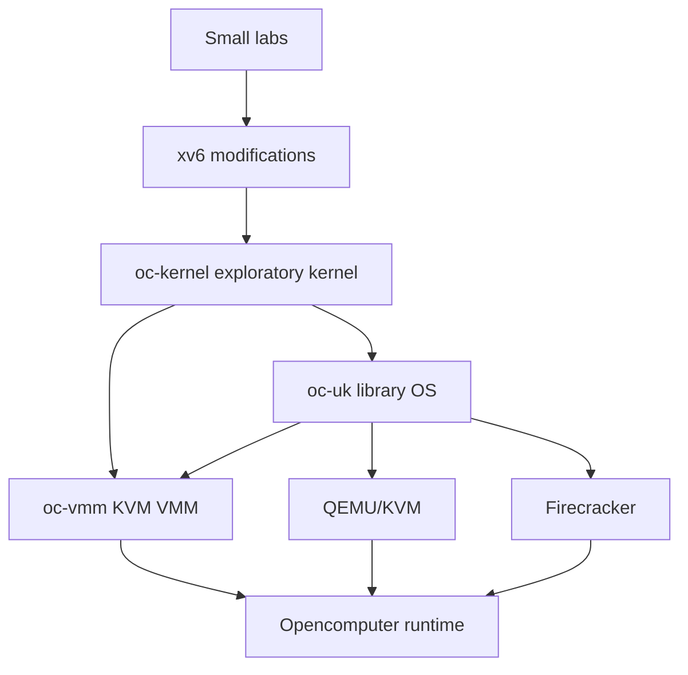

# Chapter 0 — How to Use This Handbook

## Purpose

This handbook is an implementation course, not a survey. Its goal is to take you from ordinary systems programming to a working application-specific operating system, a small KVM virtual-machine monitor, and an Opencomputer runtime capable of building, launching, checkpointing, and restoring unikernel workloads.

You will repeatedly study a mechanism at four levels:

1. **Conceptual model** — what problem the mechanism solves.
2. **Concrete implementation** — how a small system such as xv6 realizes it.
3. **Authoritative contract** — what the architecture, ABI, protocol, or API specification requires.
4. **Product design** — which parts belong in `oc-uk`, `oc-vmm`, and the Opencomputer control plane.

This sequence prevents two common failure modes: copying tutorial code without understanding it, and reading specifications without ever building enough machinery to make them concrete.

## Learning objectives

By the end of the course you should be able to:

- trace execution from an ELF entry point to a statically linked application;
- explain x86-64 privilege, paging, exceptions, interrupts, and timers;
- implement frame, heap, stack, and DMA allocation;
- design cooperative and preemptive execution;
- implement split virtqueues and virtio-net, block, and vsock drivers;
- create a VM directly through `/dev/kvm` and handle VM exits;
- design a narrow application ABI and a narrow platform ABI;
- port Rust and C applications into a single-address-space library OS;
- threat-model the guest, VMM, snapshot, build, and control-plane boundaries;
- measure boot, memory, network, VM-exit, and restore performance;
- integrate the resulting system into Opencomputer.

## The three systems you will build



### `oc-kernel`

`oc-kernel` is a learning kernel. It is where you first implement boot, page tables, traps, timers, memory allocation, tasks, and drivers. It may contain experiments and temporary abstractions.

### `oc-vmm`

`oc-vmm` is a small userspace VMM built on KVM. Its purpose is to make guest memory, vCPU state, VM exits, interrupt injection, device models, and snapshots tangible. It is not initially intended to replace Firecracker.

### `oc-uk`

`oc-uk` is the actual library operating system. It should have a small platform-independent core, stable application interfaces, platform backends, virtio drivers, a network stack, a host-control channel, and reproducible image generation.

## Recommended initial scope

Use the following constraints until the first HTTP service works:

| Area | Initial choice |
|---|---|
| Architecture | x86-64 |
| Language | Rust plus minimal assembly |
| Standard library | `#![no_std]` |
| Address spaces | One |
| vCPUs | One |
| Scheduling | Cooperative/event-driven |
| Boot | Existing bootloader/protocol for the learning kernel |
| Devices | Virtio-MMIO first |
| Networking | Handwritten ARP/IPv4/ICMP/UDP exercise, then smoltcp |
| Storage | Embedded read-only archive, then virtio-block |
| Control | virtio-vsock |
| Applications | Static linking |
| Compatibility | Native API first, limited POSIX later |
| Build | Cargo in a Nix-pinned environment |
| Artifact | ELF plus embedded manifest |

These constraints are architectural tools. They remove unrelated work so that you can study the unique properties of a library OS.

## Weekly operating rhythm

A productive full-time week is approximately:

| Activity | Hours |
|---|---:|
| Textbook and paper reading | 6–8 |
| Specification reading | 3–4 |
| Source archaeology | 3–5 |
| Implementation | 20–26 |
| Testing, debugging, and benchmarks | 6–8 |
| Notes and design review | 2–4 |

Every week must end with observable evidence:

- a boot log;
- a test result;
- a packet capture;
- a fault report;
- a benchmark;
- a source trace;
- an architecture decision;
- or a reproducible artifact.

Do not count pages read as progress.

## The reading hierarchy

Use materials according to their strengths:

- **CS:APP** explains the machine/software boundary.
- **OSTEP** explains OS abstractions and mechanisms.
- **xv6** provides a complete, compact kernel implementation.
- **Writing an OS in Rust** supplies practical bare-metal scaffolding.
- **OSDev Wiki** provides orientation, terminology, checklists, and common mistakes.
- **Intel/AMD manuals, ELF gABI, psABI, KVM API, Virtio, and RFCs** are authoritative.
- **MirageOS, Solo5, Unikraft, Firecracker, and rust-vmm** show production trade-offs.

OSDev Wiki should not be treated as the final authority for hardware behavior. Use it to find the right concepts and specifications, then verify critical details in the primary source.

## The implementation discipline

Before implementing any hardware-facing structure, write a contract containing:

```text
layout
alignment
endianness
ownership
lifetime
valid states
state transitions
memory ordering
error behavior
reset behavior
snapshot behavior
```

For every unsafe Rust function, document:

```text
what the caller must guarantee
what memory may be accessed
which aliases are permitted
which alignment is required
whether interrupts may run
whether the operation may block
what remains valid after return
```

For every device queue, write down exactly when ownership passes from guest to device and back again.

## Branch and commit strategy

Use one branch per week or lab:

```text
week/01-scope
week/02-lab-environment
week/03-address-types
...
```

Prefer small commits that correspond to independently testable steps:

```text
test: add ELF malformed-input corpus
feat: parse ELF64 program headers
feat: validate load segment ranges
docs: record ELF loader invariants
```

Do not place a week of debugging into one unreviewable commit.

## Completion standard

A subsystem is not complete merely because it works once. It is complete when:

1. its invariants are written down;
2. the happy path has automated tests;
3. malformed input is rejected;
4. failure behavior is observable;
5. the implementation is benchmarked where performance matters;
6. the public API does not leak accidental platform details;
7. the design decision is recorded when alternatives exist.

## Review questions

1. Why are `oc-kernel` and `oc-uk` separate projects?
2. Which components belong in the guest, VMM, and control plane?
3. Why is a booting demo insufficient evidence of correctness?
4. What is the difference between a tutorial, an implementation guide, and an authoritative specification?
5. Which first-version constraints are easiest to relax later, and which would create architectural debt?

## Opencomputer connection

The course is deliberately organized around interfaces Opencomputer will eventually own:

```text
source → reproducible build → signed image → VMM configuration
      → guest control channel → block/network attachment
      → readiness → checkpoint → restore → teardown
```

Keeping these interfaces explicit from the beginning prevents the unikernel from becoming a one-off demo that cannot be scheduled, observed, upgraded, or restored by a real platform.
