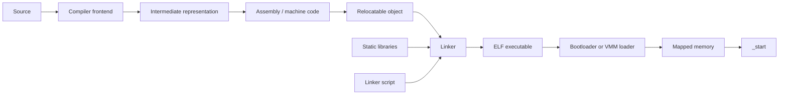

# Chapter 1 — Toolchains, ABIs, ELF, and the Path to `_start`

## Purpose

A unikernel is created as much by its toolchain and linker as by its runtime. Before implementing paging or drivers, you must understand how source code becomes bytes, how those bytes are organized into an ELF image, how a loader maps them, and what the CPU and compiler expect when control reaches `_start`.

## Learning objectives

After this chapter you should be able to:

- describe preprocessing, compilation, assembly, linking, and loading;
- distinguish object-file sections from loadable segments;
- explain symbols, relocations, static archives, and linker garbage collection;
- cross an assembly/Rust boundary using the x86-64 System V ABI;
- write a linker script that creates explicit RX, R, and RW segments;
- explain how `.bss` is initialized and why `p_memsz` can exceed `p_filesz`;
- validate a kernel image before attempting to boot it.

## From source to executable

A simplified native pipeline is:



A relocatable object does not yet have final addresses. It contains code, data, symbols, and relocation records. The linker chooses final locations, resolves symbol references, merges input sections, applies relocations, and emits program headers that tell a loader what to map.

## Sections versus segments

This distinction is foundational:

- **Sections** are a link-time view: `.text`, `.rodata`, `.data`, `.bss`, symbol tables, debug information, relocation tables.
- **Segments** are a load-time view: contiguous ranges that receive permissions and are copied or zero-filled into memory.

A loader normally follows program headers, not section headers. A stripped executable can boot without a section table as long as its loadable segments are valid.

Typical layout:

```text
ELF file
├── ELF header
├── program headers
├── RX load segment
│   ├── .text.boot
│   └── .text
├── R load segment
│   └── .rodata
├── RW load segment
│   ├── .data
│   └── .bss (zero-fill portion)
├── symbols/debug sections (not necessarily loaded)
└── section headers
```

If a segment's in-memory size exceeds its file size, the remainder is initialized to zero. This is the common representation of `.bss`.

## The application binary interface

The ABI is the contract between independently compiled code. It defines, among other things:

- register roles;
- parameter and return-value placement;
- stack alignment;
- caller-saved and callee-saved registers;
- data layout rules;
- object-file conventions;
- process-entry conventions.

For ordinary System V x86-64 functions, the first integer/pointer arguments are passed in registers, selected registers must be preserved by callees, and the stack must meet alignment requirements at call boundaries. Bare-metal startup is different from an ordinary function call: `_start` has no caller and must establish every precondition required by the first Rust function.

## A disciplined startup path

A minimal startup sequence should be explicit:

```text
loader transfers control
    ↓
mask or define interrupt state
    ↓
establish a known stack
    ↓
clear direction flag
    ↓
clear .bss if loader contract does not guarantee it
    ↓
construct/validate boot information
    ↓
call a Rust `extern "C"` entry point
    ↓
never return unexpectedly
```

A useful assembly stub is tiny. Its job is to establish architecture state, not to implement runtime policy.

## Linker-script design

Your linker script should express the memory contract rather than merely concatenate sections. It should:

- set the entry point;
- choose a load address;
- page-align permission boundaries;
- keep startup and manifest sections;
- export image-boundary symbols;
- separate executable, read-only, and writable data;
- make the generated map easy to inspect.

Example scaffold:

```ld
ENTRY(_start)

PHDRS
{
  text   PT_LOAD FLAGS(5); /* R-X */
  rodata PT_LOAD FLAGS(4); /* R-- */
  data   PT_LOAD FLAGS(6); /* RW- */
  note   PT_NOTE;
}

SECTIONS
{
  . = 0xffffffff80200000;
  __image_start = .;

  .text : ALIGN(4096) {
    KEEP(*(.text.boot))
    *(.text .text.*)
  } :text

  .rodata : ALIGN(4096) {
    *(.rodata .rodata.*)
  } :rodata

  .note.oc_uk : ALIGN(4) {
    KEEP(*(.note.oc_uk))
  } :note

  .data : ALIGN(4096) {
    *(.data .data.*)
  } :data

  .bss (NOLOAD) : ALIGN(4096) {
    __bss_start = .;
    *(.bss .bss.* COMMON)
    __bss_end = .;
  } :data

  __image_end = .;
}
```

Do not copy this blindly. Verify whether your boot protocol expects physical or virtual addresses and whether the loader honors the emitted permissions.

## ELF validation pipeline

Treat image validation as a build stage:

```bash
readelf -hW result/kernel.elf
readelf -lW result/kernel.elf
readelf -SW result/kernel.elf
nm -n result/kernel.elf
objdump -d result/kernel.elf
```

Automate checks for:

- expected machine and ELF class;
- entry point inside an executable segment;
- non-overlapping load ranges;
- page-aligned permission changes;
- no RWX segment;
- file ranges within the artifact;
- `p_filesz <= p_memsz`;
- manifest presence;
- load ranges within supported guest memory.

Your own ELF parser should be strict. Never trust offsets or sizes from an untrusted image without checked arithmetic.

## Debugging playbook

### Immediate reset or no output

Check, in this order:

1. Is the entry point the address you expect?
2. Did the loader map that address?
3. Is the stack mapped and canonical?
4. Is the stack aligned before calling Rust?
5. Is the serial port initialized before use?
6. Did `.bss` contain stale values?
7. Did a relocation assume a different code model or image base?

### Works in debug, fails in release

Likely causes include undefined behavior, missing volatile accesses, incorrect aliasing, uninitialized memory, stack alignment, or optimizer-visible assumptions that are not true.

### Symbols look correct but runtime addresses do not

Compare section virtual addresses, program-header virtual/physical addresses, the bootloader's placement contract, and any higher-half offset. Do not infer one from another.

## Exercises

1. Build a static C executable and a Rust executable, then compare sections, segments, symbols, relocations, and dependencies.
2. Modify the linker script to deliberately create an RWX segment; make CI reject it.
3. Change `.bss` to occupy one megabyte and prove that the file grows minimally while the memory image grows.
4. Build an ELF with overlapping load ranges and confirm your parser rejects it.
5. Write a function in assembly that corrupts a callee-saved register; create a test that detects the ABI violation.

## Review questions

1. Why can a loader ignore most section headers?
2. What information is lost when an ELF is reduced to a flat binary?
3. Why is `_start` not an ordinary function?
4. What is the difference between a symbol value and a relocation?
5. Why should permission boundaries be page-aligned?
6. Which ELF fields must be validated with checked arithmetic?

## Opencomputer connection

Opencomputer should validate and identify unikernel artifacts before scheduling them. The image service should extract an embedded manifest, verify architecture and ABI versions, reject unsafe segment layouts, calculate a digest, and sign the resulting metadata. A malformed image should fail in the build or admission path—not after a worker allocates a VM.
