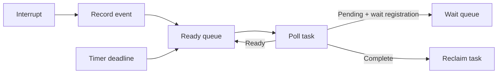

# Chapter 4 — Concurrency, Scheduling, and Event-Driven Execution

## Purpose

A unikernel can avoid much of the process machinery of a general-purpose OS, but it still needs to coordinate timers, network packets, block completions, application tasks, and shutdown. The first design decision is whether to use threads and preemption, cooperative tasks, an async executor, or a mixture.

## Learning objectives

You should be able to:

- distinguish concurrency from parallelism;
- explain interrupt, task, and vCPU execution contexts;
- use atomics and locks with explicit memory-ordering arguments;
- design a cooperative event loop with wait queues and timers;
- identify lost wake-ups, lock-order cycles, and priority inversion;
- add preemption without corrupting scheduler invariants;
- explain the extra work required for SMP.

## Execution contexts

A first `oc-uk` runtime has at least these contexts:

```text
boot context
interrupt context
executor/task context
idle context
host-control callback context
panic/shutdown context
```

Each context needs explicit rules. For example, interrupt context should not block or perform arbitrary allocation. Panic context should avoid locks that may already be held. Host-control callbacks should not mutate application state without a synchronization or message-passing contract.

## Cooperative first

A cooperative executor is a strong initial choice because:

- context switches occur at explicit points;
- most invariants can be reasoned about without arbitrary preemption;
- an event-driven network stack integrates naturally;
- single-vCPU execution avoids data races between tasks unless interrupts intervene;
- debugging is substantially easier.

A minimal model:



The hardest part is not polling tasks; it is making registration and wake-up atomic enough to avoid a task going to sleep after its event has already occurred.

## Wait-queue invariant

A useful invariant is:

> A task is either runnable, running, blocked on exactly one owned wait registration, or complete—never in two states simultaneously.

Implement state transitions with one synchronization domain. Avoid separately updating a task state and queue membership without a protocol that prevents races.

## Timers

Use monotonic time for scheduling. A deadline queue can be implemented as a binary heap initially. The timer interrupt should advance or sample the clock, mark expired timers, and enqueue work. Wall-clock time is configuration or a service, not the basis of scheduler correctness.

Define behavior for:

- deadline in the past;
- overflow when adding duration;
- timer cancellation;
- task destruction with an active timer;
- snapshot pause duration;
- clock-source changes.

## Locks and interrupt safety

On a single vCPU, ordinary task code can still be interrupted while holding a lock. If an interrupt handler attempts the same lock, the guest deadlocks. Options include:

- disable relevant interrupts around the critical section;
- ensure interrupt handlers never acquire task locks;
- use lock-free handoff from interrupt to deferred work;
- split data into interrupt-owned and task-owned portions.

A lock type should encode or document its interrupt policy. “It is single-core” is not a sufficient synchronization argument.

## Memory ordering

Atomics coordinate both compiler and CPU behavior. Use the weakest ordering you can correctly justify, but optimize only after establishing a simple correct version. In queue publication, the producer must make descriptor and buffer writes visible before updating the shared index or notifying the consumer. The consumer must acquire visibility before reading the published data.

The question to write in every review is:

```text
Which write must happen before which read, and what creates that ordering?
```

## Adding preemption

Preemption requires:

- a timer interrupt capable of requesting reschedule;
- complete context save/restore;
- preemption-disable regions;
- scheduler data structures safe against interrupt-time access;
- defined behavior inside locks and unsafe code;
- stack and extended-state management;
- careful return paths.

Add preemption only after the cooperative executor has strong tests. One approach is deferred preemption: the timer marks a reschedule flag, and the actual switch happens at a safe boundary.

## SMP

Multiple vCPUs introduce true parallelism and require:

- per-CPU state;
- startup of application processors;
- inter-processor interrupts;
- TLB shootdowns;
- scalable allocation and scheduling;
- lock-order discipline;
- memory-reclamation strategy;
- device interrupt routing;
- snapshot coordination across vCPUs.

A sensible first SMP design uses per-CPU run queues, pinned tasks, and no task migration. General work stealing can come later.

## Debugging playbook

### Task never wakes

Inspect the ordering between event observation and wait registration. Add unique IDs to tasks and wait objects. Log state transitions, not merely function entry. Build a deterministic hosted test where the event fires at every possible point in the registration sequence.

### Sporadic deadlock

Record lock acquisition order and ownership. Add a debug-only lock graph or rank system. Check interrupt reentrancy and panic paths, not only task-to-task contention.

### Works with logging, fails without it

Suspect timing, missing atomics, uninitialized state, or optimizer-sensitive undefined behavior. Logging can accidentally serialize execution.

### CPU at 100% while idle

Check tasks that continuously self-wake, timer programming, interrupt acknowledgement, eventfd behavior in the VMM, and whether the idle path uses an appropriate halt/wait instruction.

## Exercises

1. Build a hosted executor whose event sources are pipes, timerfds, and eventfds.
2. Create a lost-wake-up bug intentionally, then write a deterministic regression test.
3. Implement an interrupt-to-task SPSC queue and justify its ordering.
4. Add cancellation to timer waits without use-after-free.
5. Add scheduler tracing and render a timeline from structured events.
6. Implement deferred preemption and compare tail latency with purely cooperative execution.

## Review questions

1. Why can a single-vCPU system still deadlock on a spin lock?
2. What invariant prevents a task from being both runnable and blocked?
3. Why should scheduler deadlines use monotonic time?
4. What is the difference between atomicity and memory ordering?
5. What new state must be saved once SIMD is permitted?
6. Which SMP feature creates the need for TLB shootdowns?

## Opencomputer connection

An Opencomputer workload must respond to stop, quiesce, checkpoint, and shutdown requests. The runtime therefore needs cancellation and quiescing as first-class concepts, not afterthoughts. The scheduler should expose bounded metrics—runnable tasks, blocked tasks, longest poll duration, timer lag, and event-queue depth—through the host control channel so the platform can distinguish a busy workload from a wedged guest.
