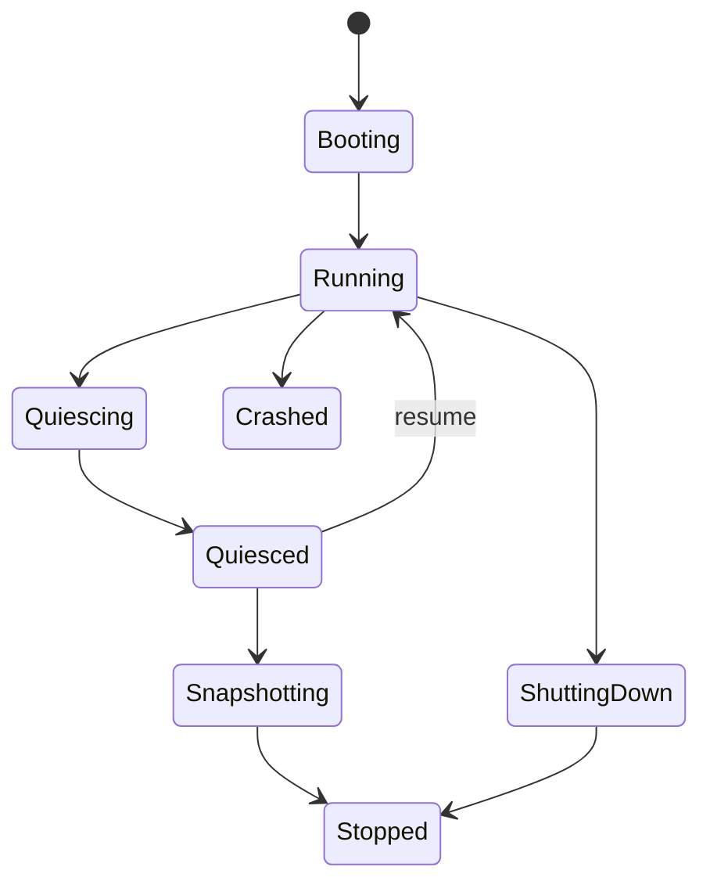

# Chapter 7 — Interrupts, Time, Entropy, and Lifecycle State

## Purpose

Timers, interrupts, clocks, and entropy are deceptively cross-cutting. They influence scheduling, networking, TLS, timeouts, snapshots, and security. A correct implementation must distinguish event delivery from time measurement and monotonic time from wall-clock time.

## Learning objectives

You should be able to:

- route and acknowledge interrupts correctly;
- program or consume a virtual timer source;
- maintain a monotonic clock and deadline queue;
- distinguish wall time, monotonic time, and CPU cycle counters;
- initialize and reseed entropy safely;
- explain how suspend, restore, and cloning affect time and randomness;
- design lifecycle-safe timer and entropy APIs.

## Interrupt routing

A virtual platform may deliver interrupts through legacy-compatible mechanisms, an APIC, MSI/MSI-X, or transport-specific mechanisms. Your platform layer should normalize this into:

```rust
register_handler(vector, handler)
mask(source)
unmask(source)
acknowledge(source)
set_affinity(source, vcpu)
```

The device driver should not need to know every detail of the host VMM's interrupt implementation.

## Timer sources

Possible sources include emulated legacy timers, local APIC timer, HPET, paravirtual clocks, or calibrated cycle counters. Choose the simplest source supported by your target, then hide it behind a monotonic clock interface.

A timer mechanism has two distinct jobs:

1. **Measure time** — answer “what is the monotonic time now?”
2. **Deliver an event** — interrupt or wake the guest near a deadline.

Do not conflate tick counting with accurate time. Periodic ticks are simple but create unnecessary exits and interrupt overhead. A later design can program one-shot deadlines.

## Monotonic time

Monotonic time must never move backward within one running instance. Represent deadlines with checked arithmetic and a well-defined epoch meaningful only inside the instance.

API sketch:

```rust
pub trait MonotonicClock {
    fn now(&self) -> Instant;
}

pub trait DeadlineTimer {
    fn arm(&mut self, deadline: Instant) -> Result<(), TimerError>;
    fn disarm(&mut self);
}
```

Avoid using wall-clock timestamps for scheduler decisions. Wall clock can jump because of synchronization or administrator action.

## Snapshot and restore

A restored VM may resume after seconds, hours, or days. Decide whether guest monotonic time:

- includes suspended duration;
- excludes suspended duration;
- or is explicitly rebased.

For application timeout behavior, excluding suspended duration is often intuitive for “continue where I left off,” while external leases and credentials may need real elapsed time. There is no universal answer; expose policy and record it in snapshot metadata.

## Entropy

Entropy is required for:

- cryptographic keys;
- TCP sequence and port randomization;
- identifiers;
- randomized algorithms;
- stack/address randomization if implemented.

Do not seed a deterministic PRNG solely from time, MAC address, or image digest. Prefer a virtual entropy device or host-provided cryptographic seed delivered at boot through a trusted channel.

A robust model:

```text
host obtains cryptographic entropy
    ↓
per-instance boot seed
    ↓
guest CSPRNG initialization
    ↓
periodic/explicit reseed where supported
```

On snapshot clone, two guests must not continue from identical PRNG state. Reseed before exposing network or secret-dependent operations. If the snapshot contains long-lived private keys, cloning also has identity implications beyond PRNG state.

## Wall-clock time

Treat wall clock as an external service with an uncertainty and trust model. For a small first runtime, receive a boot timestamp plus monotonic anchor from the host. Later you may add a paravirtual clock or network synchronization.

Define behavior when wall time is unavailable. Most core runtime functions should continue operating with monotonic time only.

## Lifecycle API

A useful lifecycle state machine:



Timer creation, entropy use, network acceptance, and block writes should be constrained by lifecycle state. For example, quiescing should prevent new application work while allowing in-flight operations to drain.

## Debugging playbook

### Timers fire too quickly or slowly

Check frequency conversion, integer overflow, calibration, virtualization of the cycle counter, and whether units are mixed. Store conversion tests for boundary values.

### Guest consumes a full host CPU while idle

Check whether the timer remains continuously expired, whether the interrupt is acknowledged, and whether the idle loop actually halts/waits.

### Restored TLS or identifiers repeat

Assume duplicated PRNG state until proven otherwise. Add an explicit post-restore reseed event and tests that clone one snapshot twice.

### Timeout occurs immediately after restore

Inspect monotonic rebase policy and serialized deadline representation. Prefer serializing relative remaining duration or restoring the clock epoch coherently.

## Exercises

1. Implement a host-tested deadline heap with insertion, cancellation, and randomized tests.
2. Measure periodic versus one-shot timer VM exits.
3. Clone one memory snapshot twice and verify random streams diverge after restore.
4. Simulate wall-clock jumps while confirming scheduler deadlines remain correct.
5. Add a lifecycle state machine that rejects invalid operations.
6. Define a snapshot policy for external leases, credentials, and network timeouts.

## Review questions

1. Why are time measurement and event delivery separate concerns?
2. Why should scheduler time be monotonic?
3. What happens to a future deadline when a VM is suspended for an hour?
4. Why is cloning a PRNG state dangerous?
5. Which operations should be disallowed while quiescing?
6. How can a periodic guest timer increase host VM-exit load?

## Opencomputer connection

Opencomputer should inject per-instance entropy and explicit time metadata, record snapshot pause/resume policy, and rotate ephemeral credentials after restore. The worker and guest should agree on lifecycle state through the control channel so a snapshot is never mistaken for a durable application checkpoint when writes or external protocols remain in flight.
