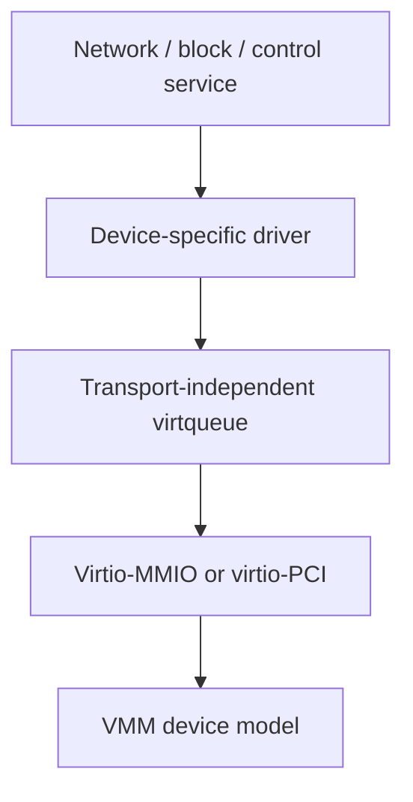

# Chapter 9 — Virtio: Transport, Virtqueues, and Device Families

## Purpose

Virtio is the central device interface for this handbook because it provides a standardized contract between guest drivers and virtual-machine monitors. Mastering it means understanding both the data structure shared with the device and the ordering and lifecycle rules around that data structure.

Use the current [OASIS Virtio specification](https://docs.oasis-open.org/virtio/virtio/v1.4/cs01/virtio-v1.4-cs01.html) as the authority. Tutorials and existing code are aids, not substitutes.

## Learning objectives

You should be able to:

- explain virtio device discovery and status transitions;
- negotiate features without accepting unsupported semantics;
- implement a split virtqueue;
- distinguish transport-independent queue logic from MMIO or PCI transport;
- implement safe descriptor allocation and reclamation;
- reason about notification and interrupt suppression;
- apply the generic queue to network, block, entropy, console, and vsock devices.

## Virtio layering



Keep these layers separate. A block request should not directly write MMIO registers; it should create device-specific descriptors and submit them through a queue abstraction.

## Device status and feature negotiation

The driver and device communicate initialization progress through status bits. Your implementation should represent the process as a state machine rather than scattered register writes.

Conceptually:

```text
reset
  → acknowledge device
  → announce driver
  → read offered features
  → select supported subset
  → confirm feature negotiation
  → configure queues
  → mark driver ready
```

If the device rejects the negotiated features or initialization fails, set failure state as specified and reset before reuse.

Feature negotiation is a compatibility contract. Never accept a feature bit merely because the device offered it. A negotiated feature may change descriptor layout, header fields, or ordering requirements.

## Split virtqueue layout

A split queue has three major areas:

```text
Descriptor table
  entries describe buffers and chains

Available ring
  driver publishes descriptor heads to device

Used ring
  device publishes completed descriptor heads to driver
```

The queue size is negotiated and bounded. Indexes wrap naturally in their fixed-width representation, while array access uses modulo queue size.

A descriptor contains:

```text
buffer address
buffer length
flags
next descriptor index when chained
```

Typical flags indicate whether the device may write the buffer and whether another descriptor follows.

## Descriptor allocation

Use a free list or bitmap with generation/debug metadata. For every descriptor head, record the associated request, owned buffers, expected completion constraints, and lifecycle state.

Required invariants:

1. A free descriptor appears exactly once in the free structure.
2. A submitted chain contains only allocated descriptors.
3. A chain terminates and cannot loop.
4. No descriptor is reclaimed until a valid completion returns its head.
5. A completion refers to a currently in-flight head.
6. Queue reset invalidates all outstanding request identities.

In debug builds, poison reclaimed descriptors and increment a queue generation to detect stale completions.

## Publication ordering

Submission follows a logical sequence:

```text
1. Write request buffers.
2. Write descriptor entries.
3. Publish descriptor head into available ring.
4. Publish updated available index.
5. Notify device if required.
```

The device must not observe step 4 before steps 1–3 are visible. Use the ordering required by the architecture and virtio specification. Volatile register access alone does not necessarily order ordinary memory writes.

Completion processing similarly needs to acquire visibility of device-written used entries and buffers after observing the used index.

## Notification strategy

Notifications and interrupts are hints that work is available; queue state is the source of truth. Avoid assuming one notification per request or one interrupt per completion.

A high-performance path may:

- batch submissions before notification;
- process multiple completions per interrupt;
- suppress notifications while continuously busy;
- recheck the ring after enabling interrupts to avoid races.

Implement the simplest unconditional notification path first, then optimize with measurements.

## Virtio-MMIO

Virtio-MMIO exposes a register region with device identification, feature selection, queue configuration, notifications, interrupt status, and device status. It is an appropriate first transport because it avoids PCI enumeration and MSI-X setup.

Your MMIO transport should expose a transport-independent interface:

```rust
trait VirtioTransport {
    fn device_type(&self) -> DeviceType;
    fn read_device_features(&mut self) -> u64;
    fn write_driver_features(&mut self, features: u64);
    fn set_status(&mut self, status: DeviceStatus);
    fn configure_queue(&mut self, index: u16, config: QueueConfig)
        -> Result<(), TransportError>;
    fn notify_queue(&mut self, index: u16);
    fn interrupt_status(&self) -> InterruptStatus;
    fn acknowledge_interrupt(&mut self, status: InterruptStatus);
}
```

Do not expose raw offsets to every driver.

## Virtio-PCI later

Virtio-PCI adds PCI discovery, capabilities, BAR mapping, and typically MSI-X. Add it after the queue core and device drivers work through MMIO. The goal is for net/block/vsock logic to remain unchanged.

## Device-specific patterns

### Network

Receive buffers are posted before packets arrive. Transmit chains contain a virtio network header plus packet bytes. Validate device-written lengths before parsing.

### Block

A request commonly chains a header, data buffer, and status byte. Respect read/write direction, sector units, flush semantics, and feature-dependent fields.

### Entropy

Post writable buffers and treat returned bytes as entropy input. Define health/failure behavior; do not silently substitute predictable data.

### Vsock

Vsock includes connection-oriented protocol state above the transport queues. The device driver is only one layer; connection identity, credit flow, and lifecycle require separate implementation.

## Testing architecture

Create a transport-independent queue test suite and run it against:

- pure in-memory fake device;
- toy device in `oc-vmm`;
- QEMU virtio device;
- Firecracker device where applicable.

Use randomized operation sequences:

```text
allocate chain
submit
complete some requests out of sequence
reset
inject malformed completion
wrap indexes
repeat
```

## Debugging playbook

### Device remains unavailable

Check magic/version/device ID, status sequence, selected feature pages, and whether unsupported bits were accidentally acknowledged.

### Queue appears configured but device ignores it

Check queue-ready state, size, descriptor/available/used GPAs, alignment, and notification register value.

### Used index advances but packet/data is corrupt

Check acquire ordering, write flags, buffer lengths, header layout, and whether the device wrote into memory still aliased mutably by the driver.

### Failure after index wrap-around

Check arithmetic width, modulo use, monotonic counters, and comparisons that incorrectly assume indexes only increase numerically without wrapping.

## Exercises

1. Implement a split queue entirely in hosted tests before touching MMIO.
2. Create a fake device that completes requests in random order.
3. Fuzz descriptor chains and used entries.
4. Measure notifications per request under batching strategies.
5. Add reset during every request lifecycle state.
6. Implement the same toy device on both sides: guest driver and `oc-vmm` device model.

## Review questions

1. Which parts of virtio are transport-independent?
2. Why is feature negotiation part of the ABI rather than a performance hint?
3. What makes a descriptor chain valid?
4. Why can an interrupt be coalesced or omitted without losing correctness?
5. What ordering is required before publishing the available index?
6. Why must queue reset invalidate request identities?

## Opencomputer connection

The selected virtio feature set is part of the runtime compatibility contract. Opencomputer should record VMM version, device type, transport, negotiated feature policy, queue sizes, and topology in the instance and snapshot metadata. Restoring a snapshot onto a worker with an incompatible device model must fail admission before guest execution begins.
