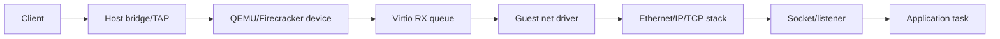

# Chapter 10 — Networking From Ethernet to an HTTP Service

## Purpose

Networking combines device ownership, packet parsing, checksums, timers, resource limits, and adversarial input. Implementing a small protocol path yourself builds the required mental model; integrating a maintained stack then produces a realistic system.

## Learning objectives

You should be able to:

- trace a frame from virtio receive completion to an application task;
- parse Ethernet, ARP, IPv4, ICMP, and UDP safely;
- explain TCP's connection state and timer dependence;
- integrate an event-driven stack such as smoltcp;
- design bounded packet buffers and connection limits;
- capture and diagnose traffic across the host/guest boundary;
- expose ports safely through an Opencomputer data plane.

## End-to-end packet path



Debug each boundary independently. A missing HTTP response can be caused by TAP setup, ARP, IP configuration, queue ownership, checksums, TCP timers, listener state, or application scheduling.

## Buffer design

A simple first design uses fixed-size receive and transmit buffers in bounded pools. Avoid allocating on every packet.

Track buffer state:

```text
free → posted to device → received → stack-owned → recycled
free → app/stack builds packet → device-owned → completed → recycled
```

Record drops by reason:

```text
no receive buffer
malformed frame
unsupported EtherType
invalid checksum
no route/ARP entry
socket queue full
connection limit
application backlog
```

Silent drops are extremely difficult to debug.

## Ethernet and ARP

Ethernet provides source/destination MAC addresses and an EtherType. Validate minimum/maximum lengths before reading protocol headers.

ARP maps an IPv4 address to a link-layer address. A minimal cache needs:

- bounded entries;
- expiration;
- pending resolution state;
- retry limits;
- handling for unsolicited/reply updates;
- duplicate and malformed packet policy.

Do not let arbitrary peers grow the cache without bound.

## IPv4

Validate:

- version;
- header length;
- total length against received bytes;
- checksum;
- destination address;
- fragmentation policy;
- protocol number.

A first stack may reject fragments explicitly. Do not partially parse unsupported fragmentation states.

## ICMP and UDP

ICMP echo is an excellent first end-to-end test because it exercises receive, parse, transmit, checksums, and addressing without socket state.

UDP then adds ports and application demultiplexing. A bounded UDP echo service should reject oversized datagrams and avoid reflecting traffic indiscriminately outside the development environment.

## TCP mental model

Do not implement production TCP as a prerequisite. Understand:

- connection identification;
- sequence and acknowledgment numbers;
- receive windows;
- retransmission timers;
- connection establishment and teardown;
- out-of-order data;
- congestion control;
- TIME-WAIT;
- reset behavior.

TCP correctness depends on monotonic timers and resource limits. A snapshot can preserve TCP memory state but not guarantee external peers or NAT mappings remain valid.

## Integrating smoltcp

[smoltcp](https://github.com/smoltcp-rs/smoltcp) is event-driven and suitable for `no_std` environments. Adapt your `NetDevice` to its device abstraction and drive polling when:

- a packet arrives;
- a socket/application changes state;
- the next protocol deadline occurs.

Avoid busy polling. Ask the stack for its next deadline and arm the guest timer.

## Application server design

Your first HTTP service should be intentionally bounded:

```text
GET  /health
GET  /version
GET  /metrics
POST /echo
```

Limits:

- maximum request-line and header bytes;
- maximum body size;
- maximum concurrent connections;
- per-connection idle timeout;
- bounded response queue;
- bounded work per executor poll;
- graceful shutdown deadline.

Do not add TLS until the base data path is reliable. Terminating TLS at an Opencomputer proxy is acceptable initially. Later, guest TLS becomes valuable for end-to-end trust or confidential workloads.

## Host networking laboratory

Begin with an isolated namespace or bridge:

```text
host namespace
  ├── TAP interface for VM
  ├── test client interface
  └── packet capture
```

Automate setup and teardown. Never require a developer to manually leave global routes, iptables rules, or TAP devices behind.

Useful observations:

```bash
tcpdump -n -e -vv -i tap0
ip link show tap0
ip neigh show
ss -tnp
```

Correlate packet timestamps with guest queue and stack events.

## Security and abuse controls

Treat every byte as hostile. Required protections include:

- checked length arithmetic;
- bounded parsing loops;
- bounded fragment/connection/ARP state;
- timeout of half-open connections;
- rate limits where appropriate;
- no unbounded logging of packet contents;
- fuzzing of each protocol parser;
- separation of control and tenant data channels.

## Snapshot behavior

Default to treating external network connections as nonportable. Before a durable checkpoint:

- stop accepting new connections;
- drain or terminate active requests;
- record application state, not assumptions about remote TCP state;
- reestablish listeners after restore;
- rotate connection-scoped credentials if needed.

Warm resume on the same network may preserve some connections, but it should be an optimization with explicit constraints.

## Debugging playbook

### No ARP reply

Check MAC addresses, EtherType endianness, target IP, TAP bridge state, RX buffer posting, and whether the reply is transmitted to the correct destination.

### UDP works but TCP does not

Check stack timer polling, MSS/MTU assumptions, checksums, window configuration, listener binding, and executor wake-ups.

### Packets appear in `tcpdump` but not guest logs

Inspect VMM device queue state, descriptor posting, queue notification, interrupt/polling path, and receive-buffer availability.

### Throughput is unexpectedly low

Measure copies, buffer size, queue depth, notification frequency, executor batch size, checksum work, and VM exits. Do not optimize based on intuition alone.

## Exercises

1. Implement and test Ethernet, ARP, IPv4, ICMP echo, and UDP echo manually.
2. Fuzz each parser with truncated and inconsistent lengths.
3. Integrate smoltcp and expose the four HTTP endpoints.
4. Simulate packet loss, duplication, and reordering with host traffic control.
5. Measure interrupts and VM exits per packet under different queue batching.
6. Quiesce the server, snapshot, restore, and verify listeners reappear cleanly.

## Review questions

1. Why should receive buffers be posted before packets arrive?
2. Which IPv4 length fields must be cross-validated?
3. Why is an ARP cache a resource-exhaustion surface?
4. What event sources should trigger a smoltcp poll?
5. Why is TCP state not automatically a durable application checkpoint?
6. Where should Opencomputer enforce tenant egress policy?

## Opencomputer connection

Opencomputer should give each microVM a controlled virtual NIC and keep platform control on a separate vsock channel. Port exposure should be declared in workload metadata and implemented by a host proxy or data-plane service. The guest should not configure host firewall policy. Per-instance network identity, rate limits, egress rules, and connection metrics belong to the platform.
