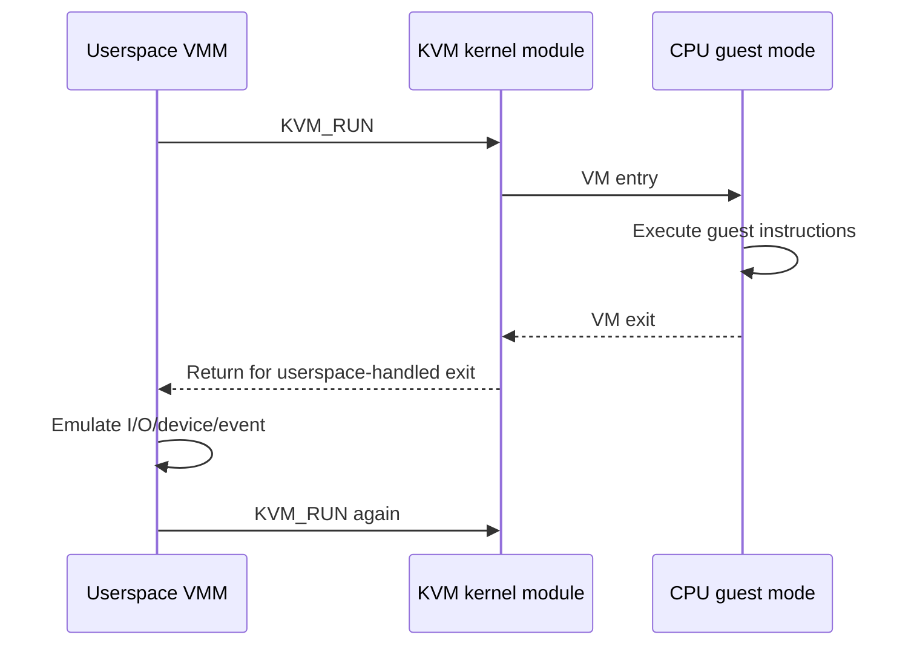

# Chapter 12 — Virtualization Theory: From Trap-and-Emulate to KVM

## Purpose

Building a VMM is easier when the historical design space is clear. Hardware-assisted virtualization, paravirtualization, library OSes, and process-hosted unikernels solve different problems at different boundaries.

## Learning objectives

You should be able to:

- explain the classic virtualization requirements of Popek and Goldberg;
- compare trap-and-emulate, binary translation, paravirtualization, and hardware assistance;
- explain VMX/SVM execution modes and VM exits;
- distinguish guest paging from EPT/NPT translation;
- describe interrupt injection and virtual device emulation;
- explain why KVM is a kernel API rather than a complete VMM;
- place Xen, QEMU/KVM, Firecracker, Solo5, and process-hosted unikernels in one model.

## The core virtualization problem

A VMM wants most guest instructions to execute directly while retaining control over sensitive operations and resources. Conceptually, a virtualizable architecture permits sensitive operations to trap when executed without sufficient privilege, allowing the monitor to emulate their effects.

Early x86 contained instructions that complicated pure trap-and-emulate. Systems used binary translation, paravirtualization, or other techniques. Modern VT-x and AMD-V add explicit guest execution modes and control structures so the processor can transfer to the VMM on configured events.

## Four major approaches

### Emulation

Interpret or translate every guest instruction. Flexible and architecture-independent, but usually slower. Useful for cross-architecture development and testing.

### Binary translation

Dynamically rewrite problematic instruction sequences while allowing translated code to execute natively. Historically important for x86 virtualization.

### Paravirtualization

Modify the guest interface to cooperate with the hypervisor. Xen's original design exposed an intentionally virtualized machine interface and hypercalls. Paravirtualized devices such as virtio retain this idea even when CPU virtualization is hardware-assisted.

### Hardware-assisted virtualization

The CPU executes guest code in a controlled non-root mode. Configured events cause VM exits into the host. KVM exposes these hardware facilities through Linux.

## VM entry and exit



Not every VM exit reaches userspace. KVM handles many events in the kernel. Userspace commonly handles selected port I/O, MMIO, shutdown, and device-model interactions.

## VMCS and VMCB

Intel VMX uses a virtual-machine control structure; AMD SVM uses a virtual-machine control block. They contain guest state, host state, control fields, and exit information. You normally do not manipulate these directly when using KVM, but understanding their role explains why KVM needs register/state ioctls and why CPU compatibility matters for snapshots.

## Two-dimensional translation

Without second-level translation, a hypervisor may maintain shadow page tables mapping guest virtual addresses toward host physical memory. EPT (Intel) and NPT (AMD) add a second hardware walk:

```text
GVA --guest tables--> GPA --EPT/NPT--> HPA
```

This makes guest page-table changes cheaper to virtualize and allows KVM to manage the guest-physical mapping independently.

## TLB and address-space tags

Virtualization adds translation caching concerns. The CPU may tag translations by guest/virtual-machine context, but changes to guest tables or EPT/NPT still require appropriate invalidation. Snapshot restore and vCPU migration must establish coherent translation state.

## Interrupt virtualization

A VMM must present virtual interrupt-controller state and inject interrupts into the guest. Delivery may be immediate or delayed until guest state permits it. The VMM/device model must avoid losing level-triggered conditions or injecting duplicates inconsistent with virtual-controller state.

For your educational VMM, begin with a simple interrupt path and one vCPU. Add advanced routing only after basic correctness.

## KVM's role

KVM is not QEMU or Firecracker. It is the Linux kernel virtualization API and execution engine. Userspace remains responsible for:

- creating and configuring the VM;
- allocating/mapping guest memory;
- loading firmware/kernel/application images;
- creating vCPUs;
- configuring registers;
- handling userspace exits;
- implementing device models;
- lifecycle, metrics, snapshots, and control API.

The official [KVM API documentation](https://docs.kernel.org/virt/kvm/api.html) organizes operations around system, VM, vCPU, and device file descriptors and capability queries.

## Device-model spectrum

```text
full machine emulation  ←────────────→  minimal purpose-built devices
QEMU                                        Firecracker / oc-vmm
```

A larger device model improves compatibility but increases code, attack surface, startup work, and snapshot state. A unikernel permits a very small model because it can target a known set of virtio devices directly.

## Unikernel execution targets

A library OS can target:

- virtual hardware through QEMU/KVM;
- a narrow tender ABI such as Solo5;
- Firecracker's microVM device model;
- a process-hosted backend for testing;
- potentially bare metal.

The application/library-OS architecture is conceptually separate from whether isolation is supplied by a VM or process boundary. This is the lesson behind process-hosted unikernel research and hosted test backends.

## Debugging playbook

### Guest runs under TCG but not KVM

Check unsupported CPU assumptions, control-register setup, CPUID exposure, timing races, and undefined behavior hidden by slower emulation.

### Unexpected VM-exit storm

Classify exits by reason and guest RIP. Common causes include port polling, MMIO-heavy notification, frequent timer programming, and instructions configured to exit unnecessarily.

### Interrupt is pending but guest never handles it

Check virtual interrupt-controller state, guest interrupt flag, masking, injection readiness, and whether the device's asserted condition remains represented.

## Exercises

1. Write a comparison table for emulation, binary translation, paravirtualization, and hardware assistance.
2. Run one guest under TCG and KVM; compare exit/trace behavior and performance.
3. Draw GVA→GPA→HPA translation for a concrete address.
4. Classify every interaction in a virtio-net packet path as guest code, KVM, or VMM work.
5. Read the Firecracker paper and identify which compatibility features it deliberately removes.
6. Write an ADR choosing the minimal virtual machine interface for `oc-uk`.

## Review questions

1. Why was classic x86 difficult to virtualize with pure trap-and-emulate?
2. What does hardware-assisted virtualization add?
3. Why are virtio devices still paravirtualized?
4. What does KVM implement, and what remains in userspace?
5. Why does a smaller device model improve more than image size?
6. How can a unikernel run as a process without ceasing to be a library OS?

## Opencomputer connection

Opencomputer can standardize on a deliberately narrow virtual platform: a defined CPU contract, RAM layout, virtio-net, block, vsock, entropy, and a shutdown mechanism. This reduces worker variability and snapshot compatibility problems. QEMU can remain a development/reference backend, while Firecracker or a hardened `oc-vmm` supplies production isolation.
