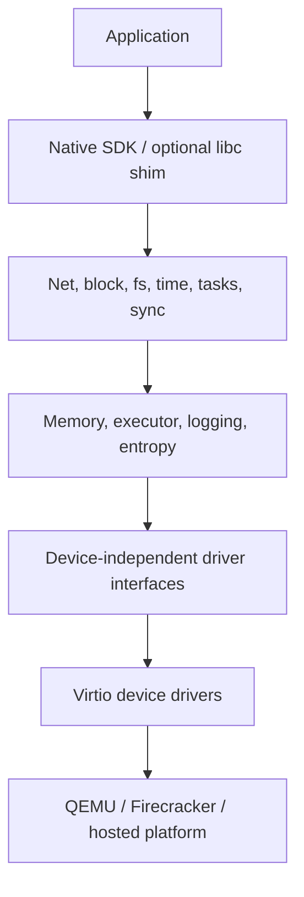

# Chapter 15 — Library Operating Systems and Unikernel Architecture

## Purpose

A unikernel is not merely a small kernel. It is an application-specific system assembled by linking an application with the OS facilities it requires. The important design questions concern interfaces, specialization, compatibility, protection, configuration, and execution targets.

## Learning objectives

You should be able to:

- distinguish monolithic kernels, microkernels, exokernels, library OSes, and unikernels;
- explain the architectural contributions of Exokernel, Drawbridge, MirageOS, Solo5, and Unikraft;
- identify application, library-OS, platform, and hypervisor boundaries;
- choose where specialization occurs;
- design explicit dependencies on time, entropy, networking, and storage;
- explain the single-address-space security trade-off;
- justify the `oc-uk` architecture.

## The defining composition

```text
application source
    + selected runtime/libraries
    + selected OS services
    + selected drivers/platform backend
    ↓ static specialization and linking
standalone application-specific image
```

A stripped Linux guest is still Linux. A unikernel removes the conventional userspace/kernel boundary for the target application and composes needed OS functionality as libraries into one image.

## Architectural lineage

### Exokernel

The exokernel idea separates protection from high-level resource-management policy. A small privileged layer securely multiplexes resources, while library operating systems implement abstractions useful to applications. The lesson for `oc-uk` is that abstractions need not be fixed in a general-purpose kernel.

### Drawbridge

Drawbridge takes a top-down compatibility approach: support rich applications by placing an OS personality in a library and exposing a small host interface for threads, memory, and I/O streams. The lesson is that the host ABI can be far smaller than the application-facing API.

### MirageOS

MirageOS makes system dependencies explicit in a high-level language ecosystem and specializes one application into a sealed image. It demonstrates that the hypervisor can be the hardware compatibility layer and that configuration is a compile-time dependency graph.

### Solo5

Solo5 separates library OSes from execution environments through narrow bindings and tenders. This is highly relevant to `oc-uk`: the library OS should not depend directly on QEMU or Firecracker details. A hosted backend and a narrow hardware-virtualized platform ABI improve testing and portability.

### Unikraft

Unikraft decomposes OS functionality into configurable micro-libraries and emphasizes practical application porting, libc, and syscall compatibility. It shows the value—and complexity—of making allocators, schedulers, network stacks, and APIs selectable.

## Layers for `oc-uk`



The most important dependency rule is downward-only: applications should depend on service interfaces, not on a VMM target. Platform code should satisfy driver/runtime requirements without knowing application policy.

## Native API first

A native API can express the actual runtime model:

```rust
async fn main(runtime: Runtime) -> Result<(), AppError>;
```

It can expose explicit capabilities for:

- listener creation;
- monotonic time;
- entropy;
- durable volume access;
- configuration and secrets;
- task spawning;
- quiesce/shutdown notifications;
- metrics.

This is cleaner than pretending every Unix syscall exists. Add compatibility only for concrete applications.

## Explicit dependencies

Avoid globally available hidden services. Application construction should make dependencies visible:

```rust
struct AppContext<N, B, C, E, T> {
    network: N,
    block: B,
    config: C,
    entropy: E,
    time: T,
}
```

In practice you may use trait objects or generated composition to control type complexity. The principle is that a service cannot accidentally call a filesystem, wall clock, or network implementation that does not exist on a target.

## Specialization dimensions

Specialization can occur at:

- source configuration;
- crate/library feature selection;
- link-time dead-code elimination;
- generated platform manifest;
- runtime configuration for values that must remain dynamic.

Do not compile secrets or tenant-specific mutable configuration into the image. Specialize code and capabilities; inject secret values at launch.

## One address space

Benefits:

- no syscall transition for application-to-OS calls;
- direct language-level APIs;
- simpler memory sharing;
- fewer process abstractions;
- potentially smaller image and startup path.

Costs:

- an application memory-corruption bug can corrupt runtime state;
- no in-guest privilege boundary between app and drivers;
- resource capabilities must be enforced through APIs and the hypervisor;
- debugging accidental corruption can be difficult;
- ported unsafe C code expands trusted code.

Rust improves memory safety but does not make unsafe drivers, FFI, parsers, or logic automatically secure.

## Configuration graph

The build tool should resolve a graph such as:

```text
http-app
├── executor
├── smoltcp
│   └── virtio-net
├── metrics
├── monotonic-time
├── entropy
├── vsock-control
└── qemu-x86_64 platform
```

The output manifest should identify selected components and ABI versions. Build failure is preferable to silently substituting a service.

## Execution backends

Implement at least:

1. **Hosted Linux backend** for fast unit/integration testing.
2. **QEMU/KVM backend** as the broad reference platform.
3. **Firecracker backend** as the production-oriented target.
4. **`oc-vmm` backend** as the educational/reference VMM.

The same application should run across these targets with platform-independent logic unchanged.

## Design traps

### “Everything is a global singleton”

This simplifies first boot but makes hosted tests, multiple instances, lifecycle control, and dependency reasoning difficult.

### “POSIX compatibility first”

You may spend years recreating semantics before learning whether the native architecture is good. Port one bounded application after the native service works.

### “Compile out all observability”

Small images are useless if failures cannot be diagnosed. Make observability configurable and bounded, not absent.

### “The hypervisor makes the guest secure”

The hypervisor protects the host and other tenants. It does not prevent a network bug from compromising all code and secrets inside the single guest address space.

## Exercises

1. Build the same HTTP service in MirageOS and Unikraft.
2. Produce a comparison matrix for host ABI, app API, configuration, debugging, and targets.
3. Define the minimum platform ABI needed by your native app.
4. Run the same app through a hosted backend and QEMU without changing application code.
5. Create two images with different selected allocators or network features and compare size/performance.
6. Write ADRs for native API first, single address space, and virtio-only device support.

## Review questions

1. What makes a library OS different from a small general-purpose kernel?
2. Which responsibilities are separated in an exokernel design?
3. What does Drawbridge teach about host versus application interfaces?
4. Why is Solo5's binding/tender separation valuable?
5. Which configuration belongs at build time versus launch time?
6. What does the hypervisor protect in a single-address-space system?

## Opencomputer connection

Opencomputer can treat the unikernel image as an immutable capability declaration: the manifest lists required devices, ABI versions, memory, and services. The scheduler then admits the image only on compatible workers. Dynamic tenant configuration and secrets arrive through vsock after instance identity is established, keeping builds reusable and secrets out of artifacts.
