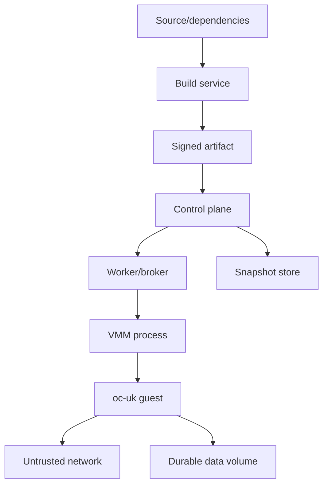

# Chapter 17 — Security Engineering for a Unikernel Platform

## Purpose

A small image and reduced feature set can reduce attack surface, but they do not automatically provide security. In a single address space, compromise of unsafe application or parser code may grant access to runtime, driver, and secret state. The hypervisor protects the host and other tenants; guest hardening protects the workload itself and reduces malicious interaction with the VMM.

## Learning objectives

You should be able to:

- construct a threat model spanning build, artifact, guest, VMM, control plane, storage, and network;
- enforce W^X, NX stacks/heaps, guard pages, and null-page protection;
- minimize capabilities and device surface;
- isolate unsafe Rust and C code;
- fuzz parsers and state machines;
- secure boot/configuration/secret injection;
- authenticate and encrypt snapshots;
- design a supply-chain and update policy.

## Security boundaries



Each arrow is a trust decision. Document who authenticates whom, what data crosses, how it is bounded, and which component is allowed to fail without compromising others.

## Threat actors

At minimum consider:

- malicious network peer;
- malicious application input;
- vulnerable or malicious tenant application;
- compromised unikernel attempting to attack the VMM;
- malicious or buggy VMM/device response attacking the guest;
- hostile snapshot or image artifact;
- compromised build dependency;
- malicious tenant attempting cross-tenant access;
- compromised worker;
- privileged operator misuse;
- denial-of-service through resource exhaustion.

Not every threat can be eliminated. Record assumptions and residual risks.

## Guest memory hardening

Required baseline:

```text
no RWX mappings
code read-execute only
read-only data immutable after init
heap/stacks/DMA non-executable
null page unmapped
stack guard pages
stack canaries where supported
checked arithmetic for sizes and offsets
bounded recursion and parser depth
```

Consider address randomization later, but do not use it as a substitute for memory safety or permissions. Snapshot cloning and reproducibility complicate randomization policy.

## Unsafe-code policy

Create a repository policy:

1. Unsafe code lives in named modules with narrow APIs.
2. Every unsafe function has a `# Safety` section.
3. Public safe APIs must uphold invariants for all safe callers.
4. Raw pointers are not stored longer than necessary without ownership documentation.
5. FFI layouts receive static tests.
6. MMIO and DMA types encode address domain and lifetime.
7. `unsafe` additions require focused review.

Use linting to deny or audit unsafe code outside approved modules.

## Parser policy

Parsers consume attacker-controlled lengths and state. Apply:

- checked addition and multiplication;
- early total-size limits;
- no recursion from untrusted depth unless bounded;
- exact cross-validation of nested lengths;
- rejection of unknown critical versions/features;
- deterministic error behavior;
- bounded logs without secret or packet amplification;
- fuzz harnesses that run outside the VM.

Targets include ELF, manifest, network, virtqueue, vsock/control, block metadata, and snapshot formats.

## Capability minimization

A unikernel image manifest should declare required capabilities:

```text
network
read-only block image
writable data volume
vsock control
entropy
debug serial
```

Do not attach devices the image does not require. Do not expose a shell, package manager, SSH service, or generic host filesystem merely for convenience. Debug features should be explicit development profiles.

## Secret injection

Never bake tenant secrets into the image or command line. A robust flow:

```text
VM boots with public instance identity
    ↓
control channel authenticates instance/session
    ↓
platform sends encrypted/authorized configuration
    ↓
guest stores secrets in bounded memory
    ↓
configuration becomes read-only where possible
    ↓
secrets zeroized on shutdown/error
```

Avoid emitting secrets in panic dumps, metrics, or snapshots. Decide whether a snapshot is allowed to contain secrets and how restore authorization works.

## Artifact security

The build output should include:

- content digest;
- source revision;
- dependency lock data;
- compiler/toolchain identity;
- selected features/components;
- ABI versions;
- reproducibility result;
- vulnerability/advisory scan result where applicable;
- signature/provenance statement.

The worker should launch by immutable digest, not a mutable tag.

## VMM and worker hardening

The worker should broker exact resources and launch the VMM with:

- minimal privileges;
- isolated filesystem namespace;
- cgroup limits;
- seccomp/system-call policy;
- no arbitrary path access;
- no undeclared host network access;
- bounded logs and metrics;
- watchdog and termination policy;
- up-to-date KVM/VMM compatibility checks.

Treat vCPU threads as capable of provoking hostile exit patterns and device requests.

## Denial-of-service controls

Bound:

```text
memory and vCPUs
network rate and connection count
virtqueue size and in-flight requests
block bandwidth/IOPS
vsock message size and request concurrency
log volume
panic dump size
snapshot size and decode work
build CPU/time/disk
```

A memory-safe parser can still be a denial-of-service vulnerability if it allocates based on attacker input or performs quadratic work.

## Fuzzing strategy

Use three layers:

### Pure parser fuzzing

No VM; fastest and easiest to scale.

### State-machine fuzzing

Random sequences of device status changes, queue operations, lifecycle transitions, and snapshot sections.

### Differential/integration fuzzing

Compare behavior with a known implementation or run generated queue/packet inputs through QEMU/`oc-vmm` test devices.

Persist minimized crashing inputs in the repository.

## Update policy

Static images improve immutability but require a deliberate update pipeline. Define:

- supported image lifetime;
- dependency update cadence;
- emergency rebuild process;
- revocation of vulnerable digests;
- snapshot compatibility across updates;
- migration of durable application data;
- rollback policy.

A resumed old snapshot may reintroduce vulnerable code. Admission policy should consider both snapshot and image age.

## Security review checklist

For each subsystem ask:

1. What input is attacker controlled?
2. What resource can it consume?
3. Which unsafe code processes it?
4. What is the maximum size and state count?
5. What happens on reset, cancellation, or partial failure?
6. What data appears in logs and snapshots?
7. What prevents cross-instance confusion?
8. Which invariant is fuzzed or property-tested?

## Debugging and incident playbook

When a security-relevant crash occurs:

- preserve image/config/snapshot digests;
- capture bounded guest and VMM crash records;
- isolate the reproducer from production secrets;
- minimize the input;
- determine whether guest-only, VMM, worker, or cross-tenant impact exists;
- revoke affected artifacts if needed;
- add regression tests before patch release;
- review sibling parsers sharing the same pattern.

## Exercises

1. Write `THREAT-MODEL.md` using STRIDE or an equivalent structured method.
2. Add CI that rejects RWX segments and unexpected device requirements.
3. Fuzz ELF, packet, virtqueue, control, and snapshot parsers.
4. Launch `oc-vmm` under a minimal seccomp and namespace profile.
5. Prove two cloned snapshots receive distinct entropy and instance identities.
6. Create a compromised-guest test that submits hostile descriptor chains while the host remains bounded.

## Review questions

1. What does the hypervisor protect, and what does it not protect?
2. Why can a smaller image still be insecure?
3. Which secrets may be captured in a memory snapshot?
4. Why must resource exhaustion be included in parser design?
5. How should image revocation interact with old snapshots?
6. Which guest capabilities should be declared in the manifest?

## Opencomputer connection

Security must be enforced at admission and runtime. Opencomputer should verify signed artifact metadata, attach only declared resources, isolate the VMM, enforce resource quotas, authenticate control messages, encrypt snapshots, and preserve lifecycle evidence. `oc-uk` should expose the smallest possible application capability surface and assume that any unsafe C application may compromise the entire guest.
