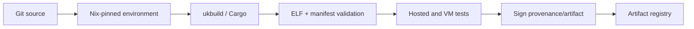
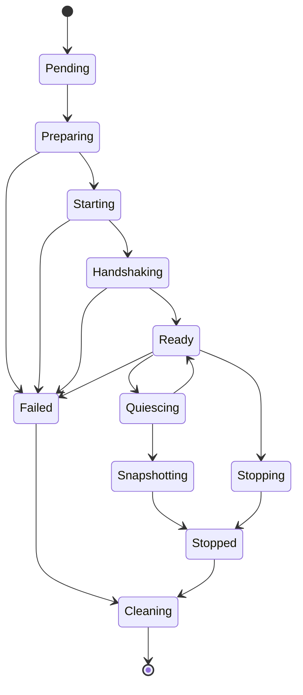

# Chapter 20 — Integrating `oc-uk` With Opencomputer

## Purpose

The final step is to turn a bootable unikernel into a schedulable product. This requires artifact identity, reproducible builds, admission, worker orchestration, network and storage attachment, control channels, snapshots, observability, and upgrade policy.

## Learning objectives

You should be able to:

- define a content-addressed unikernel artifact;
- build and sign it reproducibly;
- design a VMM-neutral runtime interface;
- implement worker lifecycle and rollback;
- separate image, configuration, data, and runtime snapshots;
- authenticate guest control communication;
- schedule based on compatibility and measured resources;
- operate upgrades and failure recovery safely.

## Artifact model

A unikernel artifact can use OCI-compatible distribution infrastructure without pretending to be a Docker root filesystem. Define a media type and manifest:

```json
{
  "schemaVersion": 2,
  "mediaType": "application/vnd.opencomputer.unikernel.manifest.v1+json",
  "config": {
    "mediaType": "application/vnd.opencomputer.unikernel.config.v1+json",
    "digest": "sha256:...",
    "size": 1234
  },
  "layers": [
    {
      "mediaType": "application/vnd.opencomputer.unikernel.elf.v1",
      "digest": "sha256:...",
      "size": 1048576
    }
  ]
}
```

The config should declare:

```text
architecture
image and application ABI
supported VMM targets
minimum and recommended memory
vCPU range
required/optional devices
entry/boot protocol
configuration schema digest
health/readiness protocol
build provenance
```

Use immutable digests throughout runtime state.

## Build pipeline



The build service executes untrusted source and must itself be isolated. Cache by content inputs, not mutable project names. Never allow build credentials to leak into the output image.

## `ukbuild`

A build command might be:

```bash
ukbuild build \
  --app ./apps/http-service \
  --platform firecracker-x86_64 \
  --features net,vsock,block \
  --profile release \
  --output ./result
```

It should emit:

```text
unikernel ELF
embedded/extracted manifest
component and size report
SBOM/provenance
hosted test report
VM smoke-test report
content digest
signature metadata
```

## Runtime API

Keep the control-plane interface VMM neutral:

```go
type UnikernelSpec struct {
    ImageDigest string
    Platform    string
    VCPUs       int
    MemoryBytes uint64
    CPUContract string
    Network     NetworkSpec
    Blocks      []BlockSpec
    ConfigRef   string
    SecretRefs  []string
    RestoreRef  string
}

type Runtime interface {
    Create(ctx context.Context, spec UnikernelSpec) (Instance, error)
    Start(ctx context.Context, id string) error
    Quiesce(ctx context.Context, id string) error
    Snapshot(ctx context.Context, id string, mode SnapshotMode) (Snapshot, error)
    Stop(ctx context.Context, id string) error
    Delete(ctx context.Context, id string) error
}
```

Define idempotency for every operation. Repeated `Stop` or cleanup after partial `Create` should be safe.

## Worker lifecycle

A worker agent owns local execution resources:

```text
admit assignment
verify compatibility and artifact signature
reserve CPU/memory/storage/network identities
materialize immutable objects
create data/scratch attachments
start isolated VMM
configure devices
start guest
perform control handshake
inject config/secrets
wait for readiness
report running
monitor
quiesce/snapshot/stop
clean up deterministically
```

Persist a small local journal so worker restart can reconcile orphaned VMMs, TAP devices, mounts, and allocations.

## State machine



Every transition should be observable, timed, and recoverable.

## Guest control protocol

Messages might include:

```text
Hello(instance nonce, image digest, ABI versions)
Configure(config payload reference/data)
Secrets(secret envelope)
Ready(endpoints, build info)
Health(status)
Metrics(snapshot)
Quiesce(reason, deadline)
Quiesced(checkpoint token)
Resume
Shutdown(reason, deadline)
Crash(report)
```

Bind the session to the expected instance and VMM channel. Use framed, size-bounded, versioned messages and idempotent request IDs.

## Networking

The platform owns:

- TAP/backend creation;
- MAC/IP assignment;
- routing and egress policy;
- exposed-port proxying;
- rate limits;
- DNS/service identity;
- network teardown and restore.

The guest owns its stack and listeners. The control plane should publish an endpoint only after the guest reports ready and host data-plane health checks pass.

## Storage

Define volume classes:

```text
image        immutable and content addressed
data         durable, snapshot capable
scratch      ephemeral
shared-ro    optional immutable data set
```

Map stable logical device IDs to VMM devices and guest names. Snapshot manifests should reference logical IDs and storage objects, never rely on `/dev/vdX` ordering alone.

## Snapshot modes

### Data checkpoint

Application quiesce plus durable volume snapshot. Portable across runtime versions if application format permits.

### Runtime suspend

Data checkpoint plus VMM memory/device state. Fast continuation, stronger compatibility coupling.

### Template creation

A new immutable application artifact or image layer. It should not capture instance secrets or transient identity.

Expose these as distinct APIs and user concepts.

## Scheduling

Scheduler filters:

```text
architecture
KVM availability
VMM and snapshot format
CPU contract
required devices/features
memory/vCPU capacity
storage locality/capability
network policy
artifact availability
security/update policy
```

Then score based on:

```text
measured resident memory
startup/restore latency
local artifact/snapshot cache
NUMA/CPU isolation
network/storage locality
worker load and failure domain
```

Use real telemetry rather than assuming manifest minimums equal steady-state cost.

## Failure handling

Examples:

### VMM starts, guest never handshakes

Capture serial/VMM diagnostics, terminate after deadline, classify as guest boot failure, release resources, and retain bounded evidence.

### Worker dies during snapshot

Use transactional object creation: incomplete snapshots are not published as restorable. Data snapshot and runtime state receive one committed manifest only after all objects are durable.

### Control plane retries `Create`

Use idempotency key and instance ID. Reconcile existing local state instead of launching a duplicate.

### Restore incompatible

Fail before starting the guest and provide a structured compatibility reason. Optionally fall back to data-checkpoint restore with a fresh runtime, never silently.

## Upgrade strategy

Version independently:

```text
oc-uk runtime
application ABI
artifact manifest
control protocol
VMM
snapshot format
worker API
```

Use canaries and compatibility tests. A VMM upgrade should prove clean boot and supported snapshot behavior for the currently admitted image set. Durable data must have an application migration plan separate from runtime snapshots.

## Final capstone

Deploy a key-value or HTTP service through the complete path:

```text
source commit
  → reproducible build
  → signed artifact
  → registry
  → scheduler
  → worker/Firecracker
  → vsock handshake
  → network endpoint
  → durable data writes
  → quiesced checkpoint
  → worker teardown
  → restore on another worker
  → service validation
```

Inject failures at every transition.

## Exercises

1. Define and validate the artifact manifest and media types.
2. Implement an idempotent worker lifecycle state machine.
3. Build the versioned vsock control protocol.
4. Separate data checkpoint, runtime suspend, and template creation APIs.
5. Restore on a second worker with a recreated network and exact data snapshot.
6. Produce an operational runbook for boot failure, VMM crash, snapshot failure, and incompatible restore.

## Review questions

1. Why can OCI distribution be reused without using a container rootfs?
2. Which runtime operations must be idempotent?
3. Why should the worker maintain a local reconciliation journal?
4. What is the difference between a data checkpoint and runtime suspend?
5. Which compatibility filters belong in scheduling?
6. How should incomplete snapshot objects be prevented from becoming visible?

## Completion criteria

The Opencomputer capstone is complete when:

- builds are reproducible and content addressed;
- image admission validates ABI, devices, and permissions;
- the worker launches the guest through an isolated VMM;
- the guest authenticates its control session and reports readiness;
- networking and durable data work;
- data checkpoint and runtime suspend have distinct semantics;
- restore works on a compatible second worker;
- failures leave no leaked resources;
- logs, metrics, traces, and crash evidence link to the exact image and instance.
