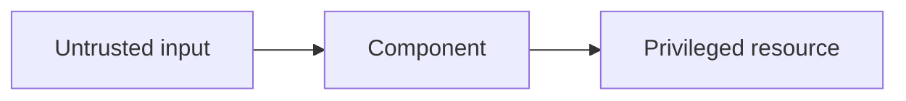

# Threat Model — <System/component>

**Version:**  
**Date:**  
**Owners:**

## Scope

## Assets

- Tenant code/data
- Secrets
- Snapshot integrity/confidentiality
- Host and other tenants
- Control-plane authority
- Availability/resources

## Trust boundaries

## Actors

- Malicious network peer
- Malicious tenant application
- Compromised guest
- Malicious snapshot/artifact
- Compromised dependency/build
- Compromised worker/operator

## Entry points

| Entry point | Input | Privilege | Bounds/authentication |
|---|---|---|---|
| | | | |

## Threats and mitigations

| Threat | Impact | Existing mitigation | Test/evidence | Residual risk |
|---|---|---|---|---|
| | | | | |

## Resource-exhaustion limits

## Secret handling

## Logging/snapshot disclosure

## Update and revocation

## Security tests

- [ ] Fuzz targets
- [ ] Malicious guest tests
- [ ] Snapshot/authentication tests
- [ ] Resource-limit tests
- [ ] Isolation tests

## Assumptions and non-goals

